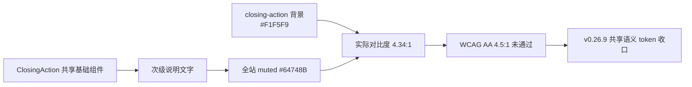

# xingbuild v0.26.9：ClosingAction 浅色表面对比度收口方案

状态：正式产品/视觉方案
父版本：`v0.26.8` / `ae3820f45b6cddad57bc2301f318f0faf10ce396`
来源：v0.26.8 产品/视觉独立验收发现 `V268-COLOR-CONTRAST-CLOSING-SUMMARY`
责任：产品/视觉定义合同；Engineering 实现与自 QA；内容与 Ops 不参与本版本。

## 1. 结论

v0.26.8 的页面结构、页面独立投影、作品锚点和 Closing Action 语义均已满足合同。唯一阻断是一个共享视觉语义错误：`ClosingAction` 的次级说明在浅色表面上仍沿用全站普通 muted token，导致 Home 和 `/products` 同时出现同一对比度失败。



这不是 Home 和 `/products` 两个页面的局部颜色补丁，也不改变已确认的冷白视觉。修复对象是共享组件的“浅色表面次级文字”语义：全站 `--color-text-muted: #64748B` 保持不变，`ClosingAction` 统一使用一个达到 AA 的表面专用 token。

## 2. 根因与影响

- 组件：`src/components/showcase/ClosingAction.jsx` 的 summary `<p>`；样式：`src/styles/components.css` 的 `.closing-action p`。
- 当前组合：前景 `#64748B`（`--color-text-muted`）+ 背景 `#F1F5F9`（`--color-surface-subtle`）。
- 独立 axe 证据：1600×1067 和 390×844 的 `/`、`/products` 均命中 `color-contrast` serious；实测比值 `4.34:1`，正常 15px 文本要求 `4.5:1`。
- 影响：两个高价值页面的作品说明在浅色 ClosingAction 表面上不满足可读性合同；不是内容事实、ContentSet、媒体或发布工具故障。

## 3. 正式视觉合同

### 3.1 语义 token

新增一个全站 tokens 层的语义颜色：

```css
--color-text-muted-on-subtle: #526277;
```

该颜色在 `#F1F5F9` 上的计算对比度约为 `5.68:1`，保留 muted 层级，同时通过 WCAG AA。颜色值属于共享视觉系统，不得写在 Home、Products 或 ClosingAction 的页面私有 CSS 中。

### 3.2 组件使用

- `.closing-action p:not(.eyebrow)` 使用 `var(--color-text-muted-on-subtle)`。
- 其他使用 `--color-text-muted` 的页面和组件不变；`About`、文章、简讯、观察列表的已验收视觉不变。
- `ClosingAction` 仍是无业务状态的基础渲染组件；HomeProductProjection 与 ProductsShowcase 的独立 IA、文案、动作和生命周期不改变。
- 不降低字号、不加粗正文、不改变背景、不添加阴影或装饰线来掩盖对比度问题。

## 4. 产品与内容边界

```yaml
contentImpact: compatible
contentImpactReason: shared-closing-summary-surface-contrast-only
affectedTargets: [home, practice]
affectedRoutes: [/, /products]
affectedFields: [closing-summary-surface-text-color]
compatibilityEvidence: v0.26.8-local-axe-V268-COLOR-CONTRAST-CLOSING-SUMMARY
```

- 不修改 Home 或 Robotaxi 的标题、说明、来源、审核、正文、媒体、ContentSet、ContentReleaseId 或发布台账。
- 不修改 content CLI、ContentSet、Coordinator、ProductArtifact、SiteSnapshot、SitePublication 或内容运营生命周期。
- 本版本不运行 content prepare/build/transport/finalize，不创建内容身份，不通知或恢复 ops-content。
- Product build 继续保持产品与内容隔离；Site Publication 仍由 Coordinator 在产品 transport 时组装当前 ProductArtifact 与 active ContentSet。

## 5. Engineering 实现限制

1. 只在共享 tokens 与 `ClosingAction` 组件责任边界内实现，不对两页分别添加颜色覆盖。
2. 保留 `--color-text-muted` 的既定全站视觉事实；不得把全站 muted token 全局改深来解决单一表面问题。
3. 保留 v0.26.8 已通过的 B-01/B-02、Home/Products 页面投影独立、CTA、安全外链、视频属性、空内容降级、键盘和 Reduced Motion。
4. 不改页面结构、文案、内容 schema 或任何 `.content-workspace/` 文件。

## 6. 验收合同

- 路由：`/`、`/products` 重点回归；`/business-observations`、`/observations`、`/about` 全站回归。
- 视口：`1600×1067`、`1280×1067`、`390×844`、`320×844`，必要时等效 200% CSS 视口。
- axe：五路由桌面/移动 `color-contrast` violations=0；具体 closing summary 计算对比度 `≥4.5:1`，目标约 `5.68:1`。
- B-01/B-02：标签与标题左起点 `≤1px`、gap=4px、标题/说明居中；Home/Products Closing 文案、说明、外链和独立投影保持通过。
- 无横向溢出、每页一个 H1、console/pageErrors=0；视频 autoplay/muted/loop/controls、focus-visible、Reduced Motion 保持通过。
- `npm run check`、`release:prepare`、页面/视觉专项、`release:build`、`release:closeout-check`、`release:preflight`、`git diff --check`，以及 `content:check`、`article:check`、`practice:check` 通过；既有 retained fixture/environment failures 分层报告。
- 产品/视觉先用 `xingbuild-visual-ux-review` 独立本地验收；上线后 design-ui 做公网 Web→Mobile 复验。

## 7. 发布顺序

```text
Engineering 实现 + 分层 QA
→ v0.26.9 commit/tag/clean + exact ProductArtifact
→ 产品/视觉本地独立验收
→ 持续授权 product transport
→ SitePublication 公网验证与 finalize
→ design-ui 公网视觉验收
→ 内容保持既有 ContentSet，不重发
```

v0.26.8 保持不可变且不回写；在 v0.26.9 完成独立验收前不 transport v0.26.8，不运行内容发布。
