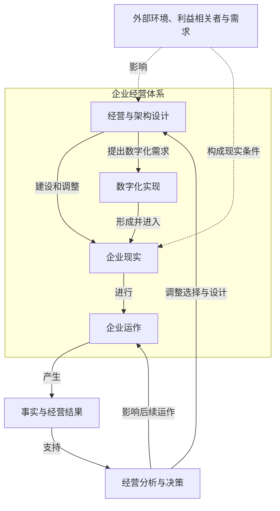
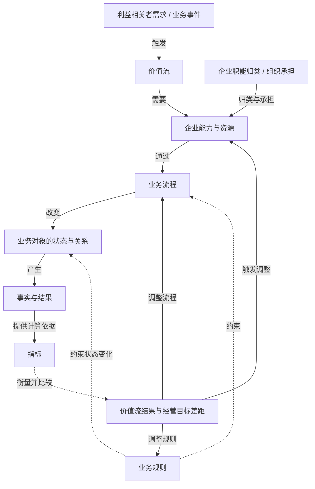
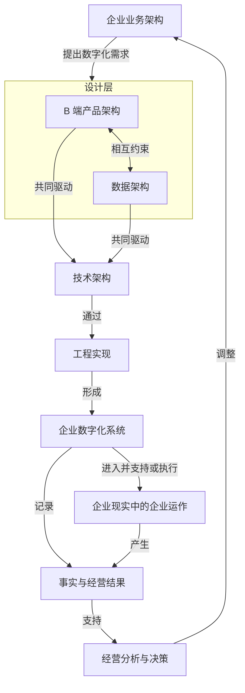
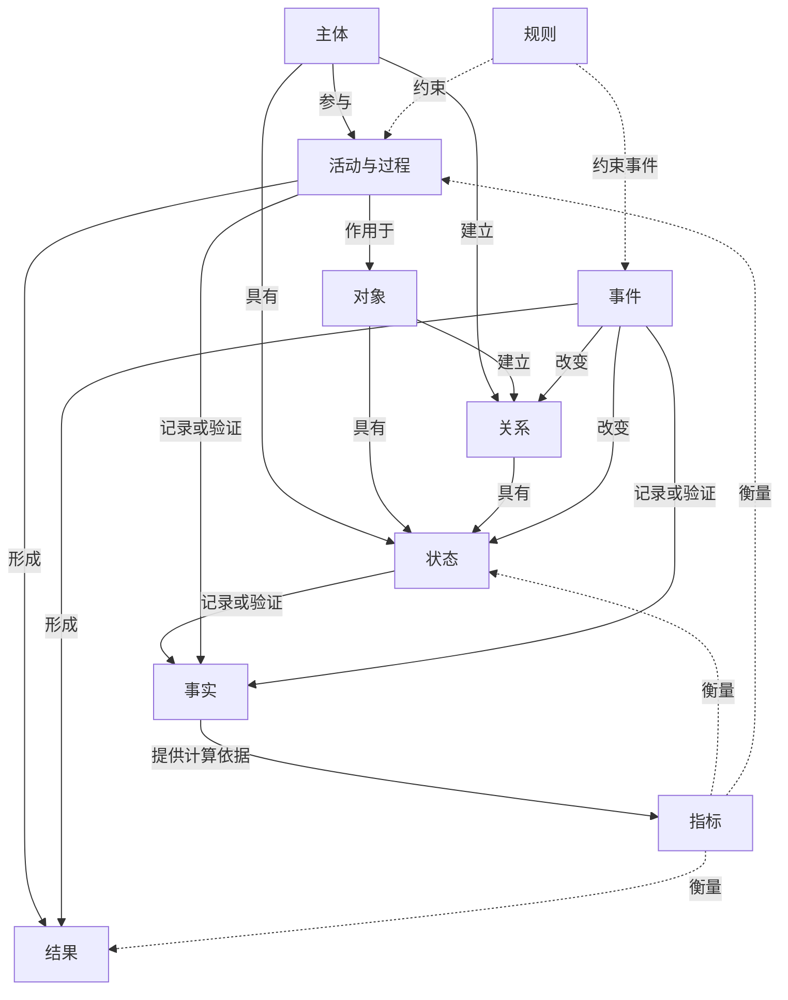

# v0.8.0 四张架构低保真结构提案

## 文档状态

- 阶段：结构低保真；
- 用途：验证对象、边界、层级、关系、约束和反馈是否正确；
- 当前门槛：等待产品 task 进行一次结构检查；
- 尚未开始：品牌高保真、桌面/手机效果图、用户视觉确认、Engineering 实现；
- 本文不替代上游概念定义，也不修改 `career` 权威事实。

## 唯一推荐方向

采用“容器化主脊柱 + 侧向作用 + 可闭合反馈轨道”。

这不是要求四张图具有相同外形，而是要求它们共用同一套结构语法：

1. 核心研究对象或系统边界先成为视觉锚点；
2. 实际发生的价值形成、执行或转化关系形成主脊柱；
3. 责任、规则、资源、设计和衡量从侧面作用于主脊柱，不伪装成执行步骤；
4. 事实与结果位于执行输出端；
5. 需要反馈的图使用独立回程轨道闭合到可被调整的对象；
6. 桌面和手机只改变投影方向、节点停靠和局部折叠，不改变关系性质。

## 统一低保真语法

### 节点角色

| 角色 | 结构表达 |
| --- | --- |
| 外部条件或触发 | 位于系统边界外或主脊柱起点 |
| 核心研究对象 | 全图主锚点，必要时表现为容器 |
| 设计层 | 位于执行之前，表达设计、选择和调整 |
| 支撑层 | 从侧向或并行轨道支持执行 |
| 执行主链 | 使用连续实线箭头 |
| 约束 | 从侧面以虚线箭头作用于被约束对象 |
| 事实与结果 | 位于执行输出端 |
| 衡量与反馈 | 独立于执行主链，以回程箭头返回可调整对象 |

### 连接关系

- 实线箭头：触发、需要、通过、执行、改变、产生、形成、进入；
- 双向实线：两个设计对象持续相互约束；
- 虚线箭头：影响、约束、衡量；
- 回程箭头：反馈和调整；
- 每条关键连接使用短动词标签，不让颜色承担唯一语义。

## 架构一：企业经营体系整体结构

### 低保真结构图

### 结构说明

- 核心对象：`企业经营体系`是系统容器；`企业现实`是容器内被设计、建设并实际运作的现实对象。
- 主链：经营与架构设计 → 企业现实 → 企业运作 → 事实与经营结果 → 经营分析与决策。
- 侧向关系：外部环境从边界外影响整个经营体系；数字化实现由设计提出需求，再形成并进入企业现实。
- 反馈：经营分析与决策分别返回经营与架构设计、后续企业运作；不再使用“决策直接调整企业现实”的跨级关系。

### 桌面与手机同构规则

- 桌面：容器横向展开，设计与数字化位于左侧，企业现实与企业运作位于右侧；反馈沿容器外缘回到上游。
- 手机：容器内部改为纵向主链；数字化实现作为“设计 → 现实”的并行支路停靠在两者之间；反馈使用右侧独立回程轨道返回设计与现实。
- 不变项：外部条件始终在系统边界外，事实与决策始终在执行输出端，反馈必须闭合。

## 架构二：企业业务架构

### 低保真结构图

### 结构说明

- 核心对象：价值形成与执行主脊柱，不以九宫格呈现九个并列分类。
- 主链：需求/事件 → 价值流 → 能力与资源 → 业务流程 → 对象状态与关系 → 事实与结果 → 目标差距。
- 侧向关系：职能与组织承接能力责任；规则约束流程和对象变化；指标承担衡量，不参与执行。
- 反馈：目标差距返回能力、流程、规则和资源这些可调整对象。

### 桌面与手机同构规则

- 桌面：主脊柱纵向居中；责任停靠在能力左侧，规则停靠在流程和对象右侧，指标停靠在事实和差距右侧；反馈沿外侧返回。
- 手机：主脊柱保持纵向；侧向节点移动到被作用对象之后的缩进附属位，并保留“归类与承担 / 约束 / 衡量”连线标签；反馈仍使用独立回程轨道。
- 不变项：附属视角不能插入主流程；指标不能被画成事实之后的执行步骤。

## 架构三：数字化实现

### 低保真结构图

### 结构说明

- 核心对象：从企业业务架构提出需求，到数字化系统进入企业现实的完整转化结构。
- 主链：业务架构 → 设计层 → 技术架构 → 工程实现 → 数字化系统 → 企业现实与运作 → 事实与经营结果。
- 侧向关系：产品架构与数据架构在同一设计层并行、相互约束，并共同驱动技术架构。
- 反馈：事实与结果先支持经营分析与决策，再由决策调整企业业务架构；只保留这一条轻量反馈，不重复架构一的完整经营闭环。

### 桌面与手机同构规则

- 桌面：设计层内部产品、数据双轨横向并列，在技术架构处汇合；其余层纵向下钻。
- 手机：设计层内部改为上下错位双轨，两者之间保留双向关系，并分别汇入同一个技术架构节点；不能折叠成“产品 → 数据”的顺序。
- 不变项：技术架构是设计结果，工程实现是活动，数字化系统是实现结果，三者必须分开。

## 架构四：底层概念语法

### 低保真结构图

### 结构说明

- 核心对象：不是五列分类，而是“参与和作用”“现实结构”“变化”“结果”“记录与衡量”五组可追踪关系；`状态`与`关系`是两个独立概念。
- 主链一：主体 → 活动与过程 → 对象；主体与对象建立关系；主体、对象、关系分别具有状态；事件分别改变状态和关系。
- 主链二：活动与事件 → 结果；状态、活动、事件 → 事实 → 指标。
- 侧向关系：规则约束活动，并约束引起状态或关系变化的事件；指标反向衡量状态、过程和结果。
- 反馈：本图表达的是观察和验证闭环，不增加经营决策反馈，以免把底层语法误画成经营流程。

### 桌面与手机同构规则

- 桌面：将参与/作用与事件/变化作为上半部两条并行因果链；结果位于汇合区；事实和指标位于下部观察层。
- 手机：四组关系纵向分区，但复用同一节点身份；跨区连接以短标签和锚点保持可追踪，不把同一对象复制成互不相干的卡片。
- 不变项：规则始终是侧向约束；事实不是结果的同义词；指标不制造事实，只基于事实计算并衡量目标对象。

## 互动机制的结构约束

低保真阶段只确定互动不破坏结构：

- 默认：显示完整系统关系和全部关键连线；
- hover/focus：突出当前节点、直接相连节点和连接标签，其余关系降权但不消失；
- selected：保持整图可见，并在桌面右侧、手机当前图下方展示节点叙述；
- 点击叙述解释“它是什么、连接了什么、为什么连接”，不替代图中的关键关系；
- 反馈回路可以按路径逐步聚焦，但不能通过动画才首次暴露其存在。

采用这些机制是为了把 Kumu 的连接/回路叙述、Nicky Case/LOOPY 的因果可探索性、IBM 的节点层级与正交关系、Vexlio/Nodefall 的整体图加点击细节，转译为 xingbuild 自己的暖色编辑型视觉系统；当前低保真不复制任何外部品牌外观。

## 本次结构检查只需回答

1. 四张图的核心对象和系统边界是否正确；
2. 主链是否表达真实发生顺序，而不是概念分类；
3. 侧向责任、约束、支撑和衡量是否停靠在正确对象；
4. 反馈是否返回真正可调整的对象；
5. 桌面与手机投影是否保持同一种关系；
6. 若通过，下一步只制作一个推荐方向的高保真桌面与手机效果图。
