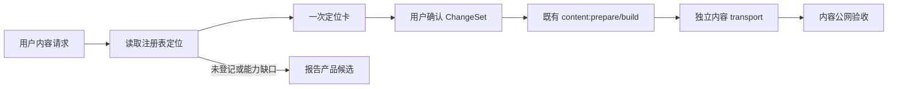

# 声明式内容定位与快速内容发布方案

状态：已确认的独立内容运营能力设计；不进入产品工程版本、`current.md`、产品 `history` 或产品 tag。

来源候选：`XBUILD-CONTENT-OPERATIONS-001`。
机器注册表：[`content/registry/content-targets.json`](../../content/registry/content-targets.json)。
运营规则唯一正文：[`docs/operations/内容运营与发布规则.md`](../operations/内容运营与发布规则.md)。

## 1. 用户目标

用户说“更新 B 端某个模块说明”时，内容 task 应直接知道页面、对象、字段和边界，快速形成可确认的内容方案；用户确认后沿用既有独立内容发布链路，不重复研究页面、不创建产品版本、不把普通文案问题升级为产品候选。

这不是人工 CMS，也不是让 AI 任意编辑代码。AI 只负责把自然语言映射到已登记目标并提出 `ChangeSet`；注册表和既有内容校验/发布命令负责确定性检查与发布。

## 2. 最短工作流



普通内容请求只需要一次定位卡和一次确认。没有歧义时不重复 ACK、不重复交接、不轮询、不重新研究整站。

## 3. 唯一定位事实

`content/registry/content-targets.json` 是机器可读的定位与编辑白名单；本文件和内容运营规则只说明如何使用它，不复制正文。

每个目标必须给出：

- `targetId`：稳定目标 ID；
- `sourcePath`：canonical 内容对象路径；
- `fieldPath`：明确字段路径；数组项使用 `arrayPath[id=value]`，禁止按易变文本定位；
- `projectionRoutes`：实际受影响的 URL；
- `valueType`、编辑约束和事实/媒体门禁；
- `editable`：是否允许内容 task 直接变更。

首批注册的可编辑范围仅包含现有 JSON 内容对象的登记文本字段：B 端 Robotaxi、经营观察、企业经营长文和关于我。首页暂不开放，因为首页主文案仍位于 `src/content/siteContent.js`；这属于产品工程外部化能力，不允许内容 task 猜测或直接改 `src/`。

`scope=page` 只表示多个明确字段组成一个内容批次，不表示整文件覆盖；`scope=module` 只表示一个已登记模块的明确字段集合。

## 4. 定位卡合同

内容 task 首次回复最多说明以下事实，不先写长候选：

```text
目标：targetId / scope
位置：sourcePath#fieldPath
当前：beforeHash + 当前值摘要
影响：projectionRoutes
可改：登记字段与约束
不可改：路由、结构、schema、组件、CSS、业务/上游事实
方案：after 值或明确的字段批次
需要用户确认：仅列一个真正未决问题；无问题则直接请求确认
```

定位唯一且属于登记白名单时，内容 task 只读注册表、目标对象和必要媒体/来源文件；不重复读取产品总案、页面组件和历史 task。只有注册表缺失、页面能力变化或事实边界无法判断时，才扩大读取范围并报告原因。

## 5. ChangeSet 与发布边界

确认后的变更在被忽略的 `.content-workspace/changes/` 形成结构化 `ChangeSet`，至少保留：

```text
changeId / targetId / scope / fieldPath
beforeHash / before / after
affectedRoutes / sourceRefs / boundary / authority
baseProductVersion / rollbackReleaseId
```

第一阶段复用现有 `content:prepare`、`content:build` 和对应的独立 transport 命令；不先新建第二套 `content:plan/preview/approve/publish/rollback` 发布引擎。只有现有命令无法消费已确认 ChangeSet 时，才单独提出工具能力候选。

内容发布仍不修改产品 `current.md`、`VERSION.md`、产品 commit/tag、UI、IA、schema、组件或工程业务逻辑；CLI 只执行内容校验、构建、独立部署和内容公网验证。

## 6. 何时才产生候选

以下普通内容工作不产生产品候选：标题、简介、模块说明、已登记 CTA/链接、已批准媒体和事实边界内的公开表达。

只有下列情况才停止并登记候选：

- 目标未在注册表登记，且需要新增页面/字段/模块或改变页面结构；
- 需要修改路由、IA、schema、组件、CSS、交互、业务逻辑或共享视觉能力；
- 现有内容 CLI、媒体合同或发布 transport 无法安全执行；
- 来源、事实边界或媒体公开资格无法验证。

候选只记录能力缺口和证据；普通文案直接由内容 task 形成 ChangeSet，不再走候选往返。

## 7. Practice 兼容性

Practice video 支持是独立兼容性验收项：当前展示组件可渲染 video，但媒体校验仍需明确 image/video 合同、比例、审核、hash、provenance 和 public 门禁。`publish-practice --id` 只保留回归测试要求；当前代码路径已接受 `--id`，没有新的参数修复授权。未批准媒体不得因本方案进入公开发布。

## 8. 验收与下一动作

- 内容 task 能用注册表在一次定位卡内给出精确文件、字段、路由和边界；
- 用户确认后可直接复用既有内容发布命令，不再重复研究或创建产品候选；
- 首页请求明确、快速地报告“当前未登记，需产品工程外部化”，而不是修改 `src/`；
- 未登记目标、代码越界、来源缺失和未批准媒体均硬停止；
- 内容发布身份与产品工程版本完全分离。

本设计完成后，内容 task 的下一次普通工作从 `content/registry/content-targets.json` 开始；不需要再次阅读本候选的长篇设计过程。
