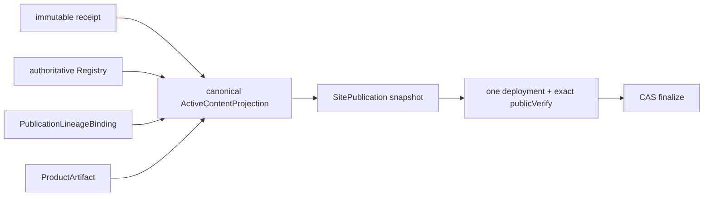
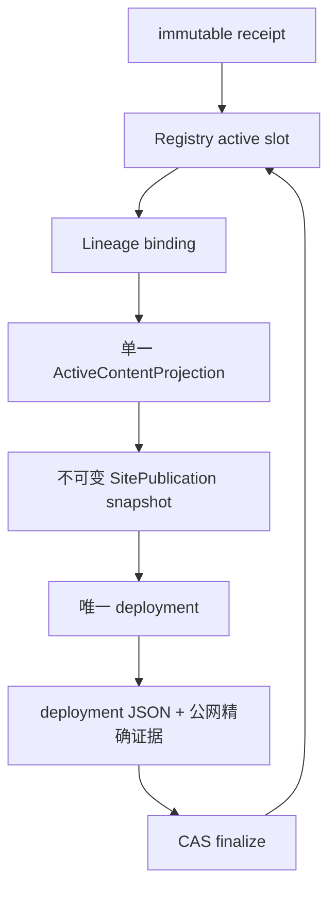

# 当前迭代

## 当前唯一版本：`v0.25.19`

父版本：`v0.25.18` / `cca1f5970b695baee8435fca453a98c4623782e2`

## 正式方案

[`docs/design/v0.25.19 内容收据与活动站点投影单一身份方案.md`](../design/v0.25.19%20内容收据与活动站点投影单一身份方案.md)

来源 Incident：v0.25.18 product transport 的 `content manifest receipt identity mismatch: practice-robotaxi-604214b3bfddf09f`。

v0.25.18 已正确建立 authoritative ContentSlotRegistry，但本次 transport 暴露出更深的对象边界缺陷：不可变 `ContentReleaseReceipt.receiptHash` 与带当前 lineage binding 的活动站点投影共用同一字段，且由不同调用点重复计算。v0.25.19 不做单点条件修补，而是按“事实层 → 关系层 → 投影层 → SitePublication 快照 → deployment → 公网证据 → CAS finalize”重建身份闭环：receipt 事实与 ActiveContentProjection 分离，使用 `receiptHash` + `projectionHash` 两个明确身份，并要求 SitePublication 全链路消费同一个规范化投影。

## 根本目标



产品与内容继续保持独立生命周期；本版本只修复 receipt/projection 身份边界，不修改页面、内容正文、审核、媒体或产品视觉。

## 全链路不变量



- 一个 `logicalContentId` 只有一个 active slot，替换必须通过 predecessor + CAS；
- released receipt 的正文、来源、审核、媒体、`receiptHash` 不可变；
- projection 只由 ProductArtifact、Registry、Receipt、Binding 确定性生成；
- snapshot 组装后不重新推导 active 集合；
- 失败只保留 recoverable/recovery，旧 active 不变；resume 复用同一 revision、snapshot 和 deployment；
- Deploy Success 不是完成，只有 deployment JSON、双 manifest、目标页/媒体公网证据和 finalize 全部成立才算成功。

## Engineering 正式实现范围

1. 在现有 receipt 模块内建立唯一 ActiveContentProjection resolver；不创建第二套 Registry、lifecycle 或 Coordinator。
2. `receiptHash` 只表示 immutable package receipt；`projectionHash` 只表示加入 Registry、lineage binding 和 ProductArtifact 后的活动投影。
3. `readActiveContentReleases`、`createActiveContentSet`、manifest、Coordinator assembly/publicVerify/finalize/resume 全部消费同一个投影对象，禁止各处重新拼接和重算。
4. 新旧 projection 兼容必须隔离：legacy 只能被明确解释，不能和新 schema 混合组装；输入/输出/hash 必须确定性。
5. 34 active corpus、Robotaxi replacement、About recoverable package、resume/idempotency、drift/CAS/失败不污染 active 全部形成专项和真实验证；测试必须覆盖事实、关系、投影、快照、传输、公网六层，不以单 slug 夹具代替真实闭环。

## 产品—内容兼容声明

```yaml
contentImpact: compatible
contentImpactReason: receipt-projection-identity-boundary
affectedTargets: [content-release-receipt, active-content-projection, content-slot-registry, publication-lineage-binding, site-publication-coordinator, content-resume]
affectedRoutes: [/, /about, /business-observations, /observations, /products]
affectedFields: [receiptHash, projectionHash, lineageBindingId, predecessorReceiptId, baseSiteArtifactId]
compatibilityEvidence: v0.25.19-active-content-projection-v1
```

## 验收顺序

```text
Engineering 实现 + 34 active corpus / replacement / legacy QA
→ local commit/tag/clean
→ 产品/视觉独立验收
→ v0.25.19 product transport / 公网完整验证
→ 内容 task 复用既有 About package
→ Article / Business Observation 串行发布与逐项公网验证
```

## 明确不做

- 不手改 receipt、completion、manifest、Registry、lineage 或 contentHash；
- 不重新扫描或放宽 legacy migration；
- 不重发 33 条 observation、Robotaxi practice 或已发布内容；
- 不修改 UI、IA、页面 schema、视觉、正文、审核、媒体或产品业务逻辑；
- 不创建第二套 Coordinator、task、branch、worktree 或 scheduler。

## 当前责任

- 产品/视觉主线：维护本正式方案并完成能力验收；
- Engineering 主线：`019fcbf2-20e3-7d51-a4de-87ad7c94b190`，只按本合同实现、测试和版本闭环；
- 内容及发布主线：保留 `profile-about-93ea5608339c4973` recoverable package，产品上线后按顺序复用，再处理 Article 与 Business Observation；
- Ops：不参与本产品版本。
