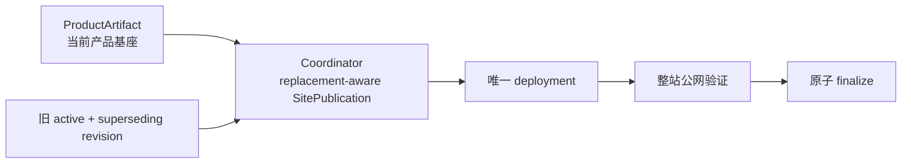

# 当前迭代

## 当前唯一版本：`v0.25.6`

父版本：`v0.25.5` / `554526b93e62d589b132308b185d8e40b90e89a0`

## 正式方案

`docs/design/v0.25.6 内容发布替换 revision 与 active 生命周期方案.md`

来源：v0.25.5 发布后的真实 Publish Incident；不创建替代内容候选。

## 目标

修复同一逻辑内容的旧 released package 与新 reconcile revision 并存时，Coordinator 错误拒绝合法 replacement 的问题，使内容运营能够在不修改产品版本和内容事实的前提下恢复三条既有 Brief。



## 产品—内容兼容声明

```yaml
contentImpact: compatible
affectedTargets: [all-active-content-receipts, content-release-candidate]
affectedRoutes: [/, /products, /business-observations, /observations, /about, /observations/:slug]
affectedFields: [ContentPackageRevision lineage, ContentReleaseReceipt active selection, SitePublication replacement identity, deployment recovery]
compatibilityEvidence: v0.25.6-supersedes-replacement-contract
```

## 范围

- 以 `content-release.json` 与 `completion.json` 形成的 `ContentReleaseReceipt` 作为 active 生命周期事实；
- 以 logical identity 分组，消费 `supersedesPackageId` 与 revision tuple，旧 package 保留历史，新 revision 占用唯一 active slot；
- 每次发布从当前 ProductArtifact、全部 active receipt 和 replacement candidate 组装完整站点快照；
- 快照统一保存 `sitePublicationId`、`snapshotHash`、active IDs、slug 列表、媒体路径、deployment JSON 和公网验证；
- SitePublication Coordinator 负责 replacement 校验、站点 lease、唯一 deployment、传播验证、resume 和原子 finalize；
- 保留三个既有 Brief 的 `contentReleaseId`、hash、审核、deployment、recovery 证据，能力验收后从现有 revision 恢复，不改正文、不创建新内容身份。

## 明确不做

- 不修改 v0.25.5 tag/history、产品 UI、IA、schema、视觉或内容正文；
- 不让产品 build 读取独立内容根；
- 不让内容 task 直接调用 EdgeOne；
- 不以单次 Deploy Success、HTTP 200 或单页可见替代整站快照证据；
- 不创建第二套发布 CLI、后台 CMS、候选、branch、worktree 或 task。

## Engineering 实现合同

1. active 读取以 receipt 与 replacement lineage 为准；合法 supersedes 不得误报 duplicate，身份漂移必须硬失败；
2. snapshot manifest 原子生成，`activeContentReleaseIds`、slug、media、hash 与唯一逻辑内容集合完整一致；
3. 同一 SitePublication 使用唯一 lease、幂等键和原 deployment resume，不重复部署；
4. transport、传播、verify、finalize 任一阶段失败保留 package、publication、日志和 recovery，不污染旧 active；
5. 产品发布只消费 ProductArtifact，内容发布不产生产品版本。

## 验收合同

- 旧 released package 与三个 superseding revision 可由同一完整快照同时恢复，逻辑内容只出现一次；
- 公网 active IDs 与 slug 列表完全对应，三个新 slug 的页面、内容身份、媒体和 hash 均可验证；
- replacement lineage、旧投影、部分 manifest、身份漂移均按合同硬失败或可恢复；
- 重复 resume 不产生第二个内容身份或 deployment；
- 部署成功但公网未传播、身份漂移、内容清单不完整均不得返回成功；
- 产品版本、内容事实和既有 active 发布证据不被破坏；
- `npm run check`、release/内容专项、closeout、preflight 和真实公网整站验证通过。

## 当前责任

- 产品/视觉：维护本方案并执行提交后验收；
- Engineering 主线：`019fcbf2-20e3-7d51-a4de-87ad7c94b190`，负责实现、自 QA、本地 commit/tag/clean 和持续授权发布；
- 内容及发布主线：`019fa166-9645-7532-87f6-99ae4cf9508a`，保留三个 package/recovery/log，能力验收前不重发，验收后按 replacement-aware reconcile 合同恢复；
- Ops：不参与发布恢复。
