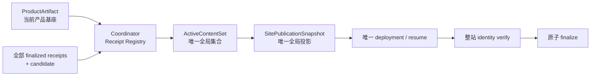

# 当前迭代

## 当前唯一版本：`v0.25.8`

父版本：`v0.25.7` / `5a983e3aca7ce7cb1cab153b50ee0789d698ea76`

## 正式方案

`docs/design/v0.25.8 ContentReleaseReceipt 投影一致性与 active 快照方案.md`

来源：v0.25.7 内容恢复真实 Publish Incident；Didi finalized 后其派生 content manifest 缺少 `publishedSlugs`，阻断后续 Ojai active 快照读取。

## 目标

修复将单条内容 package 的派生 manifest 误当成全局 active 集合，导致后续 active 快照误阻断的问题；建立单条 `ContentReleaseReceipt` → 规范化 `ActiveContentSet` → 整站 `SitePublicationSnapshot` 的唯一物化链，同时保留 v0.25.7 的传播恢复能力。内容运营的 Xing 决策流程保持独立，不进入本产品版本。



## 产品—内容兼容声明

```yaml
contentImpact: compatible
affectedTargets: [content-receipt-registry, active-content-set, site-publication-snapshot, active-snapshot-reader, site-publication-finalize]
affectedRoutes: [/, /products, /business-observations, /observations, /about, /observations/:slug]
affectedFields: [publishedSlugs, activeContentReleaseIds, mediaPaths, snapshotHash, sitePublicationId]
compatibilityEvidence: v0.25.8-receipt-projection-consistency-contract
```

## 范围

- `content-release.json` 与 `completion.json` 形成的 `ContentReleaseReceipt` 是单条内容生命周期唯一事实源；
- Coordinator 从全部 finalized receipts 与 candidate 生成规范化 `ActiveContentSet`，再生成唯一全局 `SitePublicationSnapshot`；单条 package manifest 不再承担全局 active 语义；
- active reader 读取 receipt registry/ActiveContentSet；单条 package 投影只校验自身 identity，缺字段、部分全局快照或 identity 漂移硬失败，不静默丢弃 active；
- 每次发布从当前 ProductArtifact、全部 active receipt 和 candidate 组装完整站点快照；logical identity 只占唯一 lineage slot；
- SitePublication Coordinator 继续负责 lease、唯一 deployment、传播恢复、同 deployment resume、整站验证和原子 finalize；
- Didi 使用现有 `revision-988ae19646556ba9` 保持 released；Ojai `revision-7e65a94afb3333fa` 保持 recoverable；Waymo service 保持 prepared，能力验收后顺序恢复，不改正文或内容身份。

## 明确不做

- 不修改 v0.25.5 tag/history、产品 UI、IA、schema、视觉或内容正文；
- 不让产品 build 读取独立内容根；
- 不让内容 task 直接调用 EdgeOne；
- 不以单次 Deploy Success、HTTP 200 或单页可见替代整站快照证据；
- 不创建第二套发布 CLI、后台 CMS、候选、branch、worktree 或 task。

## Engineering 实现合同

1. finalized receipt 只负责单条内容的 `contentReleaseId`、`packageRevisionId`、`contentHash`、`target`、`baseSiteArtifactId`、review 与自身 public evidence；
2. Coordinator 只从 receipt registry 生成 `ActiveContentSet` 与全局 `content-manifest`；`publishedSlugs`、`activeContentReleaseIds`、`practiceIds`、`mediaPaths` 等全局字段不得来自单条 package；
3. active reader 以 receipt/ActiveContentSet 为事实源，单条投影仅作自身 identity 校验；缺字段、旧投影、部分全局 manifest 或漂移必须保留 recovery 并停止；
4. 快照合并全部 active receipts 与 candidate，同一 logical identity 只占一个 lineage slot，不得由单个 package 清空或覆盖前序 active；
5. 同一 SitePublication 使用唯一 lease、幂等键和原 deployment resume，不重复部署；只有精确整站 publicVerify 后才 finalize 和报告成功；
6. 产品发布只消费 ProductArtifact，内容发布不产生产品版本。

## 验收合同

- Didi finalized 后，其 receipt 被 ActiveContentSet 正确读取；以 Ojai、Waymo service 原 revision 顺序作为 candidate 时，全部既有 active 始终保留；
- 公网 active IDs 与 slug 列表完全对应，新内容页面、身份、媒体和 hash 均可验证；
- replacement lineage、旧投影、部分 manifest、身份漂移均按合同硬失败或可恢复；
- 传播延迟首次验证进入 recoverable，重复 resume 不产生第二个内容身份或 deployment；
- 传播收敛后同一 deployment 可 finalize；永久 mismatch、身份漂移、内容清单不完整不得返回成功；
- 产品版本、内容事实和既有 active 发布证据不被破坏；
- `npm run check`、release/内容专项、closeout、preflight 和真实公网整站验证通过。

## 当前责任

- 产品/视觉：维护本方案并执行提交后验收；
- Engineering 主线：`019fcbf2-20e3-7d51-a4de-87ad7c94b190`，负责实现、自 QA、本地 commit/tag/clean 和持续授权发布；
- 内容及发布主线：`019fa166-9645-7532-87f6-99ae4cf9508a`，能力验收前保留 Didi/Ojai/Waymo 的现有 receipt、revision、recovery/log，不重发、不手改投影；
- Ops：只按采集合同输出候选和运行结果，不参与发布恢复。
