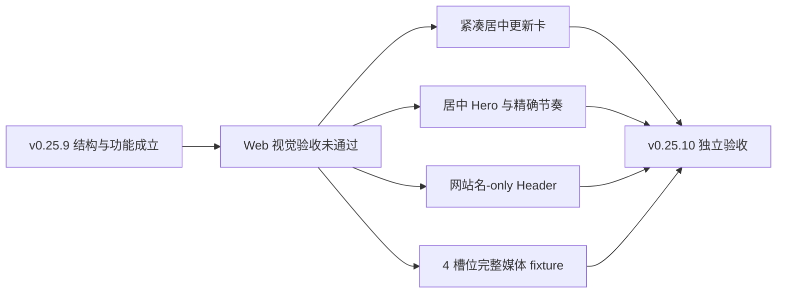

# 当前迭代

## 当前唯一版本：`v0.25.10`

父版本：`v0.25.9` / `36c98daedde4d73904aac0de9302f0d7af7885a7`

## 正式方案

[`docs/design/v0.25.10 Web视觉定稿几何与完整展示验收修正方案.md`](../design/v0.25.10%20Web视觉定稿几何与完整展示验收修正方案.md)

来源：v0.25.9 提交后产品/视觉独立验收未通过；按规则直接形成下一版本，不创建普通候选、不回写旧版本。

## 根本目标

保留 v0.25.9 已完成的统一视觉系统和结构化页面能力，只修正没有精确落地的 Web 视觉稿几何与完整展示验收。



## 产品—内容兼容声明

```yaml
contentImpact: compatible-visual-correction
affectedTargets: [site-header, latest-update-card, product-hero, home-hero, showcase-visual-fixture]
affectedRoutes: [/, /products, /business-observations, /observations, /observations/:slug, /about]
affectedFields: []
compatibilityEvidence: v0.25.10-web-visual-geometry-contract
```

- 不改变 Observation、Article、Practice、Profile 或现有 ContentReleaseIntent；
- 不改变内容 schema、审核、媒体事实、产品/内容发布身份；
- Engineering 只用显式 QA fixture 证明四个独立槽位可引用同一批准媒体；
- 产品公网完整验证后，内容 task 才把同一批准媒体正式绑定到四个独立槽位并核验，不并行 transport。

## Engineering 实现范围

### 保留，不重造

- v0.25.9 的 VisualSystem、PageComposition、ShowcaseFlow、MediaStage、ClosingAction、ResumeActions；
- 冷白/sans/蓝色动作系统；
- 视频可视自动静音循环、离屏暂停、无 controls、点击/Enter 只跳转 Robotaxi；
- About career HTML/PDF 制品、内容独立身份、SitePublication Coordinator。

### 必须修正

1. Header 只显示 `xingbuild` 与一级菜单；移除公开作者副标，不改 IA。
2. LatestUpdateCard 改为 Hero 上方紧凑居中卡；桌面不铺满 shell；公开内容只保留最新更新、Robotaxi 真实版本和查看最新版，commit/核验状态留内部证据。
3. `/products` ProductHero 使用共享中心轴：最大 920px、居中标题/说明/边界/双动作；H1 为 44–56px；Hero 到首模块 72–88px。
4. 首页定位区同步使用中心轴和同一字体节奏，但保持既有内容顺序，不增加 About。
5. Showcase 继续 240–280px 说明 + 48px + 媒体；MediaStage 使用克制两层阴影和 16px 圆角，不加装饰线。
6. QA fixture 中四个独立 mediaId 槽均引用当前批准视频；另行验证 empty fallback；不得在运行时代码建立自动继承。
7. ClosingAction 是与主内容边界对齐的宽幅整体，不退化为孤立按钮；Footer 保持单行且不增加菜单。

## 明确不做

- 不回写或移动 v0.25.9 commit/tag/history；
- 不改内容正文、审核、媒体文件、Robotaxi release、路由、IA、schema 或发布架构；
- 不重做经营观察、短文集合、详情和 About 的内容结构；
- 不创建 branch、worktree、替代 task、第二套视觉系统或新候选；
- 产品完整上线前不通知内容 task 开始正式内容绑定。

## 严格验收顺序

```text
Engineering 实现 + 自 QA
→ local commit/tag/clean
→ 产品/视觉 Web 1600×1067 + 1280 独立验收
→ Web 通过后 Mobile 390×844 + 320/375/768/200% 验收
→ 持续授权 product transport-only publish
→ 公网身份/页面/媒体验证
→ 通知内容 task 正式绑定四槽位并做最终内容页面核验
```

- Web 必须与正式方案中的位置、尺寸、对齐、间距、媒体浮起和按钮合同逐项一致；自动测试通过不替代视觉验收；
- 五路由无旧暖色、纯黑大按钮、装饰线、横向溢出或页面私有视觉；
- 视频媒体与外链行为、键盘、focus-visible、axe、Reduced Motion、console 均通过；
- `npm run check`、`release:prepare`、`release:build`、全量 Sites、closeout、preflight、diff-check 通过。

## 当前责任

- 产品/视觉主线：维护本方案并执行严格 Web → Mobile 独立验收；
- Engineering 主线：`019fcbf2-20e3-7d51-a4de-87ad7c94b190`，canonical direct-local 实现、QA、commit/tag/clean，验收通过后按持续授权发布；
- 内容及发布主线：产品完整上线前保持不动；上线后只做四槽位正式内容绑定和最终页面核验；
- Ops：不参与本产品版本。
