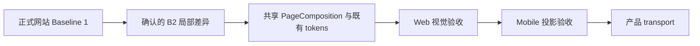

# 当前迭代

## 当前唯一版本：`v0.26.2`

父版本：`v0.26.1` / `e0b1fae8a738a6d442cbd1235b431b530824ca8a`

## 正式方案

[`docs/design/v0.26.2 全站视觉 Baseline 1→2 差异与组件契约方案.md`](../design/v0.26.2%20全站视觉%20Baseline%201%E2%86%922%20差异与组件契约方案.md)

来源：Xing 已确认的 Baseline 1→2 视觉差异稿；当前 v0.26.1 保持冻结，不回写已上线版本。

## 产品目标



- 保持现有冷白、克制、专业的全站视觉；不重造视觉系统。
- 仅收敛首页、B 端产品、经营观察、About 的已确认标题责任、槽位收紧、阅读顺序、行动区布局和辅助色。
- 页面继续由 `SiteShell → PageComposition → 共享组件 → ContentSet slots` 组合，不创建页面私有布局。
- 媒体窗口保留轻微环境阴影；阅读内容和底部行动区不使用媒体同款厚重阴影。
- 产品版本、内容 ContentSet、既有 38-entry 内容事实和独立运营身份保持分离。

## 页面与视觉合同

| ID | 路由 / 组件 | 变更 |
| --- | --- | --- |
| B2-HOME-01 | `/` / ProductHeading | `最新作品` 与 `Robotaxi 运营平台` 使用现有 `--space-1`（4px）紧邻，不创建新 section |
| B2-HOME-02 | `/` / ClosingAction | 产品内容后保留既有浅色行动区，不新增边框或媒体阴影 |
| B2-HOME-03 | `/` / ObservationRail | 使用 `最新观察简讯`，最后增加 `更多观察`，不改正文和来源 |
| B2-PRODUCT-01 | `/products` / LatestUpdateCard | 保留 `NEW + v... + 查看最新版`，链接使用已登记 Robotaxi 地址 |
| B2-PRODUCT-02 | `/products` / ProductHero | 空眉题、空边界说明自动收紧；槽位和 schema 能力保留 |
| B2-PRODUCT-03 | `/products` / ShowcaseModule | 手机端说明→媒体；同模块 `20–24px`，跨模块 `56–72px`；空 label 不留占位 |
| B2-PRODUCT-04 | `/products` / ClosingAction | 桌面左右、手机上下；操作按钮等宽单行 |
| B2-OBS-01 | `/business-observations` / PageHeader + ObservationRail | 左 `经营观察`、右 `最新简讯` 平齐；`企业经营体系`仅为文章标题 |
| B2-ABOUT-01 | `/about` / RichDocument | 保持连续阅读和近乎平面的冷白表面，不新增卡片或私有布局 |
| B2-GLOBAL-01 | 全站 / shared tokens | 辅助文字统一为 `#64748B`，不换字体家族和主色 |

未列入表格的页面、组件、字段、间距、颜色、媒体、内容和路由保持 Baseline 1。

## 产品—内容兼容声明

```yaml
contentImpact: compatible
contentImpactReason: visual-layout-and-token-only
affectedTargets: [home, practice, article, businessObservation, profile, observation]
affectedRoutes: [/, /products, /business-observations, /observations, /about]
affectedFields: [page-heading-slot, observation-rail-heading, closing-action-layout, shared-muted-text-token]
compatibilityEvidence: v0.26.2-baseline-1-2-delta
```

本版本不修改 ContentSet、正文、审核、来源、媒体或产品版本之外的内容事实；内容 task 不需要重新准备或重发既有内容。

## Engineering 合同

1. 复用既有 `PageComposition`、`ShowcaseModule`、`ObservationRail`、`RichDocument`、`ClosingAction` 和 tokens；不新增第二套 CSS 或页面私有布局。
2. 空眉题、空边界、空 label 使用条件渲染自动收紧，不用 `visibility:hidden` 保留空白。
3. 首页与 `/products` 继续读取同一套 B 端结构化对象；只允许已登记标题和 CTA 的页面投影差异。
4. `--shadow-media` 只用于 `MediaStage`；Brief、长文、观察集合、About 和 ClosingAction 不复用媒体阴影。
5. 每页保持一个 H1；经营观察页面标题、观察栏标题和文章标题责任分离。
6. 版本号继续读取真实 Robotaxi 产品版本事实，不由内容 task 管理。
7. 不修改 ContentSet、内容发布、ProductArtifact、SiteSnapshot、SitePublication 或 Coordinator 逻辑。

## 验收顺序

```text
Engineering 实现与分层 QA
→ v0.26.2 commit/tag/clean
→ final build + ProductArtifact preflight
→ xingbuild-visual-ux-review Web 验收
→ Mobile 投影验收
→ 既有持续授权 product transport / 公网验证
→ 内容保持既有 active，不重发
```

## 验收标准

- Web `1600×1067`、Mobile `390×844`、窄屏 `320px` 和等效 200% 缩放无横向溢出。
- 五路由 `/`、`/products`、`/business-observations`、`/observations`、`/about` 每页一个 H1、无控制台错误。
- 首页顺序为 `最新作品 → Robotaxi 运营平台 → ClosingAction → 最新观察简讯 → 更多观察`。
- `/products` 的版本入口跳转 Robotaxi；四模块说明、媒体和空槽位关系正确；手机端 ClosingAction 上下排列。
- `/business-observations` 左右标题平齐；`企业经营体系`不承担页面 H1。
- `/about` 连续阅读稳定；阅读面没有媒体同款厚重浮起。
- 键盘焦点、可访问名称、Reduced Motion、自然换行通过。
- 38-entry active ContentSet、33 条观察、article/profile/businessObservation/practice 身份不变；不运行内容发布。

## 明确不做

- 不回写 v0.26.1 或更早 tag/history。
- 不复制参考站品牌，不引入纸张式大卡片、装饰线、纯黑按钮、厚重阴影或炫光。
- 不改产品定位、业务事实、路由、IA、schema、ContentSet、正文、审核、媒体或发布架构。
- 不创建并行 task、branch、worktree、scheduler 或第二套发布器。

## 当前责任

- 产品/视觉主线：维护本方案，执行 Web→Mobile `xingbuild-visual-ux-review` 和公网产品验收；
- Engineering 主线：`019fcbf2-20e3-7d51-a4de-87ad7c94b190`，按本合同实现、测试、commit/tag、final build 和 preflight；
- 内容及发布主线：继续独立管理已上线 ContentSet；本版本不要求重发内容；
- Ops：继续只负责采集、去重和 EvidenceCandidate，不参与产品版本。
