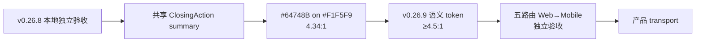

# 当前迭代

## 当前唯一版本：`v0.26.9`

父版本：`v0.26.8` / `ae3820f45b6cddad57bc2301f318f0faf10ce396`

## 正式方案

[`docs/design/v0.26.9 ClosingAction 浅色表面对比度收口方案.md`](../design/v0.26.9%20ClosingAction%20浅色表面对比度收口方案.md)

来源：v0.26.8 产品/视觉独立验收阻断 `V268-COLOR-CONTRAST-CLOSING-SUMMARY`。v0.26.8 保持不可变，不回写已提交版本。

## 产品目标



- 保持 v0.26.8 已通过的全站冷白视觉、Home/Products 独立页面架构、B-01/B-02、CTA 尺寸、媒体能力和经营观察页面投影。
- 只在共享 tokens 与 ClosingAction 组件责任边界内修复浅色表面次级文字对比度。
- 不改变全站 muted 视觉基线，不新增页面、路由、内容字段、媒体能力或发布能力。

## Engineering 合同

1. 新增共享语义 token `--color-text-muted-on-subtle: #526277`，在 `#F1F5F9` 上对比度约 `5.68:1`。
2. `.closing-action p:not(.eyebrow)` 使用该 token；不修改全站 `--color-text-muted: #64748B`。
3. 保持 v0.26.8 的 Home B-01、B-02、页面投影独立、CTA、媒体、键盘和 Reduced Motion 合同。
4. 不修改 ContentSet、正文、审核、来源、媒体、content CLI、Coordinator、ProductArtifact、SiteSnapshot、SitePublication 或内容发布事实。

## 产品—内容兼容声明

```yaml
contentImpact: compatible
contentImpactReason: shared-closing-summary-surface-contrast-only
affectedTargets: [home, practice]
affectedRoutes: [/, /products]
affectedFields: [closing-summary-surface-text-color]
compatibilityEvidence: v0.26.8-local-axe-V268-COLOR-CONTRAST-CLOSING-SUMMARY
```

本版本不运行内容 prepare/build/transport/finalize，不创建内容身份，不改 active ContentSet；内容 task 和 Ops 保持独立。产品 transport 时，Site Publication 仍只由 Coordinator 读取 ProductArtifact 与 active ContentSet 组装。

## 验收门禁

- 视口：`1600×1067`、`1280×1067`、`390×844`、`320×844`，必要时等效 200% CSS 视口。
- 路由：`/`、`/products`，并回归 `/business-observations`、`/observations`、`/about`。
- 五路由 axe 对比度 violations=0；Closing summary 对比度 `≥4.5:1`。
- Home B-01、Home/Products B-02、页面投影独立、CTA 等宽、视频、空内容、键盘、Reduced Motion 和五路由无溢出保持通过。
- `npm run check`、`release:prepare`、页面/视觉专项、`release:build`、`release:closeout-check`、`release:preflight`、`git diff --check`，以及 `content:check`、`article:check`、`practice:check` 通过；既有 retained fixture/environment failures 分层报告。
- 产品/视觉本地 `xingbuild-visual-ux-review` Approve 后才 transport；公网完成后 design-ui 复验；内容不重发。

## 当前责任

- 产品/视觉主线：维护本方案并执行本地、公网视觉验收。
- Engineering 主线：`019fcbf2-20e3-7d51-a4de-87ad7c94b190`，按本合同实现、测试、commit/tag、build、preflight 和 product transport。
- 内容及发布主线：保持现有 ContentSet，不参与本版本，不因本版本重新 prepare/build/transport。
- Ops：继续只负责采集和 EvidenceCandidate，不参与产品版本。
