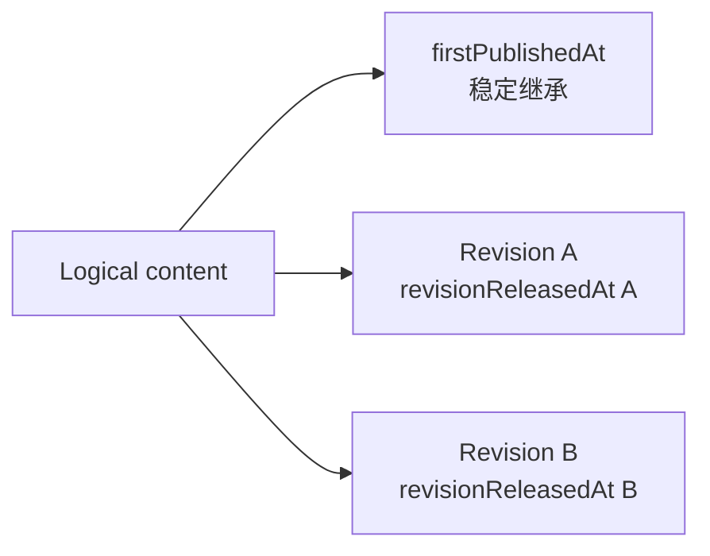

# 当前迭代

## 当前唯一版本：`v0.25.14`

父版本：`v0.25.13` / `e63ff943d4d17b2a8fdf61c4bd59dd070d9904e3`

## 正式方案

[`docs/design/v0.25.14 内容首次发布与修订发布时间分层方案.md`](../design/v0.25.14%20内容首次发布与修订发布时间分层方案.md)

来源：v0.25.13 上线后，Robotaxi 四槽原子 ChangeSet 已完成 prepare/build；replacement 把旧 active 的历史 `publishedAt` 与尚未上线 candidate 的空时间作相等比较，错误阻断合法后继修订。按 Product Incident 直接形成下一版本。

## 根本目标

把 logical content 的首次公开时间与 package revision 的本次发布完成时间分离，确保内容更新自动继承历史身份，而不是由运营手工复制时间。



## 产品—内容兼容声明

```yaml
contentImpact: compatible
contentImpactReason: logical-first-published-and-revision-release-time-separation
affectedTargets: [content-release-receipt, content-replacement, site-publication-finalize]
affectedRoutes: [/products]
affectedFields: [firstPublishedAt, revisionReleasedAt, publishedAt]
compatibilityEvidence: v0.25.14-content-publication-time-contract
```

- 不改变内容正文、审核、媒体资产或四槽产品结构；
- 不放宽 logical identity、lineage、active receipt 或公网验证门禁；
- 产品完整上线前内容 task 保留现有 recoverable package，不重试。

## Engineering 实现范围

1. `firstPublishedAt` 归属 logical content，首次 finalize 确定，后继 revision 自动继承且不可改写。
2. `revisionReleasedAt` 归属 package revision，只在本 revision 公网验证并 finalize 后生成。
3. 旧 `publishedAt` 兼容解释/投影为 `firstPublishedAt`；不迁移、不回写历史 receipt。
4. replacement candidate 的空 revision 时间合法；显式不同 firstPublishedAt 硬失败。
5. receipt/completion/package/public projection 与 Coordinator finalize 使用唯一时间 resolver。
6. resume 必须复用现有四槽 package/revision/ChangeSet/contentHash，不重新 prepare/build。
7. 保持 v0.25.13 全部产品视觉、页面、内容和发布结果。

## 明确不做

- 不回写或移动 v0.25.13 commit/tag/history；
- 不让内容 task 手工修改时间或 manifest；
- 不重建四槽内容 package，不改 UI、视觉、IA、schema、正文、媒体、hash、review；
- 不运行内容发布，不重发其他 active 内容；
- 不创建 branch、worktree、task、候选或第二套发布时间。

## 验收顺序

```text
Engineering 实现、自 QA、commit/tag/clean
→ 产品/视觉合同 + 视觉保持性验收
→ 持续授权 product publish
→ 产品公网完整验证
→ 内容 task resume 现有四槽 package
```

- 旧 active publishedAt → firstPublishedAt 兼容读取；candidate null 合法继承；篡改硬失败；
- finalize 生成独立 revisionReleasedAt，历史 firstPublishedAt 不变；
- active=34、Practice slot=1、Observation=33；
- v0.25.13 视觉、四槽、五路由、媒体和可访问性保持；
- check、release:prepare/build、全量 Sites、closeout、preflight、diff-check 通过。

## 当前责任

- 产品/视觉主线：维护方案并按正式合同与 `xingbuild-interface-review` 双门禁验收；
- Engineering 主线：`019fcbf2-20e3-7d51-a4de-87ad7c94b190`，canonical direct-local 实现、版本闭环及验收后持续授权发布；
- 内容及发布主线：保留 Incident 与 `practice-robotaxi-604214b3bfddf09f`，产品上线后仅 resume；
- Ops：不参与本产品版本。
