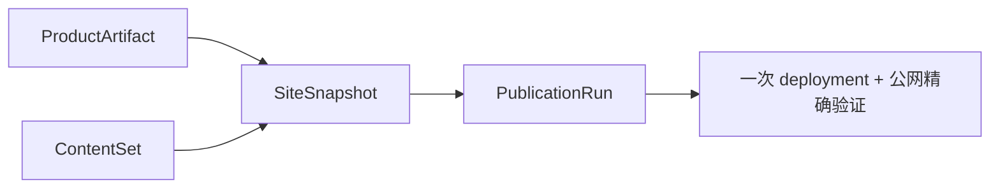

# 当前迭代

## 当前唯一版本：`v0.26.0`

父版本：`v0.25.19` / `43ab99bea9b3221c3a912bc66102b6491f024284`

## 正式方案

[`docs/design/v0.26.0 发布内核与 ContentSet 架构重构方案.md`](../design/v0.26.0%20发布内核与%20ContentSet%20架构重构方案.md)

来源：v0.25.18–v0.25.19 连续发布 Incident，以及对现有 Registry、receipt、lineage、projection 和 SitePublication 运行时多重权威的结构性复盘。

## 产品目标



- 产品、视觉、Engineering 和内容运营身份与生命周期保持独立；
- 产品发布复用 active ContentSet；内容发布复用 ProductArtifact；
- 每次物理上线只组装一个 SiteSnapshot，使用一个 Coordinator、一个 deployment 和一份公网证据；
- 失败可恢复或整站回滚，不再运行时推导逐条内容 lineage；
- 页面继续使用 PageDefinition → PageComposition → 共享 Capability → Content Slots；本版本不改 UI/IA/视觉。

## Engineering 合同

1. 建立 `ContentSet` 唯一 active 内容集合，覆盖所有公开内容类型，并完成 `home` 首页入口迁移。
2. 使用 `.content-workspace/content-state/sets/<contentSetId>/content-set.json` 与原子 `active.json` 指针。
3. 旧 receipts、ContentSlotRegistry、PublicationLineageBinding、projection 和 package 只读保留为迁移/审计证据，不再进入正常运行路径。
4. 所有产品/内容入口统一委托现有 Site Publication Coordinator；不保留第二条 EdgeOne 执行路径。
5. 最终 commit/tag 后生成 ProductArtifact；`release:preflight` 必须精确校验 ProductArtifact 与 HEAD/tag。
6. 实现一次性本地 active + 公网 manifest 双向核对迁移；只导入当前公网已验证内容，已审核未上线内容保留 Candidate。
7. 实现 SiteSnapshot、PublicationRun、resume、publicVerify、atomic finalize 和整站 rollback。

## 产品—内容兼容声明

```yaml
contentImpact: compatible
contentImpactReason: contentset-site-snapshot-kernel-rebuild
affectedTargets: [content-set, home-content-adapter, site-snapshot, publication-run, coordinator, release-preflight]
affectedRoutes: [/, /products, /business-observations, /observations, /about]
affectedFields: [contentSetId, contentSetHash, productArtifactId, siteSnapshotId, snapshotHash]
compatibilityEvidence: v0.26.0-contentset-slot-contract-and-migration
```

## 验收顺序

```text
Engineering 实现与分层 QA
→ v0.26.0 commit/tag/clean
→ final build + ProductArtifact preflight
→ 产品/视觉用同一 ProductArtifact 验收
→ product transport / 公网完整验证
→ 通知内容 task 恢复 ContentSet Candidate 运营
```

## 明确不做

- 不回写 v0.25.19 及更早 tag/history；
- 不继续为旧 lineage、slot、projection 增加局部补丁；
- 不修改 UI、IA、schema、内容正文、审核、媒体或既有视觉合同；
- 不自动发布已审核但尚未上线的内容；
- 不创建并行 task、branch、worktree、scheduler 或第二套 Coordinator。

## 当前责任

- 产品/视觉主线：维护本方案，执行 ProductArtifact 与公网视觉验收；
- Engineering 主线：`019fcbf2-20e3-7d51-a4de-87ad7c94b190`，按本合同实现、测试、commit/tag、final build 和 preflight；
- 内容及发布主线：在 v0.26.0 产品公网完整验证后，迁移到 ContentSet Candidate 流程；
- Ops：继续只负责采集、去重和 EvidenceCandidate，不参与产品版本。
