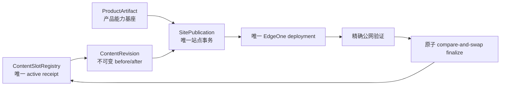

# 当前迭代

## 当前唯一版本：`v0.25.16`

父版本：`v0.25.15` / `084148068860dad6ddb7288fed51b15f618521bd`

## 正式方案

[`docs/design/v0.25.16 内容活动槽位注册表与原子替换发布架构方案.md`](../design/v0.25.16%20内容活动槽位注册表与原子替换发布架构方案.md)

来源 Incident：`CONTENT-BLOCK-ROBOTAXI-REPLACEMENT-SLOT-001`。

v0.25.15 已完成产品基座上线与 kind-specific lifecycle adapter，但现有四槽 Practice replacement 无法从真实 active legacy receipt 解析 predecessor。v0.25.16 将该问题提升为统一活动槽位、legacy 迁移与原子替换架构，不再增加单点 Incident 门禁。

## 根本目标



产品与内容保持独立生命周期；共享物理站点只在 Coordinator 处串行部署。内容不因产品版本变化而改稿或重审；不兼容时产品发布前硬失败并形成 Product Incident。

## 产品—内容兼容声明

```yaml
contentImpact: compatible
contentImpactReason: canonical-active-slot-registry-and-atomic-replacement
affectedTargets: [content-slot-registry, content-lineage, site-publication-coordinator, legacy-migration]
affectedRoutes: [/products]
affectedFields: [logicalContentId, activeReceiptId, predecessorReceiptId, packageRevisionId, snapshotHash]
compatibilityEvidence: v0.25.16-active-slot-registry-contract
```

- 不修改内容正文、审核、媒体、四槽页面结构或既有发布身份；
- 不重建 `practice-robotaxi-604214b3bfddf09f`、不改变其 ChangeSet/hash；
- 不在 v0.25.15 上继续 transport；
- 只有 Coordinator 能组装站点、调用 EdgeOne、写 SitePublication 和推进 active registry。

## Engineering 正式实现范围

1. 建立版本化 `ContentSlotRegistry` 与 repository；一个 `logicalContentId` 只能有一个 active receipt。
2. 建立 legacy migration：把现有 finalized receipts/released packages 导入 registry；冲突时硬失败，不猜测。
3. active resolver 自动生成真实 `predecessorReceiptId`；candidate 不得自填或自指 `supersedesPackageId`。
4. 保留 v0.25.15 `ContentLifecycleAdapter`，但 adapter 只负责 kind-specific source/review/recovery；跨 kind lineage 由 registry 统一负责。
5. SitePublication finalize 使用 predecessor compare-and-swap；active 已变化时停止，不覆盖、不重试第二身份。
6. 所有 manifest/projection 只能由 immutable registry + revision + ProductArtifact snapshot 生成，不能作为事实源。
7. 对 `revision-9bb22df0f30845e8` 提供兼容恢复；不重建内容、媒体、ChangeSet 或 logical identity。
8. 增加真实历史 package corpus、legacy replacement、并发 active、传播延迟、stale lease、部分 projection、失败不污染 active 等契约测试。

## 验收顺序

```text
Engineering 实现 + 历史 package corpus QA
→ local commit/tag/clean
→ 产品/视觉能力验收
→ v0.25.16 ProductArtifact transport
→ 公网完整验证
→ 内容 task resume 现有四槽 package
→ 四个媒体槽逐项公网验证
```

必须证明：现有四槽 package 不重建即可完成 replacement；失败保留旧 34 条 active；同一 publication resume 不重复 deployment；产品与内容身份继续分离。

## 明确不做

- 不继续按 Incident 增加临时字段门禁；
- 不创建第二套 Coordinator、lifecycle、registry、task、branch、worktree 或 scheduler；
- 不引入 CMS、微服务、消息总线或通用云平台；
- 不修改 UI、IA、schema、视觉、正文、审核、媒体、v0.25.15 tag/history。

## 当前责任

- 产品/视觉主线：维护本正式架构合同，并按 `xingbuild-interface-review` 做页面保持性验收；
- Engineering 主线：`019fcbf2-20e3-7d51-a4de-87ad7c94b190`，只按本合同在 canonical direct-local 实现并完成版本闭环；
- 内容及发布主线：冻结 `revision-9bb22df0f30845e8`，不得 transport/retry/手改事实，待 v0.25.16 产品能力上线后恢复；
- Ops：不参与本产品版本。
