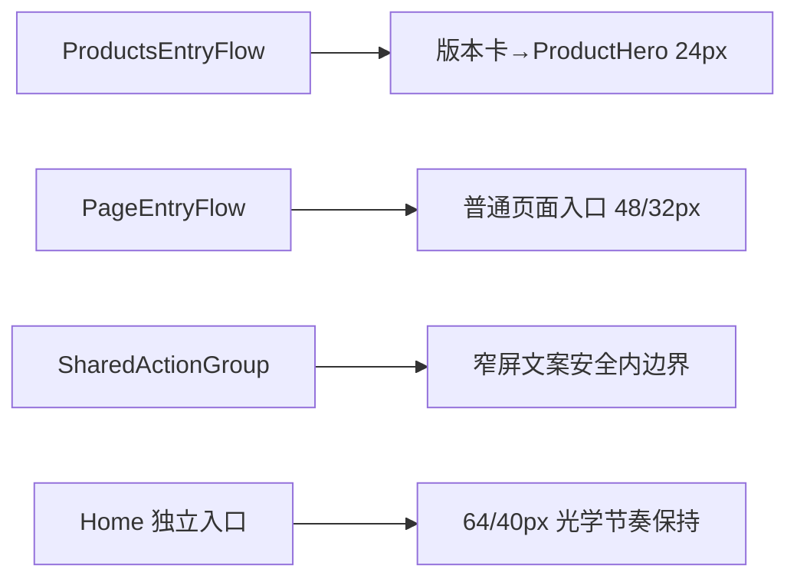

# 当前迭代

## 当前唯一版本：`v0.26.11`

父版本：`v0.26.10` / `253d1d964338bb6f0bb9a53ac272a955f2e2ecb8`

## 正式方案

[`docs/design/v0.26.11 公网视觉差异收口方案.md`](../design/v0.26.11%20公网视觉差异收口方案.md)

来源：v0.26.10 已发布后的 design-ui 公网独立验收，阻断 `V02610-PUBLIC-01`～`03`。本版本只收口三项视觉关系，不回写 v0.26.10。

## 产品目标



- 修复 `/products` 移动端版本卡到标题的双重上边距。
- 固定普通页面页眉到首内容入口的全局 `48/32px` 基线，首页 `64/40px` 保持独立。
- 让共享 `ActionGroup` 在 `320px` 窄屏对最长 CTA 保持等宽、单行和至少 `4px` 文字安全内边距。
- 保持 Home/Products 独立 IA、ContentSet、媒体能力、发布协调器和内容运营边界。

## Engineering 合同

1. `/products`：LatestUpdateCard 底部→Robotaxi 标题顶部 Web/Mobile/窄屏均 `24px ±1px`；关系由单一 Products entry-flow owner 控制，不叠加 ProductHero 移动上内边距。
2. `/products`、`/business-observations`、`/observations`、`/about`：页眉底部→首个真实内容锚点 Web `48px ±1px`、Mobile/窄屏 `32px ±1px`；首页入口仍为 `64/40px`。
3. `/products` `320px`：CTA 等宽、单行；最长 CTA Range 完整位于按钮内容边界内，左右各至少 `4px` 安全内边距；使用共享 ActionGroup token，不得页面私有缩放/换行/负 margin。推荐窄屏 label `14px`、水平 padding `8px`，等价实现必须提供 DOM Range 证据。
4. 保持 v0.26.10 已通过的 Home 节奏、Business 层级、ClosingAction `96/56px`、Products 标题→说明 `16px`、说明→CTA `24px`、页面独立 IA、视频和安全外链。
5. 优先复用既有 tokens/flow；不得新建第二套样式系统或改变内容 slot 合同。

## 产品—内容兼容声明

```yaml
contentImpact: compatible
contentImpactReason: public-visual-spacing-contract-only
affectedTargets: []
affectedRoutes: [/, /products, /business-observations, /observations, /about]
affectedFields: []
compatibilityEvidence: v0.26.10-content-set-and-content-cli-unchanged
```

本版本不运行内容 prepare/build/transport/finalize，不创建内容身份，不改 active ContentSet；内容及 Ops 继续独立工作。

## 验收门禁

- 五路由、四视口 `1600×1067/1280×1067/390×844/320×844`；Observations/About 的 `1280px` 必须单独截图和量测。
- V11-01/V11-02 所有间距误差 `≤1px`；V11-03 记录按钮 rect、文字 Range、左右安全内边距。
- overflow=false、main=1、h1=1、console/page errors=0；Home `64/40` 等既有节奏不回归。
- 四视频 autoplay/muted/loop/no-controls、外链、键盘 focus、Reduced Motion、axe 无新增 violation。
- `npm run check`、`release:prepare`、视觉/交互 QA、`release:build`、`release:closeout-check`、`release:preflight`、`git diff --check` 通过；既有 retained failures 分层报告。
- exact HEAD ProductArtifact 后产品/视觉本地 Approve 才可 transport；公网完成后 design-ui 独立公网验收；内容不重发。

## 当前责任

- 产品/视觉主线：维护 v0.26.11 方案并执行 Web→Mobile 本地、公网视觉验收。
- Engineering 主线：`019fcbf2-20e3-7d51-a4de-87ad7c94b190`，按本合同实现、测试、commit/tag、build、preflight 和 product transport。
- 内容及发布主线：保持现有 ContentSet，不参与本版本，不因本版本重新 prepare/build/transport。
- Ops：继续只负责采集和 EvidenceCandidate，不参与产品版本。
