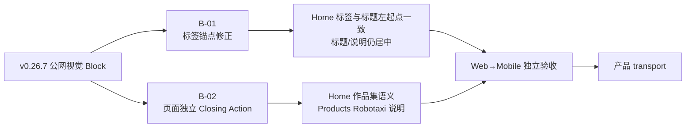

# 当前迭代

## 当前唯一版本：`v0.26.8`

父版本：`v0.26.7` / `763861c57b9047b863841300c8d9acb4aa05bedf`

## 正式方案

[`docs/design/v0.26.8 首页作品锚点与 Product Presentation Closing Action 方案.md`](../design/v0.26.8%20首页作品锚点与%20Product%20Presentation%20Closing%20Action%20方案.md)

来源：v0.26.7 design-ui 公网视觉验收阻断 `B-01/H-02`、`B-02/H-09/S-04`。v0.26.7 保持不可变，不回写已上线版本。

## 产品目标



- 保持 v0.26.7 已通过的全站冷白视觉、Home/Products 独立页面架构、CTA 尺寸、媒体能力和经营观察页面投影。
- Home 只修正“最新作品”标签的产品内容区锚点，不改变 Robotaxi 标题/说明的居中视觉。
- Home 与 `/products` 各自补齐页面语义，不共享页面级 Closing Action、CTA 或生命周期。
- 不新增页面、路由、内容字段、媒体能力或发布能力。

## Engineering 合同

1. Home `最新作品` 与 Robotaxi 标题左起点误差 `≤1px`，垂直 gap=4px；Robotaxi 标题和说明保持 `text-align:center`。
2. Home Closing Action 使用本方案确认的“查看我的最新作品”标题与作品集说明；操作仍进入已登记 Robotaxi 入口。
3. `/products` Closing Action 显示 Robotaxi 标题和现有已登记 `closing.summary` 说明槽位；两页均不显示默认“继续进入”。
4. Home 与 `/products` 页面投影、布局、组件组合、交互语义和生命周期独立；只共享 content resolver、基础组件、tokens、媒体安全链接和 empty fallback。
5. 不修改 ContentSet、正文、审核、来源、媒体、content CLI、Coordinator、ProductArtifact、SiteSnapshot、SitePublication 或内容发布事实。

## 产品—内容兼容声明

```yaml
contentImpact: compatible
contentImpactReason: page-local-product-presentation-projection-only
affectedTargets: [home, practice]
affectedRoutes: [/, /products]
affectedFields: [home-latest-work-anchor, home-product-closing-title, home-product-closing-summary, practice-product-closing-summary-projection]
compatibilityEvidence: v0.26.7-public-visual-block-B01-B02
```

本版本不运行内容 prepare/build/transport/finalize，不创建内容身份，不改 active ContentSet；内容 task 和 Ops 保持独立。产品 transport 时，Site Publication 仍只由 Coordinator 读取 ProductArtifact 与 active ContentSet 组装。

## 验收门禁

- 视口：`1600×1067`、`1280×1067`、`390×844`、`320×844`，必要时等效 200% CSS 视口。
- 路由：`/`、`/products`，并回归 `/business-observations`、`/observations`、`/about`。
- Home 标签/title 左起点误差 `≤1px`、gap=4px、标题/说明居中；Home/Products Closing Action 文案、说明槽位、外链和无默认重复文案均正确。
- Home 与 `/products` 页面投影静态独立；CTA 等宽、视频、空内容、键盘、Reduced Motion 和五路由无溢出保持通过。
- `npm run check`、`release:prepare`、页面/视觉专项、`release:build`、`release:closeout-check`、`release:preflight`、`git diff --check`，以及 `content:check`、`article:check`、`practice:check` 通过；既有 retained fixture/environment failures 分层报告。
- 产品/视觉本地 `xingbuild-visual-ux-review` Approve 后才 transport；公网完成后 design-ui 复验；内容不重发。

## 当前责任

- 产品/视觉主线：维护本方案并执行本地、公网视觉验收。
- Engineering 主线：`019fcbf2-20e3-7d51-a4de-87ad7c94b190`，按本合同实现、测试、commit/tag、build、preflight 和 product transport。
- 内容及发布主线：保持现有 ContentSet，不参与本版本，不因本版本重新 prepare/build/transport。
- Ops：继续只负责采集和 EvidenceCandidate，不参与产品版本。
