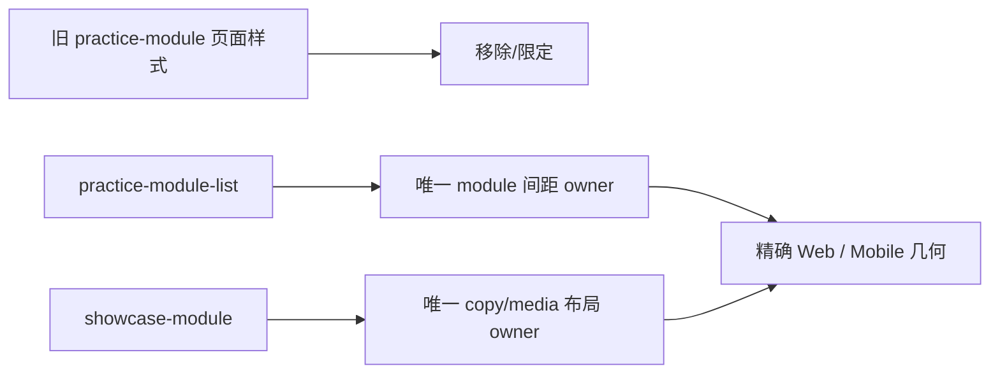

# 当前迭代

## 当前唯一版本：`v0.25.11`

父版本：`v0.25.10` / `0c68cc4e1e7077fbfed6a46622fd887dcb25a421`

## 正式方案

[`docs/design/v0.25.11 Showcase间距单一责任与视觉验收收口方案.md`](../design/v0.25.11%20Showcase间距单一责任与视觉验收收口方案.md)

来源：v0.25.10 提交后产品/视觉独立验收发现共享 Showcase 新旧 CSS 责任冲突；按规则直接形成下一版本，不回写旧版本、不创建普通候选。

## 根本目标

保留 v0.25.10 已通过的全部视觉与功能，只让 Showcase 间距拥有唯一 owner，消除页面旧样式覆盖和重复计距。



## 产品—内容兼容声明

```yaml
contentImpact: compatible-style-ownership-correction
affectedTargets: [showcase-module, practice-module-list, visual-regression]
affectedRoutes: [/, /products]
affectedFields: []
compatibilityEvidence: v0.25.11-showcase-spacing-single-owner-contract
```

- 不改变内容对象、字段、审核、媒体事实或 ContentReleaseIntent；
- 不改变产品/内容发布身份或 SitePublication；
- 产品完整上线前内容 task 保持不动。

## Engineering 实现范围

### 保留

- v0.25.10 的紧凑更新卡、居中 ProductHero、网站名-only Header、首页中心轴；
- 冷白/sans/蓝色动作系统、媒体浮起、四槽位 QA fixture 与正常 empty 状态；
- 视频可视自动播放、离屏暂停、无 controls、点击/Enter 只跳转；
- 经营观察、短文、About、ResumeArtifact 和发布架构。

### 根修正

1. `.showcase-module` 唯一拥有内部 grid 和 copy→media gap：Web 48px；Mobile 20–24px。
2. `.practice-module-list` 唯一拥有 module→module gap：Web 96–120px；Mobile 56–72px。
3. 移除或限定旧 `.practice-module` grid/gap，不能覆盖共享组件。
4. 删除 sibling margin 与 container gap 的双重计距；禁止负 margin 或 specificity 补丁。
5. 新增 computed geometry 回归，直接断言以上四个区间。

## 明确不做

- 不回写或移动 v0.25.10 commit/tag/history；
- 不重新设计或改动其他已通过视觉；
- 不改正文、媒体、路由、IA、schema、内容运营或 Coordinator；
- 不创建 branch、worktree、task、候选或第二套样式系统。

## 验收顺序

```text
Engineering 实现、自 QA、commit/tag/clean
→ 产品/视觉 Web 1600+1280 复验
→ Mobile 390+320/375/768/200% 复验
→ 持续授权 product publish
→ 公网验证
→ 通知内容 task 四槽位正式内容绑定与最终核验
```

- Web copy→media=48px；module→module=96–120px；
- Mobile copy→media=20–24px；module→module=56–72px；
- 其余 v0.25.10 验收结果全部保持；
- 全量项目、视觉、媒体、可访问性、closeout、preflight、diff-check 通过。

## 当前责任

- 产品/视觉主线：维护本方案并执行独立 Web→Mobile 复验；
- Engineering 主线：`019fcbf2-20e3-7d51-a4de-87ad7c94b190`，canonical direct-local 实现与版本闭环；验收通过后按持续授权发布；
- 内容及发布主线：产品完整上线前保持不动；上线后再执行四槽位正式绑定和最终页面核验；
- Ops：不参与本产品版本。
