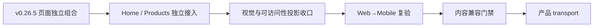

# 当前迭代

## 当前唯一版本：`v0.26.6`

父版本：`v0.26.5` / `8f219394c25a4527cd128c6b9b0d2cee873fcf7f`

## 正式方案

[`docs/design/v0.26.6 视觉验收收口与经营观察页面投影方案.md`](../design/v0.26.6%20视觉验收收口与经营观察页面投影方案.md)

来源：v0.26.5 独立视觉验收的 S-02、H-02、H-06/H-07/H-08/H-14、S-10、S-11 与 accessibility evidence 阻断；v0.26.4 保持冻结，不回写已上线版本。

## 产品目标



- 继承 v0.26.3 已上线的冷白、克制、专业全站视觉，不重造视觉系统。
- 在已解除页面编排耦合的基础上，收口 Home Hero、经营观察页面投影和无障碍证据。
- 页面继续由 `SiteShell → PageComposition → 共享组件 → ContentSet slots` 组合，不创建页面私有布局。
- 产品版本、ContentSet、既有 38-entry 内容事实和独立运营身份保持分离。

## 页面与视觉合同

本版本正式合同见 [v0.26.6 视觉验收收口与经营观察页面投影方案](../design/v0.26.6%20视觉验收收口与经营观察页面投影方案.md)。

| ID | 路由 / 组件 | 变更 |
| --- | --- | --- |
| H-02 | `/` / 产品内容区标签 | `最新作品` 位于产品内容区左上角，与 `Robotaxi运营平台` 4px 紧邻；不在 Hero 中轴，不留空白 |
| OA-02 | 首页与产品页 / Hero ActionGroup | 同组按钮共享等宽能力，移动保持单行 |
| OA-03 | `/products` / ShowcaseModule | `group===label` 时隐藏重复视觉 label，保留字段能力 |
| OA-04 | `/products` / ProductHero + ClosingAction | 空 boundary、默认 eyebrow、重复摘要自动收紧 |
| OA-05 | 全站 / MediaStage | 仅媒体使用单层轻阴影，其他内容保持平面 |
| B2-HOME-02 | `/` / ClosingAction | 产品内容后保留既有浅色行动区，不新增边框或媒体阴影 |
| B2-HOME-03 | `/` / ObservationRail | 使用 `最新观察简讯`，最后增加 `更多观察`，不改正文和来源 |
| B2-PRODUCT-01 | `/products` / LatestUpdateCard | 保留 `NEW + v... + 查看最新版`，链接使用已登记 Robotaxi 地址 |
| B2-PRODUCT-02 | `/products` / ProductHero | 空眉题、空边界说明自动收紧；槽位和 schema 能力保留 |
| B2-PRODUCT-03 | `/products` / ShowcaseModule | 手机端说明→媒体；同模块 `20–24px`，跨模块 `56–72px`；空 label 不留占位 |
| B2-PRODUCT-04 | `/products` / ClosingAction | 桌面左右、手机上下；操作按钮等宽单行 |
| B2-OBS-01 | `/business-observations` / PageHeader + ObservationRail | 左 `经营观察`、右 `最新简讯` 平齐；`企业经营体系`仅为文章标题 |
| B2-ABOUT-01 | `/about` / RichDocument | 保持连续阅读和近乎平面的冷白表面，不新增卡片或私有布局 |
| B2-GLOBAL-01 | 全站 / shared tokens | 辅助文字统一为 `#64748B`，不换字体家族和主色 |

未列入表格的页面、组件、字段、间距、颜色、媒体、内容和路由保持 Baseline 1。

## 产品—内容兼容声明

```yaml
contentImpact: compatible
contentImpactReason: visual-projection-and-accessibility-only
affectedTargets: [home, practice, article, businessObservation]
affectedRoutes: [/, /products, /business-observations, /observations, /about]
affectedFields: [home-action-group-alignment, home-product-label-anchor, business-observation-heading, article-summary-projection, figure-projection, accessibility-contrast]
compatibilityEvidence: v0.26.5-independent-visual-block
```

本版本不修改 ContentSet、正文、审核、来源、媒体或产品版本之外的内容事实；内容 task 不需要重新准备或重发既有内容。v0.26.4 继续在线，v0.26.5 不 transport。

## Engineering 合同

1. 保留 v0.26.5 的 `HomeProductProjection` 与 `ProductsShowcase` 独立页面组合，不回退到共享页面级编排器。
2. Home 的 `最新作品` 独立左上锚定，ProductHero 标题/说明独立居中；Hero ActionGroup 桌面中心与主视觉轴重合，移动单行。
3. `/business-observations` 的 H1 移出双栏，在双栏前建立整行页眉和同基线栏目标题行；文章标题降级。
4. 通过 projection props 隐藏摘要和图形，不删除源字段、图片文件或正文 block；隐藏后无空白占位。
5. 保存 axe violation 的 selector/node/颜色/对比度证据；`color-contrast` serious violation 必须为 0。
6. 保持页面独立性运行时测试、ContentSet 兼容检查和产品构建内容隔离；不修改内容发布逻辑。

## 验收顺序

```text
Engineering 实现与分层 QA
→ v0.26.6 commit/tag/clean
→ final build + ProductArtifact preflight
→ xingbuild-visual-ux-review Web 验收
→ Mobile 投影验收
→ 既有持续授权 product transport / 公网验证
→ design-ui 公网视觉验收
→ 内容保持既有 active，不重发
```

## 验收标准

- Web `1600×1067`、Mobile `390×844`、窄屏 `320px` 和等效 200% 缩放无横向溢出。
- 五路由 `/`、`/products`、`/business-observations`、`/observations`、`/about` 每页一个 H1、无控制台错误。
- 首页 ActionGroup 桌面中心与 Hero 主轴误差 ≤1px；`最新作品` 左上锚定、垂直 gap=4px；Robotaxi 标题/说明居中。
- `/business-observations` H1 整行居中；`最新经营观察`/`最新简讯` 同基线同字号；文章标题降级；摘要/图形不渲染且无空白。
- 键盘焦点、可访问名称、Reduced Motion、自然换行通过；axe violations=0，contrast node evidence 完整。
- v0.26.5 页面独立性测试继续通过；Home 与 `/products` 结构、CTA、ClosingAction 不互相继承。
- `content:check`、`article:check`、`practice:check` 通过；既有 active ContentSet 的数量、hash、ContentReleaseId、mediaId、review 和发布事实精确不变。
- 产品 build 不读取或写入 `.content-workspace`；不运行 content publish；失败保持 v0.26.4 线上运行。

## 明确不做

- 不回写 v0.26.4、v0.26.5 或更早 tag/history。
- 不复制参考站品牌，不引入纸张式大卡片、装饰线、纯黑按钮、厚重阴影或炫光。
- 不改产品定位、业务事实、ContentSet、正文、审核、来源、媒体或发布架构；本版本只收口已确认页面投影。
- 不创建并行 task、branch、worktree、scheduler 或第二套发布器。

## 当前责任

- 产品/视觉主线：维护本方案，执行 Web→Mobile `xingbuild-visual-ux-review` 和公网产品验收；
- Engineering 主线：`019fcbf2-20e3-7d51-a4de-87ad7c94b190`，按本合同实现、测试、commit/tag、final build 和 preflight；
- 内容及发布主线：继续独立管理已上线 ContentSet；本版本不要求重发内容；
- Ops：继续只负责采集、去重和 EvidenceCandidate，不参与产品版本。
