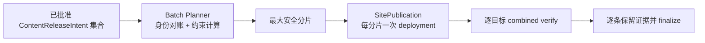

# 当前迭代

## 当前唯一版本：`v0.25.1`

## 正式方案

`docs/design/v0.25.1 内容批次发布与 active 身份一致性能力.md`

## 目标

将内容的逐条身份与站点的物理发布粒度分离：内容仍逐条审核、hash、验收和 finalize；工具在平台约束内自动生成最大安全批次/分片，减少重复构建、上传、deployment、传播等待和公网验证，同时修复已发布内容因 package 身份不一致而从 active 集合丢失的问题。



## 产品—内容兼容声明

```yaml
contentImpact: compatible
affectedTargets: []
affectedRoutes: []
affectedFields: []
compatibilityEvidence: v0.25.1-batch-publication-and-active-identity-tests
```

## 范围

- 建设通用 `ContentBatchPlan`，不把内容正文或事实身份合并。
- 按文件数、单文件大小、总大小、目标冲突和媒体路径约束自动确定最大安全批次；超限确定性分片。
- 以 `productVersion + commit + sourceBundleHash` 缓存 immutable `ProductArtifact`，不为内容递增产品版本。
- 修复 `content-release.json`、包内 `content-manifest.json`、completion 和 active 读取器的 immutable 身份原子一致性。
- 每个物理分片只创建一次 `SitePublication`/deployment；combined verify 通过后逐条幂等 finalize。
- 保留现有单条内容发布与 resume 入口作为紧急/低频 fallback。

## 明确不做

- 不修改正文、来源、审核、媒体事实、publishedAt、UI、IA、路由、schema、组件、CSS 或上游事实。
- 不让内容 task 修改 `src/`、scripts、产品版本、current/history、commit/tag；不让产品 task 把内容变成产品版本。
- 不创建并行 task、branch、worktree 或 automation；内容批次能力完成前不重复发布已有内容。

## 验收合同

1. 30 条已批准内容在约束允许时只产生一次或少量分片 deployment；超限时所有条目恰好覆盖一次。
2. 每条内容仍可查询 `contentReleaseId`、contentHash、review、deployment、publicVerify 和 finalize。
3. 任一分片失败保留 recovery，不 finalize，不影响既有 active；resume 不重复 deployment。
4. 后续内容发布不丢失已 released active 内容；覆盖 stale `baseSiteArtifactId` 回归场景。
5. 产品 version/commit/tag 不因内容批次改变；单条 fallback 仍可用。
6. `npm run check`、`release:prepare`、专项测试、closeout、preflight 和真实公网批次验证通过。

责任 task：产品与视觉主线负责方案与验收；Engineering 主线 `019fc263-abf9-7732-84ef-73914e6a0a85` 负责实现、自 QA、本地版本收口；内容及发布 task 负责提供已批准 intents 和运营验收，不修改工具。
