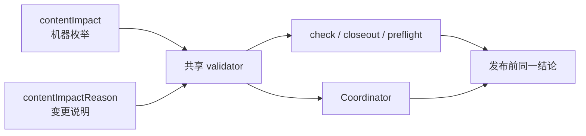

# 当前迭代

## 当前唯一版本：`v0.25.12`

父版本：`v0.25.11` / `3237d7fe68688c9c7b6e645d947d3854d9669beb`

## 正式方案

[`docs/design/v0.25.12 产品内容兼容合同单一枚举与前置门禁方案.md`](../design/v0.25.12%20产品内容兼容合同单一枚举与前置门禁方案.md)

来源：v0.25.11 产品/视觉验收通过后，product transport 在部署前发现 `contentImpact` 自由文本与 Coordinator 封闭枚举不一致；按规则直接形成下一版本，不回写旧版本、不创建普通候选。

## 根本目标

保留 v0.25.11 已通过的全部视觉与功能，把产品—内容兼容判定统一为稳定机器枚举，并在 Engineering 提交/预发布阶段使用同一 validator 提前阻断非法合同。



## 产品—内容兼容声明

```yaml
contentImpact: compatible
contentImpactReason: compatibility-contract-enum-and-gate-unification
affectedTargets: [current-contract, release-gates, site-publication-coordinator]
affectedRoutes: []
affectedFields: [contentImpact, contentImpactReason, compatibilityEvidence]
compatibilityEvidence: v0.25.12-content-impact-contract
```

- 不改变内容对象、正文、审核、媒体事实或 ContentReleaseIntent；
- 不放宽产品/内容发布身份、active receipt 或 SitePublication 门禁；
- 产品完整上线前内容 task 保持不动。

## Engineering 实现范围

1. `contentImpact` 只接受 `none`、`compatible`、`migration-required`、`breaking`、`unknown`。
2. 新增独立 `contentImpactReason` 保存变更原因；机器判定不得解析 reason。
3. `npm run check`、closeout、preflight、Coordinator 复用唯一 validator。
4. 非法枚举、缺失 reason/evidence 在提交前硬失败，不能延迟到 transport。
5. 保留 v0.25.11 已通过的全站视觉、响应式、视频、内容及站点发布能力。

## 明确不做

- 不回写或移动 v0.25.11 commit/tag/history；
- 不重新设计或改动已通过视觉；
- 不改正文、媒体、路由、IA、schema 或内容运营流程；
- 不创建 branch、worktree、task、候选或第二套样式系统。

## 验收顺序

```text
Engineering 实现、自 QA、commit/tag/clean
→ 产品/视觉合同回归 + Web/Mobile 保持性验收
→ 持续授权 product publish
→ 公网验证
→ 通知内容 task 四槽位正式内容绑定与最终核验
```

- 四个门禁对五种枚举返回同一结论，未知值在提交前失败；
- Web copy→media=48px、module→module=96px；Mobile=20px、56px 保持；
- v0.25.11 其余验收结果全部保持；
- 全量项目、视觉、媒体、可访问性、closeout、preflight、diff-check 通过。

## 当前责任

- 产品/视觉主线：维护本方案并执行兼容合同与视觉保持性验收；
- Engineering 主线：`019fcbf2-20e3-7d51-a4de-87ad7c94b190`，canonical direct-local 实现与版本闭环；验收通过后按持续授权发布；
- 内容及发布主线：产品完整上线前保持不动；上线后再执行四槽位正式绑定和最终页面核验；
- Ops：不参与本产品版本。
