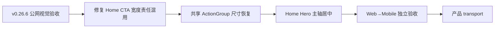

# 当前迭代

## 当前唯一版本：`v0.26.7`

父版本：`v0.26.6` / `098499040449aadd8f4bdc14a11bd9fd9df10889`

## 正式方案

[`docs/design/v0.26.7 首页 CTA 共享尺寸回归修复方案.md`](../design/v0.26.7%20首页%20CTA%20共享尺寸回归修复方案.md)

来源：v0.26.6 design-ui 公网视觉验收阻断 `V266-OA02-WIDTH`。v0.26.6 保持不可变，不回写已上线版本。

## 产品目标



- 保持 v0.26.6 已通过的全站冷白视觉、Home/Products 独立页面架构和经营观察页面投影。
- 只修复 Home CTA 的共享尺寸回归：页面容器负责对齐，`ActionGroup` 负责共享 intrinsic/equal width。
- 不新增页面、路由、内容字段、媒体能力或发布能力。

## Engineering 合同

1. Home 桌面 ActionGroup 使用共享 `--measure-action-group`（当前约 448px），两个按钮各约 218px；整体与 Hero 主视觉轴误差 `≤1px`。
2. Mobile `390×844`、窄屏 `320×844` 下按钮等宽、单行、无溢出；不以固定桌面宽度覆盖内容容器。
3. 不修改 `/products` 的已通过尺寸和 CTA；不回退 Home/Products 独立组合。
4. 不修改 ContentSet、正文、审核、来源、媒体、content CLI、Coordinator、SitePublication 或内容发布事实。

## 产品—内容兼容声明

```yaml
contentImpact: compatible
contentImpactReason: home-action-group-width-only
affectedTargets: [home]
affectedRoutes: [/, /products]
affectedFields: [home-action-group-width, home-action-group-axis]
compatibilityEvidence: v0.26.6-public-visual-block-v266-oa02-width
```

内容 task 不需重新 prepare/build/transport；ops-content 保持停止，直到 v0.26.7 产品完成本地与公网视觉验收。产品 build 仍应保持内容隔离（`publishedSlugs=[]`）。

## 验收门禁

- 视口：`1600×1067`、`1280×1067`、`390×844`、`320×844`，必要时等效 200% CSS 视口。
- 路由：`/`、`/products`，并回归 `/business-observations`、`/observations`、`/about`。
- Home group width 不超过共享 `--measure-action-group`；桌面按钮约 `218px` 等宽；group/hero center delta `≤1px`；移动单行无溢出。
- `/products` CTA、4 个视频属性、H-02、经营观察页面已通过项保持不变。
- `npm run check`、`release:prepare`、页面/视觉专项、`release:build`、`release:closeout-check`、`release:preflight`、`git diff --check`，以及 `content:check`、`article:check`、`practice:check` 全部通过。
- 产品/视觉本地 `xingbuild-visual-ux-review` Approve 后才 transport；公网完成后 design-ui 复验；内容不重发。

## 当前责任

- 产品/视觉主线：维护本方案并执行本地、公网视觉验收。
- Engineering 主线：`019fcbf2-20e3-7d51-a4de-87ad7c94b190`，按本合同实现、测试、commit/tag、build、preflight 和 product transport。
- 内容及发布主线：继续保持现有 ContentSet，不参与本版本。
- Ops：继续只负责采集和 EvidenceCandidate，不参与产品版本。
