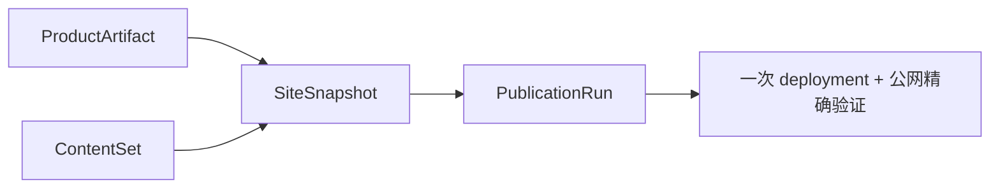

# 当前迭代

## 当前唯一版本：`v0.26.1`

父版本：`v0.26.0` / `1402304cf0cc6cee3ecaafbb134199c8651366b4`

## 正式方案

[`docs/design/v0.26.1 ProductArtifact规范化身份与SiteSnapshot契约方案.md`](../design/v0.26.1%20ProductArtifact规范化身份与SiteSnapshot契约方案.md)

来源：v0.26.0 首次 transport 在部署前发现 ProductArtifact 嵌套对象与 SiteSnapshot 扁平身份契约不一致的 Publish Incident。

## 产品目标



- 产品、视觉、Engineering 和内容运营身份与生命周期保持独立；
- ProductArtifact 由唯一适配器规范化为扁平身份对象；所有 ContentSet/Snapshot/Publication/Coordinator 只消费该对象；
- 产品发布复用 v0.26.0 已迁移的 35-entry active ContentSet；内容发布仍复用 ProductArtifact；
- 每次物理上线只组装一个 SiteSnapshot，使用一个 Coordinator、一个 deployment 和一份公网证据；
- 失败可恢复或整站回滚；不得在部署阶段才发现身份缺失；
- 页面继续使用既有 PageDefinition → PageComposition → 共享 Capability → Content Slots；本版本不改 UI/IA/视觉。

## Engineering 合同

1. 在 `scripts/lib/product-artifact.mjs` 建立唯一 ProductArtifactIdentity resolver；原始三份 manifest 只在边界适配器读取一次。
2. `readProductArtifact()`、`createSiteSnapshot()`、ContentSet、PublicationRun、SitePublication 和 Coordinator 全部使用同一扁平身份四元组：`productArtifactId/productVersion/productCommit/baseSiteArtifactId`。
3. 缺字段、嵌套身份漂移或四元组不一致必须在 SiteSnapshot 组装前硬失败；不得在调用处临时补字段。
4. 复用 v0.26.0 已迁移的 `.content-workspace/content-state/active.json` 与 35-entry ContentSet；不重新迁移、不重建内容、不修改审核/媒体事实。
5. 所有产品/内容入口统一委托现有 Site Publication Coordinator；不保留第二条 EdgeOne 执行路径。
6. 最终 commit/tag 后生成 ProductArtifact；`release:preflight` 必须精确校验 ProductArtifact 与 HEAD/tag。
7. 继续保留 SiteSnapshot、PublicationRun、resume、publicVerify、atomic finalize 和整站 rollback；同一 publication resume 不重复 deployment。

## 产品—内容兼容声明

```yaml
contentImpact: compatible
contentImpactReason: product-artifact-identity-normalization
affectedTargets: [product-artifact, content-set, site-snapshot, publication-run, coordinator, release-preflight]
affectedRoutes: [/, /products, /business-observations, /observations, /about]
affectedFields: [contentSetId, contentSetHash, productArtifactId, siteSnapshotId, snapshotHash]
compatibilityEvidence: v0.26.1-product-artifact-identity-contract
```

## 验收顺序

```text
Engineering 实现与分层 QA
→ v0.26.1 commit/tag/clean
→ final build + ProductArtifact preflight
→ 产品/视觉用同一 ProductArtifact 验收
→ product transport / 公网完整验证
→ 通知内容 task 恢复 ContentSet Candidate 运营
```

## 明确不做

- 不回写 v0.26.0 及更早 tag/history；
- 不继续为旧 lineage、slot、projection 增加局部补丁；
- 不修改 UI、IA、schema、内容正文、审核、媒体或既有视觉合同；
- 不自动发布已审核但尚未上线的内容；
- 不创建并行 task、branch、worktree、scheduler 或第二套 Coordinator。

## 当前责任

- 产品/视觉主线：维护本方案，执行 ProductArtifact 与公网视觉验收；
- Engineering 主线：`019fcbf2-20e3-7d51-a4de-87ad7c94b190`，按本合同实现、测试、commit/tag、final build 和 preflight；
- 内容及发布主线：在 v0.26.1 产品公网完整验证后，继续使用已迁移的 ContentSet Candidate 流程；
- Ops：继续只负责采集、去重和 EvidenceCandidate，不参与产品版本。
