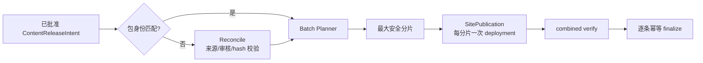

# 当前迭代

## 当前唯一版本：`v0.25.2`

## 正式方案

`docs/design/v0.25.2 内容发布包身份重建与幂等恢复能力.md`

## 目标

在 v0.25.1 批次发布能力上补齐旧包身份安全重建：内容仍逐条审核、hash、验收和 finalize；工具在不改变逻辑 `contentReleaseId` 或正文事实的前提下，生成当前 immutable 产品基座的物理 package revision，复用批次、lease、combined verify 和恢复能力。



## 产品—内容兼容声明

```yaml
contentImpact: compatible
affectedTargets: []
affectedRoutes: []
affectedFields: []
compatibilityEvidence: v0.25.2-reconcile-package-lineage-tests
```

## 范围

- 增加唯一 `content-release` reconcile 入口，区分逻辑内容身份和物理 package revision。
- 校验 canonical/draft/recovery、sourceHash、contentHash、target、approved review 和 immutable baseSiteArtifact。
- 保留 supersedes/recovery lineage；同一 reconcile 幂等，不重复 package、deployment 或 finalize。
- 将新 revision 交给既有 `ContentBatchPlan`、SitePublication、combined verify 和 resume。
- 覆盖 stale package 的 nhtsa 场景及 30 条 active 内容保留。
- 将内容日常可变台账隔离到被忽略 `.content-workspace/operations/content-publishing-ledger.md`；tracked 运营文档只保留稳定入口，内容运行变更不得阻断产品版本收口。

## 明确不做

- 不修改正文、来源、审核、媒体事实、publishedAt、UI、IA、路由、schema、组件、CSS 或上游事实。
- 不让内容 task 修改 `src/`、scripts、产品版本、current/history、commit/tag；不让产品 task 把内容变成产品版本。
- 不创建并行 task、branch、worktree 或 automation；内容批次能力完成前不重复发布已有内容。

## 验收合同

1. nhtsa 场景生成一个新的 immutable package revision，逻辑 `contentReleaseId` 不变，旧包/recovery 保留。
2. 重复 reconcile 返回同一 revision/sitePublication，不重复 deployment。
3. 29 条现有 active 内容保持不变，nhtsa 公网验证后成为第 30 条。
4. source/hash/target/review/base artifact 漂移均在 prepare 前硬失败。
5. 失败不污染 active，resume 复用同一 publication/deployment。
6. `npm run check`、`release:prepare`、专项测试、closeout、preflight 和真实公网恢复验证通过。

责任 task：产品与视觉主线负责方案与验收；Engineering 主线 `019fcbf2-20e3-7d51-a4de-87ad7c94b190` 负责实现、自 QA、本地版本收口；内容及发布 task 负责提供已批准 intents、调用 reconcile 和运营验收，不修改工具。
