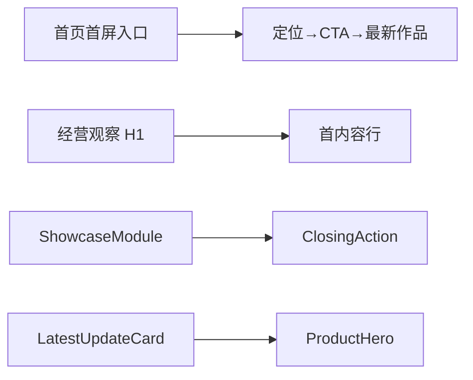

# 当前迭代

## 当前唯一版本：`v0.26.10`

父版本：`v0.26.9` / `13119436d2a6f0a07f2a3316c3a81c23efd28c4c`

## 正式方案

[`docs/design/v0.26.10 全站垂直节奏与 ProductHero 密度方案.md`](../design/v0.26.10%20全站垂直节奏与%20ProductHero%20密度方案.md)

来源：唯一视觉候选 `XBUILD-VISUAL-ACCEPTANCE-LEDGER-001` 已完成 Xing 全项确认并转化。本版本不回写已发布的 v0.26.9。

## 产品目标



- 以单一布局 owner 收口首页入口、经营观察页眉和 ClosingAction 上游节奏，消除重复 margin/gap 与路由 selector 偶然覆盖。
- 首页保留 Hero/产品内容语义，采用首屏内容带内光学居中；不使用 `100vh`。
- `/products` 版本卡成为轻量版本标记，精确收口卡片密度与 ProductHero 入口。
- 保持 Home/Products 独立 IA、ContentSet、媒体能力、发布协调器和内容运营边界。

## Engineering 合同

1. 首页：定位→CTA `40/24px`、CTA→最新作品 `64/40px`、有效上方呼吸 `64/40px`（Web/Mobile），最新作品与 Robotaxi 标题保持 `4px`；全局页眉→普通内容仍 `48/32px`。
2. `/business-observations`：H1→首内容行 `64/48px`；左右内容起点关系各 `16px`；H1 居中、栏目平齐、文章标题层级和 S-10/S-11 保持。
3. Home 与 `/products`：ClosingAction 上游统一为 `96/56px`，与相邻 ShowcaseModule 节奏相等；页面投影、IA、CTA、生命周期仍独立。
4. `/products`：LatestUpdateCard 字号 `13px`、高度 `40px`、上下 padding `8px`；卡片→ProductHero `24px`、标题→说明 `16px`、说明→CTA `24px`。
5. 优先复用既有 tokens/flow；不得新建第二套样式系统、页面私有补丁或改变内容 slot 合同。

## 产品—内容兼容声明

```yaml
contentImpact: compatible
contentImpactReason: visual-spacing-and-product-entry-density-only
affectedTargets: [home, products, business-observations]
affectedRoutes: [/, /products, /business-observations]
affectedFields: []
compatibilityEvidence: v0.26.9-content-slot-contract-unchanged
```

本版本不运行内容 prepare/build/transport/finalize，不创建内容身份，不改 active ContentSet；内容及 Ops 继续独立工作。

## 验收门禁

- 五路由 `/`、`/products`、`/business-observations`、`/observations`、`/about`，Web `1600×1067/1280×1067`、Mobile `390×844/320×844`，无横向溢出、`main=1`、`h1=1`、无 console/page error。
- DOM 几何精确验证本方案所有 Web/Mobile 间距（误差 `≤1px`）；Hero/CTA 轴心、文字不换行、内容增长、空内容和媒体状态回归。
- 页面独立 IA、四视频行为、安全外链、键盘 focus、Reduced Motion、axe 无新增 violation。
- `npm run check`、`release:prepare`、内容兼容性检查、视觉/交互 QA、`release:build`、`release:closeout-check`、`release:preflight`、`git diff --check` 通过；既有 retained fixture/environment failures 分层报告。
- exact HEAD ProductArtifact 完成后，产品/视觉本地 Approve 才可 product transport；公网完成后 design-ui 做独立公网验收；内容不重发。

## 当前责任

- 产品/视觉主线：维护 v0.26.10 方案并执行 Web→Mobile 本地、公网视觉验收。
- Engineering 主线：`019fcbf2-20e3-7d51-a4de-87ad7c94b190`，按本合同实现、测试、commit/tag、build、preflight 和 product transport。
- 内容及发布主线：保持现有 ContentSet，不参与本版本，不因本版本重新 prepare/build/transport。
- Ops：继续只负责采集和 EvidenceCandidate，不参与产品版本。
