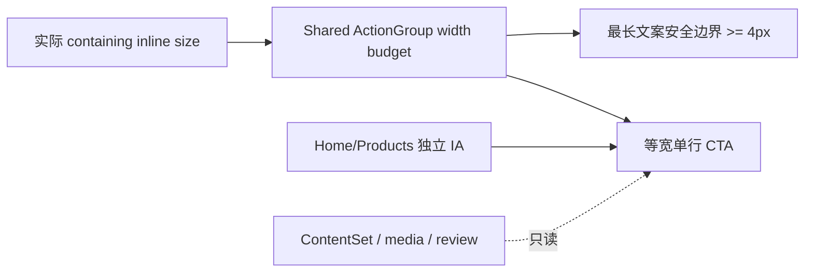

# 当前迭代

## 当前唯一版本：`v0.26.12`

父版本：`v0.26.11` / `cba8406d707a5ec8c8e2a83096965973c3d47766`

## 正式方案

[`docs/design/v0.26.12 共享 ActionGroup 可用宽度与窄屏安全边界方案.md`](../design/v0.26.12%20共享%20ActionGroup%20可用宽度与窄屏安全边界方案.md)

来源：v0.26.11 已发布后的 design-ui 公网独立验收，唯一阻断 `V02611-PUBLIC-01`。本版本只收口共享 ActionGroup 在经典滚动条下的有效宽度预算，不回写 v0.26.11。

## 产品目标



- 将共享 `ActionGroup` 的等宽计算绑定到实际 containing inline size，覆盖 overlay/classic scrollbar。
- 在 `/products` 320px 下保证最长 CTA 左右各至少 `4px` 安全内边距，不改变文案、不裁切、不换行。
- 通过双滚动条 QA 消除本地与公网可用宽度不一致造成的漏检。
- 保持 Home/Products 独立 IA、ContentSet、媒体能力、发布协调器和内容运营边界。

## Engineering 合同

1. `ActionGroup equalWidth` 只能基于实际 containing inline size 计算；overlay/classic scrollbar 均须通过。
2. `/products` `320px`：两 CTA 等宽、单行；最长 CTA Range 左右安全内边距各 `≥4px`，允许误差 `≤0.5px`；无正向 horizontal overflow。
3. 双环境证据必须记录 `innerWidth/clientWidth`、group/button rect、文字 Range、safe inset、`scrollWidth`。
4. 保持 v0.26.11 已通过的入口/间距、Home 节奏、Business 层级、ClosingAction `96/56px`、页面独立 IA、视频和安全外链。
5. 优先复用既有 tokens/flow；不得新建第二套样式系统、页面私有补丁或改变内容 slot 合同。

## 产品—内容兼容声明

```yaml
contentImpact: compatible
contentImpactReason: shared-action-layout-runtime-only
affectedTargets: []
affectedRoutes: [/, /products]
affectedFields: []
compatibilityEvidence: v0.26.11-content-set-and-content-cli-unchanged
```

本版本不运行内容 prepare/build/transport/finalize，不创建内容身份，不改 active ContentSet；内容及 Ops 继续独立工作。

## 验收门禁

- 五路由、四视口 `1600×1067/1280×1067/390×844/320×844`，overlay/classic 两种滚动条环境均采集。
- V12-01/V12-02 既有间距误差 `≤1px`；V12-03 记录按钮 rect、文字 Range、左右安全内边距和 clientWidth 差异。
- `scrollWidth=clientWidth`、overflow=false、main=1、h1=1、console/page errors=0；Home `64/40` 等既有节奏不回归。
- 四视频 autoplay/muted/loop/no-controls、外链、键盘 focus、Reduced Motion、axe 无新增 violation。
- `npm run check`、`release:prepare`、视觉/交互 QA、双滚动条证据、`release:build`、`release:closeout-check`、`release:preflight`、`git diff --check` 通过；既有 retained failures 分层报告。
- exact HEAD ProductArtifact 后产品/视觉本地 Approve 才可 transport；公网完成后 design-ui 独立公网验收；内容不重发。

## 当前责任

- 产品/视觉主线：维护 v0.26.12 方案并执行 Web→Mobile 本地、公网视觉验收。
- Engineering 主线：`019fcbf2-20e3-7d51-a4de-87ad7c94b190`，按本合同实现、双滚动条测试、commit/tag、build、preflight 和 product transport。
- 内容及发布主线：保持现有 ContentSet，不参与本版本，不因本版本重新 prepare/build/transport。
- Ops：继续只负责采集和 EvidenceCandidate，不参与产品版本。
