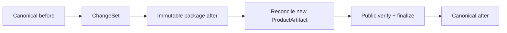

# 当前迭代

## 当前唯一版本：`v0.25.15`

父版本：`v0.25.14` / `b0bb49dcebb0b5b888ac844115f59695be0cf4cb`

## 正式方案

[`docs/design/v0.25.15 内容类型生命周期适配与Package证明式Reconcile方案.md`](../design/v0.25.15%20内容类型生命周期适配与Package证明式Reconcile方案.md)

来源：v0.25.14 上线后，现有四槽 package reconcile 被通用 Observation 生命周期文件假设与 canonical=afterHash 假设阻断；按 Product Incident 直接形成下一产品能力版本。

## 根本目标

让每种内容类型使用自己的生命周期证据，并让 immutable package + ChangeSet 证明 canonical before 如何成为 candidate after；发布成功后才原子推进 canonical。



## 产品—内容兼容声明

```yaml
contentImpact: compatible
contentImpactReason: kind-specific-lifecycle-adapter-and-package-proven-reconcile
affectedTargets: [content-lifecycle-adapter, content-package-reconcile, content-finalize]
affectedRoutes: [/products]
affectedFields: [beforeHash, afterHash, reviewEnvelope, recoveryEnvelope, logicalContentId]
compatibilityEvidence: v0.25.15-package-proven-reconcile-contract
```

- 不改变内容正文、审核、媒体资产或四槽页面结构；
- 不放宽 package、ChangeSet、review、active receipt 或公网验证门禁；
- 产品完整上线前内容 task 保留现有 package，不重试。

## Engineering 实现范围

1. 建立按 kind 选择的唯一 `ContentLifecycleAdapter`，prepare/reconcile/finalize 共用。
2. Practice 使用 products canonical、Practice review、media provenance、package recovery，不要求通用 slug draft/recovery。
3. reconcile 验证 canonical=beforeHash，确定性 apply operations 得到 package after/contentHash；只重绑 ProductArtifact。
4. package 保存/兼容读取 before/after、review/recovery envelope；现有四槽 package 不重建、不改 hash。
5. public verify/finalize 后原子推进 active receipt 与 canonical after；失败保留 before，resume 幂等。
6. Observation/Article/Profile/BusinessObservation 保持各自生命周期合同，不回归。
7. 保持 v0.25.14 全部视觉、页面、内容和发布结果。

## 明确不做

- 不回写或移动 v0.25.14 commit/tag/history；
- 不让内容 task 手改 draft/recovery/canonical/manifest/hash；
- 不重建四槽 package，不改 UI、视觉、IA、schema、正文、媒体、review；
- 不运行内容发布，不重发其他 active；
- 不创建 branch、worktree、task、候选或第二套 lifecycle。

## 验收顺序

```text
Engineering 实现、自 QA、commit/tag/clean
→ 产品/视觉合同 + 视觉保持性验收
→ 持续授权 product publish
→ 产品公网完整验证
→ 内容 task resume 现有四槽 package
```

- Practice 无通用 draft/recovery 仍合法；canonical before + ChangeSet = package after；
- 错误 before/after/review/provenance 硬失败；finalize 原子推进 canonical，失败保留 before；
- active=34、Practice slot=1、Observation=33；
- v0.25.14 视觉、五路由、媒体和可访问性保持；
- check、release:prepare/build、全量 Sites、closeout、preflight、diff-check 通过。

## 当前责任

- 产品/视觉主线：维护方案并按正式合同与 `xingbuild-interface-review` 双门禁验收；
- Engineering 主线：`019fcbf2-20e3-7d51-a4de-87ad7c94b190`，canonical direct-local 实现、版本闭环及验收后持续授权发布；
- 内容及发布主线：保留 Incident 与现有四槽 package，产品上线后只 reconcile/resume；
- Ops：不参与本产品版本。
