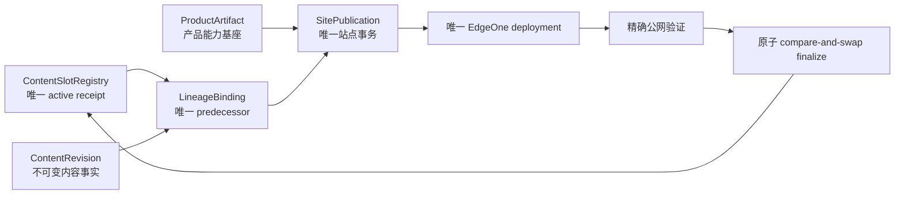

# 当前迭代

## 当前唯一版本：`v0.25.17`

父版本：`v0.25.16` / `20b6c5fb49b007b7655c6c4f113af81b5bb5dfdc`

## 正式方案

[`docs/design/v0.25.17 不可变Revision与Registry Lineage Binding完成方案.md`](../design/v0.25.17%20不可变Revision与Registry%20Lineage%20Binding完成方案.md)

来源 Incident：`CONTENT-BLOCK-ROBOTAXI-SLOT-RESUME-001`。

v0.25.16 已完成 Slot Registry 和 legacy migration 并上线，但既有 revision resume 时 lineage resolver 仅在内存返回 predecessor，旧 projection 仍被继续读取。v0.25.17 完成不可变 revision 与 Registry 之间的运行时 binding 边界；不修改 v0.25.16 或既有内容事实。

## 根本目标



产品与内容保持独立生命周期；共享物理站点只在 Coordinator 处串行部署。内容不因产品版本变化而改稿或重审；不兼容时产品发布前硬失败并形成 Product Incident。

## 产品—内容兼容声明

```yaml
contentImpact: compatible
contentImpactReason: immutable-revision-runtime-lineage-binding
affectedTargets: [publication-lineage-binding, content-slot-registry, site-publication-coordinator, content-resume]
affectedRoutes: [/products]
affectedFields: [lineageBindingId, predecessorReceiptId, packageRevisionId, snapshotHash]
compatibilityEvidence: v0.25.17-immutable-revision-lineage-binding-contract
```

- 不修改内容正文、审核、媒体、四槽页面结构或既有发布身份；
- 不重建 `practice-robotaxi-604214b3bfddf09f`、不改变其 ChangeSet/hash；
- 不在 v0.25.16 上继续 content transport；
- 只有 Coordinator 能组装站点、调用 EdgeOne、写 SitePublication 和推进 active registry。

## Engineering 正式实现范围

1. 建立不可变 `PublicationLineageBinding`，保存 registry-derived predecessor 与 binding hash。
2. 既有 revision resume 只读 Registry，原子生成/复用 binding，不回写旧 package/revision manifest。
3. Coordinator、SitePublication、receipt/completion projection 统一消费 binding，禁止从旧 self-supersedes projection 判定 predecessor。
4. finalize 使用 binding.predecessorReceiptId 与 Registry compare-and-swap。
5. 保留 v0.25.16 `ContentSlotRegistry`、legacy migration 和 `ContentLifecycleAdapter`；不创建第二套 registry/lifecycle。
6. 对 `revision-9bb22df0f30845e8` 提供兼容恢复；不重建内容、媒体、ChangeSet 或 logical identity。
7. 增加旧 self-reference、重复 resume、binding drift、CAS 竞争、失败恢复和真实历史 corpus 契约测试。

## 验收顺序

```text
Engineering 实现 + 历史 package corpus QA
→ local commit/tag/clean
→ 产品/视觉能力验收
→ v0.25.17 ProductArtifact transport
→ 公网完整验证
→ 内容 task resume 现有四槽 package
→ 四个媒体槽逐项公网验证
```

必须证明：现有四槽 package 不重建即可完成 replacement；失败保留旧 34 条 active；同一 publication resume 不重复 deployment；产品与内容身份继续分离。

## 明确不做

- 不继续按 Incident 增加临时字段门禁；本版本完成 v0.25.16 的 authority boundary；
- 不创建第二套 Coordinator、lifecycle、registry、task、branch、worktree 或 scheduler；
- 不引入 CMS、微服务、消息总线或通用云平台；
- 不修改 UI、IA、schema、视觉、正文、审核、媒体、v0.25.16 tag/history。

## 当前责任

- 产品/视觉主线：维护本正式架构合同，并按 `xingbuild-interface-review` 做页面保持性验收；
- Engineering 主线：`019fcbf2-20e3-7d51-a4de-87ad7c94b190`，只按本合同在 canonical direct-local 实现并完成版本闭环；
- 内容及发布主线：冻结 `revision-9bb22df0f30845e8`，不得 transport/retry/手改事实，待 v0.25.17 产品能力上线后恢复；
- Ops：不参与本产品版本。
