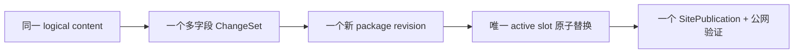

# 当前迭代

## 当前唯一版本：`v0.25.13`

父版本：`v0.25.12` / `2e76e026aaa1997b669195a450b0e5d7d3f55a35`

## 正式方案

[`docs/design/v0.25.13 多字段内容变更与稳定逻辑身份方案.md`](../design/v0.25.13%20多字段内容变更与稳定逻辑身份方案.md)

来源：产品 v0.25.12 上线后，内容 task 执行已确认的 Robotaxi 四媒体槽位绑定时发现工具只能表达单字段 ChangeSet，且 replacement 把内容 hash 当成逻辑身份；按 Product Incident 直接形成下一产品能力版本，不创建重复候选。

## 根本目标

让一次内容运营决策能够对同一内容对象执行多字段原子更新，并把稳定逻辑身份、可变化内容快照和物理发布修订彻底分层。



## 产品—内容兼容声明

```yaml
contentImpact: compatible
contentImpactReason: multi-operation-changeset-and-logical-revision-identity
affectedTargets: [content-change-set, content-package-revision, active-content-set, site-publication-coordinator]
affectedRoutes: [/products]
affectedFields: [logicalContentId, operations, changedTargets, contentHash, packageRevisionId]
compatibilityEvidence: v0.25.13-atomic-multi-field-content-contract
```

- 不改变正文、审核、媒体资产或四槽产品结构；
- 不放宽 active receipt、SitePublication、lease、deployment 或公网验证门禁；
- 产品完整上线前内容 task 保留 Incident，不重试。

## Engineering 实现范围

1. 建立稳定 `logicalContentId`，active slot 不再以 `contentHash` 判定内容对象。
2. ChangeSet 使用确定性 `operations[]`，逐项 before/after hash、同对象/registry/媒体审批校验并原子应用。
3. receipt/completion/package/public projection 保存 logical identity、revision lineage、完整 changedTargets。
4. replacement 允许有批准 lineage 的 contentHash 更新；失败保留旧 active，成功后原子替换且 active 数量不变。
5. rollback 使用逆序 operations，漂移硬停止；resume 复用同一 publication/deployment。
6. 兼容旧单字段输入，但新事实统一写多 operation 合同。
7. 保持 v0.25.12 全部产品视觉、页面、内容和发布结果。

## 明确不做

- 不回写或移动 v0.25.12 commit/tag/history；
- 不改 UI、视觉、正文、路由、IA、schema、视频文件/hash/review；
- 不运行内容发布，不重发其他 active 内容；
- 不创建 branch、worktree、task、候选或第二套发布流程。

## 验收顺序

```text
Engineering 实现、自 QA、commit/tag/clean
→ 产品/视觉合同 + 视觉保持性验收
→ 持续授权 product publish
→ 产品公网完整验证
→ 通知内容 task 使用正式工具发布四槽内容
```

- 一个 ChangeSet 精确包含四个独立 mediaId target，并产生一个后继 revision；
- 第 2/4 项失败、重复 target、跨对象、stale before、未审核媒体均原子失败；
- replacement 前后 active=34，Practice logical slot=1，Observation=33；
- v0.25.12 Web/Mobile、视频、五路由和可访问性回归保持；
- check、release:prepare/build、全量 Sites、closeout、preflight、diff-check 通过。

## 当前责任

- 产品/视觉主线：维护正式方案，按方案与 `xingbuild-interface-review` 双门禁验收；
- Engineering 主线：`019fcbf2-20e3-7d51-a4de-87ad7c94b190`，canonical direct-local 实现、版本闭环及验收后持续授权发布；
- 内容及发布主线：保留 `CONTENT-BLOCK-ROBOTAXI-FOUR-MEDIA-CHANGESET-001`，产品完整上线后使用现有内容事实恢复；
- Ops：不参与本产品版本。
