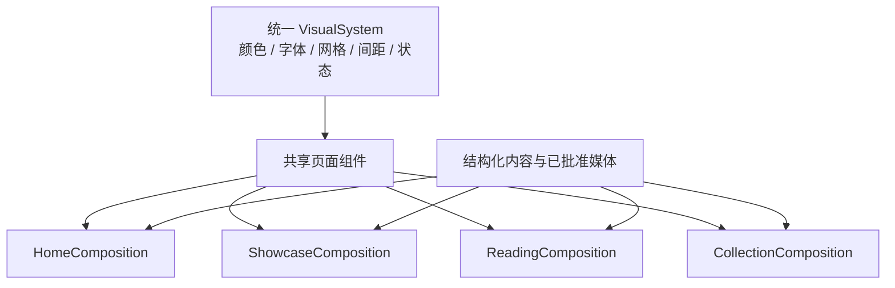

# 当前迭代

## 当前唯一版本：`v0.25.9`

父版本：`v0.25.8` / `e3385c823acb7d9cf37682f72d6e930d17112c44`

## 正式方案

[`docs/design/v0.25.9 全站统一视觉系统与结构化页面组合方案.md`](../design/v0.25.9%20全站统一视觉系统与结构化页面组合方案.md)

来源候选：`XBUILD-SITE-VISUAL-STRUCTURE-001`；已确认并归档。

## 根本目标

将统一视觉系统确立为全站产品与视觉底层，再由共享组件形成页面组合；不为每个页面继续维护私有字体、间距、版心、按钮和媒体样式。



## 产品—内容兼容声明

```yaml
contentImpact: compatible-with-capability-migration
affectedTargets: [site-visual-system, page-compositions, robotaxi-practice, profile-about, resume-artifact]
affectedRoutes: [/, /products, /business-observations, /observations, /observations/:slug, /about, /resume/]
affectedFields: [heroActions, closing, module.mediaId, media.state, productReleaseReference, resumeArtifactRef]
compatibilityEvidence: v0.25.9-visual-system-and-page-composition-contract
```

- 既有 Observation、Article、Practice、Profile、33 个短文和内容发布身份必须完整保留；
- 产品发布不得读取或改写独立内容事实；
- `/products` 当前 4 个 module 独立拥有 `mediaId`；初始可分别引用同一个批准视频，未来逐项替换；
- 产品完整上线后才通知内容 task 执行上述初始媒体引用和内容核验，不并行 transport。

## Engineering 实现范围

### 1. 全站统一视觉底层

- 将旧暖白、棕红、serif-led 视觉替换为唯一冷白、sans-led、蓝色动作系统；
- 统一 shell、网格、阅读宽度、字体角色、间距、按钮、链接、焦点、圆角、媒体比例、空/加载/错误状态；
- 媒体窗口使用克制柔和阴影形成轻浮起感；普通正文和卡片不批量加阴影；
- 禁止纯黑大按钮、装饰线、暖红色残留、页面私有版心和第二套样式系统。

### 2. 共享组件能力

在现有 PageDefinition/PageComposition、RichDocument、SystemStage 和安全 action 基线上扩展：

```text
LatestUpdateCard / ProductHero / ActionGroup
ShowcaseFlow / ShowcaseModule / MediaStage
ClosingAction / ResumeActions
```

- `/products` 是第一使用者，不是组件 owner；用第二个产品 fixture 证明可复用；
- `LatestUpdateCard` 读取 `https://robotaxi.xingbuild.top/deployment-manifest.json` 的真实版本；由于当前源未提供浏览器 CORS，Engineering 建立 xingbuild 同源只读 adapter，只投影 `version/commit/production_url` 白名单字段、短缓存和最后已验证降级；禁止内容 task 手工维护版本号；
- `MediaStage` 支持 image/video/empty/loading/failed/revoked，所有状态保持相同槽位和比例；
- 视频可视时 `autoplay + muted + loop + playsinline`，无 controls；离屏暂停；点击/Enter 只打开 Robotaxi；Reduced Motion 使用静态状态。

### 3. 页面组合

```text
首页：网站名/菜单 → 个人定位 → 双动作
    → 最新 B端产品完整投影 → 最新短文 → 单行 Footer

B端产品：最新更新 → ProductHero → 4 个说明/媒体模块
       → ClosingAction → 单行 Footer

经营观察：紧凑标题 → 左侧常青长文 + 右侧短文 → Footer
观察集合：紧凑标题 → 短文集合 → Footer
观察详情：居中阅读 → 来源/返回 → Footer
关于我：居中 RichDocument → 查看 HTML 简历 / 下载 PDF 简历 → Footer
```

- 首页不增加 About、联系或继续阅读；
- `/products` 当前不显示短文 rail，但不删除共享 rail 能力；
- About 不增加联系方式或营销收束；
- `/resume/` 不进入一级导航，只投影已核验 career HTML；PDF 下载必须绑定同一 ResumeArtifactRef。

### 4. 内容与上游制品

- 保留当前 Robotaxi 正文、模块稳定 id 和顺序；不得在产品代码复制正文；
- 四个模块是四个独立媒体关系；不得建立自动继承第一个媒体的代码逻辑；
- Engineering 可用显式测试 fixture 验证四个槽位引用同一视频；产品上线后由内容 task 写入正式独立内容引用；
- Xing 已指定本版使用 `/Users/kingjin/Documents/career/简历/金星-Kami简历候选-20260805.html` 与同名 PDF；复制为 xingbuild 受控快照前必须校验 HTML SHA-256 `453258563a8d51fc150c1ce436549ac8fd94649765cf9e98230f096216734507`、PDF SHA-256 `71cf0ece679a415222de8e359f2e11699c832ed2bd3783a803fd3f979868c386`，不得改写 career 源文件。

## 明确不做

- 不回写 v0.25.8、旧 tag/history 或独立内容发布证据；
- 不改变一级导航、Robotaxi 上游事实、Observation/Article 内容身份或 SitePublication 架构；
- 不新建第二套组件库、Tailwind、主题系统、branch、worktree、task 或 scheduler；
- 不让内容 task 管理 CSS、字体、字号、间距、页面结构、Robotaxi 版本或 xingbuild Footer 版本；
- 不把同一初始视频宣称为四份不同证据，不用假媒体填充 fallback；
- 不在产品完整上线前通知内容 task 开始正式内容更新。

## 严格视觉验收合同

视觉是本版本核心产品能力，自动测试通过不等于产品/视觉验收通过。

### 第一阶段：Web 定稿验收

- 严格视口 `1600×1067`，并补充 `1280` 宽度；
- 五类核心页面真实截图：`/`、`/products`、`/business-observations`、`/observations`、`/about`；
- 与已确认视觉稿逐项比较 shell 左右边界、首屏层级、字体、字号、行高、对齐、section 间距、媒体尺寸、轻浮起阴影、按钮颜色和 Footer；
- 任何页面仍残留旧暖白/棕红、纯黑大按钮、装饰线、旧版心或明显页面私有风格，均不通过；
- 使用当前真实长文本、4 个 Robotaxi 模块、正常 empty fallback 和 resume actions 验证，不能只用短占位数据；
- `/products` 四个说明/媒体关系必须清楚；当前 Web 左说明、右媒体；ClosingAction 位于全部模块之后。

### 第二阶段：Mobile 与稳健性验收

- Web 验收通过后再验收 `390×844`；不重新选择视觉方向；
- Mobile 每个模块说明在上、媒体在下，同模块间距 `20–24px`，模块之间 `56–72px`；
- `320/375/768` 无横向溢出、按钮可操作、媒体不裁切、Footer 单行；
- 200% zoom、键盘路径、focus-visible、axe、Reduced Motion、真实媒体加载/失败和 console error 检查通过。

### 功能与回归

- 四个 `mediaId` 独立；修改一个不影响其他三个；空 `mediaId` 显示正常 fallback；
- 视频在视口内自动静音循环、无 controls，点击/Enter 只跳转 Robotaxi；
- 首页无 About 收束；经营观察保持左长文/右短文；About 居中且 HTML/PDF 目标/hash 正确；
- Robotaxi version adapter 公网返回真实 `v049.13.23 / 242fca774a787b8922bdb02ceaa780d28c6cd3e8` 或更新的合法 manifest 身份；上游不可用时明确降级，不显示伪“最新”；
- `npm run check`、`release:prepare`、`release:build`、相关专项、全量 Sites、`release:closeout-check`、`release:preflight`、`git diff --check` 通过；
- Engineering 形成 local commit/tag/clean 后，由产品/视觉执行真实页面独立验收；未通过则直接形成下一版本，不回写旧版本。

## 当前责任与持续闭环

- 产品/视觉主线：维护方案、检查 Engineering 回传，并执行严格 Web → Mobile 视觉验收；
- Engineering 主线：`019fcbf2-20e3-7d51-a4de-87ad7c94b190`，canonical direct-local 实现、自 QA、commit/tag/clean；验收通过后按持续授权直接 publish；
- 内容及发布主线：产品完整上线前保持不动；上线后只按登记字段完成 Robotaxi 初始媒体引用与内容核验，不重发无关内容；
- Ops：不参与本产品版本。
