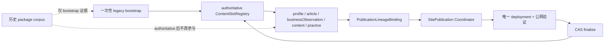

# 当前迭代

## 当前唯一版本：`v0.25.18`

父版本：`v0.25.17` / `e1cdc09182e91ca49d6dc2e6353e775837b15caf`

## 正式方案

[`docs/design/v0.25.18 ContentSlotRegistry权威边界与一次性Legacy迁移方案.md`](../design/v0.25.18%20ContentSlotRegistry%E6%9D%83%E5%A8%81%E8%BE%B9%E7%95%8C%E4%B8%8E%E4%B8%80%E6%AC%A1%E6%80%A7Legacy%E8%BF%81%E7%A7%BB%E6%96%B9%E6%A1%88.md)

来源 Incident：`CONTENT-BLOCK-CONTENT-SLOT-REGISTRY-LEGACY-MIGRATION-001`。

v0.25.17 已建立不可变 Revision 与 Registry Lineage Binding，但运行时仍在每次内容 transport 前重新扫描旧 package corpus。v0.25.18 将 legacy migration 限定为首次 bootstrap 或显式迁移动作；authoritative Registry 建立后，日常内容发布只读取 Registry，不再让历史 package lineage 参与 active 判定。

## 根本目标



产品与内容仍保持独立生命周期；本版本只修复发布能力的权威边界，不修改页面、内容正文、审核、媒体或产品视觉。

## 产品—内容兼容声明

```yaml
contentImpact: compatible
contentImpactReason: authoritative-registry-runtime-boundary
affectedTargets: [content-slot-registry, legacy-bootstrap, content-lifecycle-adapter, site-publication-coordinator, content-resume]
affectedRoutes: [/, /about, /business-observations, /observations, /products]
affectedFields: [registryMode, migrationSourceHash, logicalContentId, predecessorReceiptId, lineageBindingId, registryRevision]
compatibilityEvidence: v0.25.18-authoritative-registry-runtime-contract
```

## Engineering 正式实现范围

1. 拆分 authoritative Registry read 与 explicit legacy bootstrap；authoritative read 不调用 `scanLegacyContentSlotRegistry`。
2. 保留首次 bootstrap 的冲突硬失败，不猜测 active；authoritative Registry 存在后，历史冲突只保留为不可变诊断。
3. Coordinator、ContentLifecycleAdapter、reconcile、resume、SitePublication active projection 统一读取 authoritative Registry。
4. 复用现有 `PublicationLineageBinding`、CAS、lease、bounded publicVerify、atomic finalize，不创建第二套 lifecycle/registry/coordinator。
5. 证明 `profile-about-93ea5608339c4973` 可以复用并发布，随后 Article 与 Business Observation 能串行发布；33 条 observation 与 Robotaxi practice 不重发。

## 验收顺序

```text
Engineering 实现 + 真实 legacy conflict corpus QA
→ local commit/tag/clean
→ 产品/视觉能力验收
→ v0.25.18 product transport / 公网验证
→ 内容 task 复用 About package
→ Article / Business Observation 串行发布与逐项公网验证
```

## 明确不做

- 不手改 Registry、旧 manifest、lineage、publishedAt 或 contentHash；
- 不把 migration conflict 全部放宽；缺失 Registry 的首次 bootstrap 仍严格阻断；
- 不修改 UI、IA、schema、视觉、正文、审核、媒体或既有内容身份；
- 不重发 33 条 observation 或 Robotaxi practice；
- 不创建第二套 Coordinator、task、branch、worktree 或 scheduler。

## 当前责任

- 产品/视觉主线：维护本正式架构合同并完成能力验收；
- Engineering 主线：`019fcbf2-20e3-7d51-a4de-87ad7c94b190`，只按本合同实现并完成版本闭环；
- 内容及发布主线：保留 `profile-about-93ea5608339c4973` recoverable package，能力上线后按顺序复用，再处理 Article 与 Business Observation；
- Ops：不参与本产品版本。
