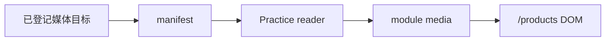

# 当前迭代

## 当前唯一版本：`v0.25.3`

## 正式方案

`docs/design/v0.25.3 Practice 页面能力与媒体投影修复方案.md`

## 目标

在已发布的 v0.25.2 产品基座上，修复 Practice 页面 Hero 展示合同与独立媒体的运行时投影契约。内容仍保持独立发布身份；本版本只建设页面能力、媒体目标映射和真实投影验收。



## 产品—内容兼容声明

```yaml
contentImpact: compatible
affectedTargets: [practice-robotaxi]
affectedRoutes: [/products]
affectedFields: [PracticeHeader, practice media projection]
compatibilityEvidence: v0.25.3-practice-runtime-projection-contract
```

## 范围

- Hero 标题/说明居中并支持受控语义换行。
- CTA 仅在登记、安全和可达合同成立时实现。
- 统一 manifest、target/practice 登记关系与 runtime reader 的媒体投影。
- 增加 reader、构建产物和真实 `/products` DOM 的视频投影测试。

## 明确不做

- 不修改正文、来源、审核、媒体事实、publishedAt、IA、路由、上游事实或内容发布身份。
- 不让内容 task 修改 `src/`、scripts、产品版本、current/history、commit/tag；不让产品 task 把内容变成产品版本。
- 不创建并行 task、branch、worktree 或 automation；不重发已发布内容。

## 验收合同

1. Hero 桌面/移动端居中、语义换行稳定且无溢出。
2. `findPractice("robotaxi")` 映射出已审核视频，`/products` DOM 存在 video。
3. manifest、target、reader、构建产物和 DOM 身份一致；漂移硬失败。
4. 其余三个模块保持空 media，不生成占位媒体。
5. 内容关闭构建不包含独立内容正文/媒体。
6. `npm run check`、`release:prepare`、专项测试、closeout、preflight 和真实页面验收通过。

责任 task：产品与视觉主线负责方案与验收；Engineering 主线 `019fcbf2-20e3-7d51-a4de-87ad7c94b190` 负责实现、自 QA、本地版本收口；内容及发布 task 只提供已批准内容事实并在能力上线后独立验收，不修改工具。
