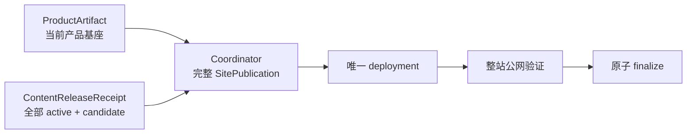

# 当前迭代

## 当前唯一版本：`v0.25.5`

父版本：`v0.25.4` / `99dcd94b08f8b2353632ce8a33c6dd12928dfddf`

## 正式方案

`docs/design/v0.25.5 内容发布站点快照身份与可恢复发布方案.md`

来源候选：`XBUILD-CONTENT-RELEASE-003`（已转化并归档）。

## 目标

修复独立内容发布的站点快照身份与生命周期事实脱节问题，使内容运营能够在不修改产品版本和内容事实的前提下，可靠地发布、验证、恢复和保留全部 active 内容。



## 产品—内容兼容声明

```yaml
contentImpact: compatible
affectedTargets: [all-active-content-receipts, content-release-candidate]
affectedRoutes: [/, /products, /business-observations, /observations, /about, /observations/:slug]
affectedFields: [ContentReleaseReceipt, SitePublication identity, content manifest projection, deployment recovery]
compatibilityEvidence: v0.25.5-receipt-snapshot-recovery-contract
```

## 范围

- 以 `content-release.json` 与 `completion.json` 形成的 `ContentReleaseReceipt` 作为 active 生命周期唯一事实源；
- `dist/client/content-manifest.json` 只做构建投影与身份一致性校验，不因旧投影缺字段静默丢失 active；
- 每次发布从当前 ProductArtifact、全部 released receipt 和 candidate 组装完整站点快照；
- 快照统一保存 `sitePublicationId`、`snapshotHash`、active IDs、slug 列表、媒体路径、deployment JSON 和公网验证；
- SitePublication Coordinator 负责站点 lease、唯一 deployment、传播验证、resume 和原子 finalize；
- 保留现有三个 Brief 的 `contentReleaseId`、hash、审核、deployment、recovery 证据，能力验收后通过 reconcile 一次恢复，不改正文、不创建新内容身份。

## 明确不做

- 不修改 v0.25.4 tag/history、产品 UI、IA、schema、视觉或内容正文；
- 不让产品 build 读取独立内容根；
- 不让内容 task 直接调用 EdgeOne；
- 不以单次 Deploy Success、HTTP 200 或单页可见替代整站快照证据；
- 不创建第二套发布 CLI、后台 CMS、候选、branch、worktree 或 task。

## Engineering 实现合同

1. active 读取以 receipt 为准；身份不一致、旧投影、部分 manifest 必须显式硬失败或进入可恢复状态，不能静默排除；
2. snapshot manifest 原子生成，`activeContentReleaseIds`、`publishedSlugs`、`publishedArticleSlugs`、media、hash 与 receipt 完整一致；
3. 同一 SitePublication 使用唯一 lease、幂等键和原 deployment resume，不重复部署；
4. transport、传播、verify、finalize 任一阶段失败保留 package、publication、日志和 recovery，不污染既有 active；
5. 产品发布只消费 ProductArtifact，内容发布不产生产品版本。

## 验收合同

- 三个待恢复 Brief 与既有 active 内容可由同一完整快照同时保留；
- 公网 active IDs 与 slug 列表完全对应，三个新 slug 的页面、内容身份、媒体和 hash 均可验证；
- 旧 dist manifest 缺少 `baseSiteArtifactId` 时不会丢失已完成 receipt；
- 重复 resume 不产生第二个内容身份或 deployment；
- 部署成功但公网未传播、身份漂移、内容清单不完整均不得返回成功；
- 产品版本、内容事实和既有 active 发布证据不被破坏；
- `npm run check`、release/内容专项、closeout、preflight 和真实公网整站验证通过。

## 当前责任

- 产品/视觉：维护本方案并执行提交后验收；
- Engineering 主线：`019fcbf2-20e3-7d51-a4de-87ad7c94b190`，负责实现、自 QA、本地 commit/tag/clean 和持续授权发布；
- 内容及发布主线：`019fa166-9645-7532-87f6-99ae4cf9508a`，保留三个 package/recovery/log，能力验收前不重发，验收后按 reconcile 合同恢复；
- Ops：不参与发布恢复。
