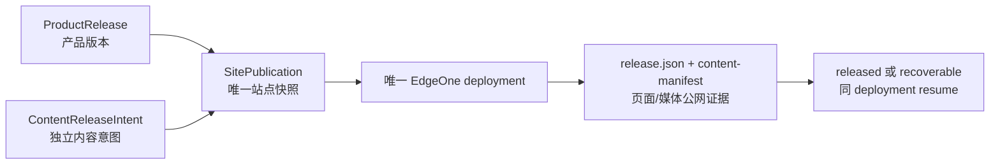

# 当前迭代

## 当前唯一版本：`v0.25.0`

## 本版本目标

以 `SitePublication` 为唯一站点发布对象，彻底分离产品能力、内容运营和物理站点部署：产品与内容保持独立身份，由本地单一协调器生成整站快照、串行部署、保存 deployment、等待传播、精确公网验证并最终收口。



## 正式设计与父版本

- 正式设计：`docs/design/v0.25.0 产品内容站点发布三层架构.md`。
- 父版本：`v0.24.37` / `bd97ed78b8cb30cb906689a131a8c612890bdc69`；v0.24.38 未形成正式 tag，不单独发布；既有 tag/history 不修改。
- 保留兼容入口：`publish-xingbuild.command`、`content-release` 与 `publish-content.command`，它们只提交意图给 Site Publication Coordinator。

## 产品—内容兼容声明

```yaml
contentImpact: compatible
affectedTargets: []
affectedRoutes: []
affectedFields: []
compatibilityEvidence: v0.25.0-site-publication-coordinator-tests
```

## 本版本范围

- `ProductRelease` 只记录产品 version/commit/annotatedTag/productArtifactId/clean。
- `ContentReleaseIntent` 只记录目标、正文/媒体 hash、来源、审核、requiredCapabilities 和 ChangeSet；不读取旧产品 dist 作为发布输入。
- `SitePublication` 合并当前产品 immutable artifact 与所有 active 内容及 candidate，持久化 snapshotHash、deployment JSON、publicVerify、failure/recoveryId。
- 产品和内容 transport 共用同一物理站点，但严格串行；产品发布中内容只能 prepared/queued，内容发布中产品不部署。
- Deploy Success 只是中间事件；只有 deployment JSON、产品身份、内容 active/candidate、目标页面/媒体和 SitePublication finalized 全部成立，工具才返回成功。
- 传播延迟由协调器使用有界退避等待；超时保留 recoverable 和同一 deploymentId，resume 不创建重复部署。
- 产品变更若 `contentImpact` 为 breaking/migration-required/unknown，发布前硬阻断并形成 Product Incident；内容发现异常只上报产品问题，不由内容 task 修改产品。

## 明确不做

- 不修改上游事实、v0.24.37 tag/history、既有内容正文/来源/status/publishedAt。
- 不让内容 task 修改 `src/`、产品版本、current/history、commit/tag；不让产品 task 把独立内容变成产品版本。
- 不允许产品或内容入口直接调用 EdgeOne；只有 Site Publication Coordinator 可以部署。
- 不创建并行 task、branch、worktree 或 automation；本轮不 push/publish/deploy。

## 验收合同

- 产品功能发布不丢失 active 内容；内容发布不改变产品版本。
- 产品变更影响内容时，兼容性声明缺失或非 compatible 立即阻断。
- 任一物理站点部署只能对应一个 SitePublication；两个 transport 不并行。
- 缺 deployment JSON、身份不匹配、页面/媒体未传播或 active 集合不完整时，工具返回失败 + Incident/recoveryId，不报告成功。
- resume 复用已保存 deploymentId；失败不改变既有 active 内容，finalize 只在完整公网证据之后发生。
- `npm run check`、`release:prepare`、`release:build`、专项测试、closeout、preflight、`git diff --check` 通过；环境 I/O 单独记录。

责任 task：产品与视觉主线负责方案和验收；Engineering 主线 `019fc263-abf9-7732-84ef-73914e6a0a85` 负责实现、自 QA、本地版本收口。
