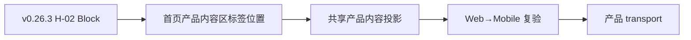

# 当前迭代

## 当前唯一版本：`v0.26.4`

父版本：`v0.26.3` / `211b3c5c4cfcdf1c79ac4799c7e10111f537a718`

## 正式方案

[`docs/design/v0.26.4 H-02 首页产品内容区标签位置方案.md`](../design/v0.26.4%20H-02%20首页产品内容区标签位置方案.md)

来源：`XBUILD-VISUAL-ACCEPTANCE-LEDGER-001` 的 H-02 独立视觉复验阻断；v0.26.3 保持冻结，不回写已上线版本。

## 产品目标



- 继承 v0.26.3 已上线的冷白、克制、专业全站视觉，不重造视觉系统。
- 只收口 H-02，修正首页产品内容区标签的结构投影。
- 页面继续由 `SiteShell → PageComposition → 共享组件 → ContentSet slots` 组合，不创建页面私有布局。
- 产品版本、ContentSet、既有 38-entry 内容事实和独立运营身份保持分离。

## 页面与视觉合同

| ID | 路由 / 组件 | 变更 |
| --- | --- | --- |
| H-02 | `/` / 产品内容区标签 | `最新作品` 位于产品内容区左上角，与 `Robotaxi运营平台` 4px 紧邻；不在 Hero 中轴，不留空白 |
| OA-02 | 首页与产品页 / Hero ActionGroup | 同组按钮共享等宽能力，移动保持单行 |
| OA-03 | `/products` / ShowcaseModule | `group===label` 时隐藏重复视觉 label，保留字段能力 |
| OA-04 | `/products` / ProductHero + ClosingAction | 空 boundary、默认 eyebrow、重复摘要自动收紧 |
| OA-05 | 全站 / MediaStage | 仅媒体使用单层轻阴影，其他内容保持平面 |
| B2-HOME-02 | `/` / ClosingAction | 产品内容后保留既有浅色行动区，不新增边框或媒体阴影 |
| B2-HOME-03 | `/` / ObservationRail | 使用 `最新观察简讯`，最后增加 `更多观察`，不改正文和来源 |
| B2-PRODUCT-01 | `/products` / LatestUpdateCard | 保留 `NEW + v... + 查看最新版`，链接使用已登记 Robotaxi 地址 |
| B2-PRODUCT-02 | `/products` / ProductHero | 空眉题、空边界说明自动收紧；槽位和 schema 能力保留 |
| B2-PRODUCT-03 | `/products` / ShowcaseModule | 手机端说明→媒体；同模块 `20–24px`，跨模块 `56–72px`；空 label 不留占位 |
| B2-PRODUCT-04 | `/products` / ClosingAction | 桌面左右、手机上下；操作按钮等宽单行 |
| B2-OBS-01 | `/business-observations` / PageHeader + ObservationRail | 左 `经营观察`、右 `最新简讯` 平齐；`企业经营体系`仅为文章标题 |
| B2-ABOUT-01 | `/about` / RichDocument | 保持连续阅读和近乎平面的冷白表面，不新增卡片或私有布局 |
| B2-GLOBAL-01 | 全站 / shared tokens | 辅助文字统一为 `#64748B`，不换字体家族和主色 |

未列入表格的页面、组件、字段、间距、颜色、媒体、内容和路由保持 Baseline 1。

## 产品—内容兼容声明

```yaml
contentImpact: compatible
contentImpactReason: visual-projection-and-token-only
affectedTargets: [home, practice, article, businessObservation, profile, observation]
affectedRoutes: [/, /products, /business-observations, /observations, /about]
affectedFields: [home-hero-action, hero-action-width, showcase-group-label, product-boundary, closing-eyebrow, media-shadow-token]
compatibilityEvidence: v0.26.2-official-oa-01-oa-05
```

本版本不修改 ContentSet、正文、审核、来源、媒体或产品版本之外的内容事实；内容 task 不需要重新准备或重发既有内容。

## Engineering 合同

1. 复用既有 `PageComposition`、`ActionGroup`、`ShowcaseModule`、`ProductHero`、`ClosingAction`、`MediaStage` 和 tokens；不新增第二套 CSS。
2. 首页与 `/products` 使用明确的页面投影配置，禁止混用 CTA 语义。
3. Hero action 组等宽由共享组件实现；不写页面私有宽度补丁。
4. 空 boundary、重复 label、默认 eyebrow 和重复摘要使用条件渲染自动收紧。
5. 阴影只由 `MediaStage` 单层 token 控制；内容正文与行动区无媒体阴影。
6. 不修改 ContentSet、内容发布、ProductArtifact、SiteSnapshot、SitePublication 或 Coordinator 逻辑。

## 验收顺序

```text
Engineering 实现与分层 QA
→ v0.26.3 commit/tag/clean
→ final build + ProductArtifact preflight
→ xingbuild-visual-ux-review Web 验收
→ Mobile 投影验收
→ 既有持续授权 product transport / 公网验证
→ 内容保持既有 active，不重发
```

## 验收标准

- Web `1600×1067`、Mobile `390×844`、窄屏 `320px` 和等效 200% 缩放无横向溢出。
- 五路由 `/`、`/products`、`/business-observations`、`/observations`、`/about` 每页一个 H1、无控制台错误。
- 首页主 CTA 为 `查看最新B端产品`，产品页主 CTA 为 `进入 Robotaxi运营平台`；目标分别正确。
- Hero action 组等宽；四模块重复 group/label 收紧；空 boundary/默认 eyebrow/重复摘要不渲染；MediaStage 仅轻阴影。
- `/business-observations` 左右标题平齐；`企业经营体系`不承担页面 H1。
- `/about` 连续阅读稳定；阅读面没有媒体同款厚重浮起。
- 键盘焦点、可访问名称、Reduced Motion、自然换行通过。
- 38-entry active ContentSet、33 条观察、article/profile/businessObservation/practice 身份不变；不运行内容发布。

## 明确不做

- 不回写 v0.26.1 或更早 tag/history。
- 不复制参考站品牌，不引入纸张式大卡片、装饰线、纯黑按钮、厚重阴影或炫光。
- 不改产品定位、业务事实、路由、IA、schema、ContentSet、正文、审核、媒体或发布架构。
- 不创建并行 task、branch、worktree、scheduler 或第二套发布器。

## 当前责任

- 产品/视觉主线：维护本方案，执行 Web→Mobile `xingbuild-visual-ux-review` 和公网产品验收；
- Engineering 主线：`019fcbf2-20e3-7d51-a4de-87ad7c94b190`，按本合同实现、测试、commit/tag、final build 和 preflight；
- 内容及发布主线：继续独立管理已上线 ContentSet；本版本不要求重发内容；
- Ops：继续只负责采集、去重和 EvidenceCandidate，不参与产品版本。
