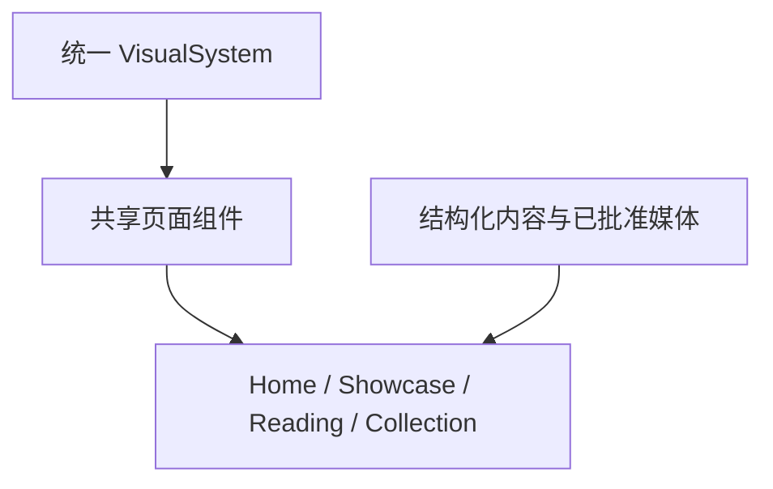

# XBUILD-SITE-VISUAL-STRUCTURE-001

状态：confirmed / converted / archived
确认人：Xing
确认日期：2026-08-05
目标版本：v0.25.9

## 来源与转化

- 来源：视觉探索 task `019fd068-cd5d-7f30-9642-32d0589a4953`；产品/视觉主线持续评审。
- 原 reserve 文件：`.content-workspace/design-reserve/XBUILD-SITE-VISUAL-STRUCTURE-001.md`。
- 正式方案：[`docs/design/v0.25.9 全站统一视觉系统与结构化页面组合方案.md`](../../../design/v0.25.9%20全站统一视觉系统与结构化页面组合方案.md)。
- 当前合同：[`docs/iterations/current.md`](../../current.md)。

## 最终决策

候选不是 `/products` 局部换皮，而是转化为全站统一视觉底层和结构化页面组合能力：

- 冷白、sans-led、蓝色动作、无装饰线和轻浮起媒体成为统一视觉基线；
- 当前 Robotaxi 4 个 module 独立拥有 `mediaId`；初始允许分别引用同一批准视频，未来分别替换；
- empty fallback 是正常内容状态；视频默认可见时自动静音循环，点击只跳转 Robotaxi；
- 首页、经营观察、观察集合/详情和 About 的最终组合进入正式方案；
- Robotaxi 最新更新卡读取真实 release；About 消费 career 已确认 HTML/PDF 简历制品；
- 视觉验收按 Web 先行、Mobile 后续的严格门禁执行。

本候选不再活动，不应重新进入 `docs/iterations/candidates/`。
