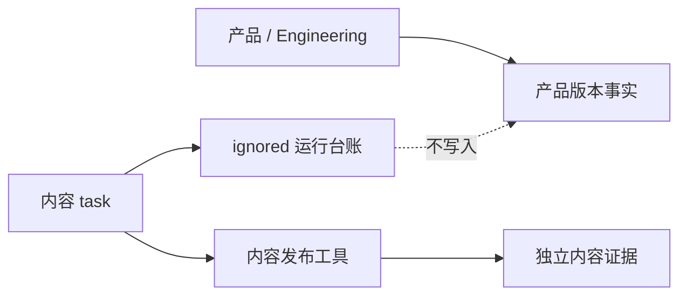

# 内容发布运营台账入口

状态：稳定入口（不保存日常可变发布事实）
责任：内容及发布 task

## 唯一运行台账

内容运营的每日状态、内容数量、draft/review/recovery、ChangeSet、content package、deployment、publicVerify、finalize、失败和恢复证据，统一写入被 Git 忽略的：

`.content-workspace/operations/content-publishing-ledger.md`

该文件是内容运营的运行事实源，不进入产品版本、产品 bundle、产品 `current.md`、`VERSION.md`、Git history 或产品发布门禁。

## 稳定规则事实源

| 主题 | 文件 |
| --- | --- |
| 内容运营与独立发布边界 | `docs/operations/内容运营与发布规则.md` |
| 经营观察采集 | `docs/operations/经营观察信息源与覆盖合同.md` |
| Robotaxi 内容方案 | `docs/content/Robotaxi运营平台展示内容方案 v1.0.md` |
| 当前产品能力与兼容性 | `docs/iterations/current.md` |

## 责任边界

内容 task 不修改产品代码、产品版本、`current.md`、`VERSION.md`、产品 `history`、UI/IA/schema、commit/tag；产品 task 不把日常内容事实写入产品版本。若产品能力不兼容内容，产品/视觉形成候选并进入 `current.md`，内容 task 只保留原有运行证据。

详细执行规则见 `docs/operations/内容运营与发布规则.md`。
