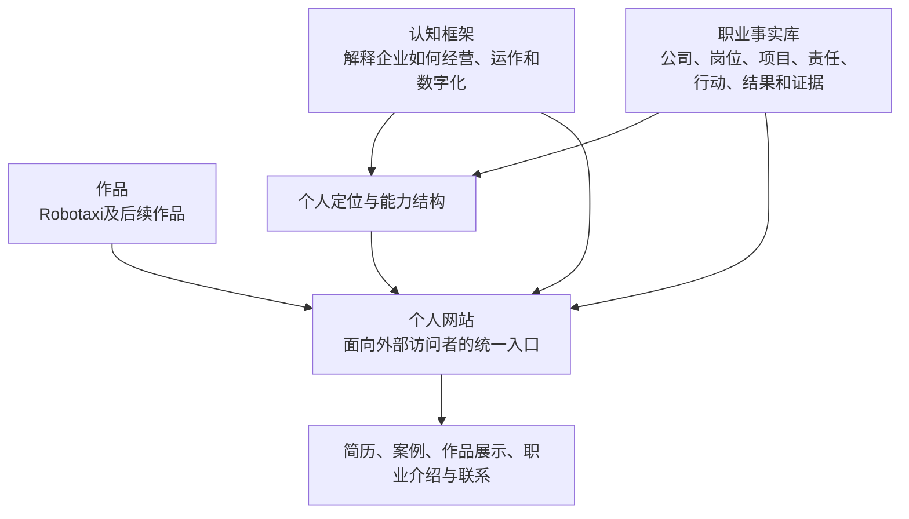
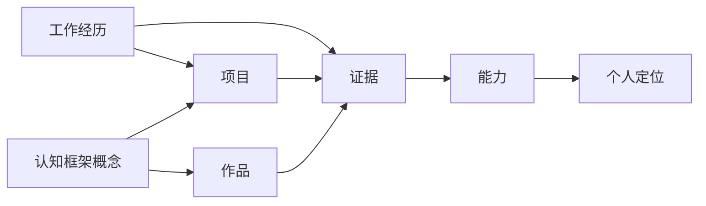

<!--
所属项目：career
上游基线：《企业经营体系、数字化与职业定位认知框架 v5.1》
关联内容：个人简历与工作经历、Robotaxi 及后续作品
当前边界：产品与内容设计，不进入视觉设计和工程编码
-->

> 本文件是早期产品定位与信息架构方案（历史参考），不再是当前网站产品基线。当前唯一现行产品/视觉主文档见 [`xingbuild 网站产品架构与视觉系统总案`](./xingbuild%20网站产品架构与视觉系统总案.md)。保留本文件用于追溯早期决策和上游来源。

# 个人网站定位、内容与信息架构设计 v1.0

## 1. 网站定位

个人网站不是简历、认知框架和作品的简单集合，而是面向外部访问者组织个人职业价值及其证据的统一入口。

网站需要回答五个问题：

1. 我是谁，当前职业定位是什么。
2. 我过去主要解决过什么问题。
3. 我形成了什么可以重复使用的能力。
4. 哪些经历、结果和作品能够证明这些判断。
5. 我下一阶段希望进入什么行业、承担什么责任。

固定定位沿用认知框架：

> 我是以供应链与企业运作为业务基础、以企业业务架构为核心专业、以 B 端产品研发为职业载体，推动复杂经营问题数字化落地的产品研发负责人。

网站不重新定义个人定位，只根据访问场景选择相应事实、证据和作品进行表达。

---

## 2. 网站在个人知识与职业体系中的位置



认知框架、职业事实和作品是内容来源；个人网站是学习、浏览和对外沟通视图，不成为第二套事实源。

---

## 3. 目标访问者与阅读深度

| 访问者 | 首要问题 | 网站需要提供的答案 |
| --- | --- | --- |
| 招聘负责人和猎头 | 岗位是否匹配，是否值得沟通 | 清晰定位、核心能力、关键经历、代表结果和简历入口 |
| 业务负责人和企业高管 | 能否解决企业当前问题 | 可以解决的问题、责任深度、经营价值和证据 |
| 产品、业务和技术专业人士 | 专业判断和实践能力是否可靠 | 企业业务架构、B 端产品、数据、工程和复盘方法 |
| Robotaxi及相关行业从业者 | 既有能力能否迁移到行业 | Robotaxi作品、迁移逻辑、真实边界和发展方向 |
| 潜在合作方与长期关注者 | 是否值得持续关注或合作 | 持续演进的认知、作品、公开成果和联系方式 |

网站支持四种阅读深度：

```text
30 秒：理解个人定位、能够解决的问题和当前方向
 3 分钟：看到核心能力、代表经历和代表作品
10 分钟：理解完整案例、责任边界和结果证据
深度阅读：进入认知框架、概念关系和作品实现
```

---

## 4. 网站核心叙事

全站使用同一条职业证据关系：

```text
企业和业务面临什么问题
          ↓
我承担什么责任
          ↓
我作出什么判断并采取什么行动
          ↓
形成什么业务架构、产品、数据、系统或团队能力
          ↓
产生什么可以验证的事实与结果
          ↓
沉淀什么可以跨场景复用的能力
          ↓
现在能够解决什么问题并提供什么价值
```

网站不以职位名称、系统清单或抽象能力词作为主要叙事。职位、项目和系统都必须回到问题、责任、行动、结果和证据。

---

## 5. 一级信息架构

网站一级导航固定为：

```text
首页
经历
认知框架
作品
关于
```

简历下载和联系方式是全站可直接到达的行动入口，不单独占用一级导航。

### 5.1 首页

首页负责在最短时间内建立定位和可信度，内容顺序为：

1. 当前职业定位。
2. 现在能够解决的核心问题。
3. 核心能力组合。
4. 代表成果和证据摘要。
5. 代表工作经历。
6. Robotaxi及后续代表作品。
7. 企业经营与数字化认知框架入口。
8. 当前发展方向。
9. 简历与联系入口。

首页只提供结论和证据摘要，不展开完整认知框架，也不要求访问者先理解全部概念。

### 5.2 经历

```text
经历
├─ 职业概览
├─ 工作经历时间线
├─ 每段经历的核心问题、责任、行动和结果
├─ 代表项目
├─ 能力与责任演进
└─ 简历查看与下载
```

每段经历必须区分：

- 企业和业务背景；
- 个人参与、主导、决策和最终责任；
- 规划、建设中、已上线、已使用和实际结果；
- 个人贡献、团队结果和企业结果；
- 已验证事实与待补充证据。

### 5.3 认知框架

认知框架按照自上而下的学习路径呈现：

```text
企业经营体系总览
├─ 企业现实
│  ├─ 现实构成
│  ├─ 企业运作
│  └─ 事实、结果与反馈
├─ 经营与架构设计
│  ├─ 战略与商业模式
│  ├─ 企业经营架构与经营模型
│  └─ 企业业务架构
├─ 数字化实现
│  ├─ B 端产品架构
│  ├─ 数据架构
│  ├─ 技术架构
│  └─ 工程实现与企业数字化系统
├─ 运行反馈
│  ├─ 事实与指标
│  ├─ 分析与决策
│  └─ 调整与再次验证
├─ 底层概念
│  └─ 主体、对象、关系、状态、事件、活动与过程、规则、事实、指标、结果
└─ 应用
   ├─ 供应链
   ├─ Robotaxi
   └─ 职业定位与经历证据
```

认知框架页面需要支持：

- 总览到模块的进入；
- 模块到概念的继续深入；
- 概念到其底层依赖的追溯；
- 概念返回所属上层结构；
- 相关概念和具体应用之间的跳转；
- 每个概念只显示同一份权威定义。

### 5.4 作品

```text
作品
├─ Robotaxi
├─ 后续公开作品
└─ 每个作品的完整案例
```

每个作品统一使用：

1. 背景与目标。
2. 研究对象和系统边界。
3. 需要解决的核心问题。
4. 个人判断与责任。
5. 企业业务架构。
6. B 端产品架构与数据架构。
7. 技术架构与工程实现。
8. 当前完成状态。
9. 可验证结果与证据。
10. 局限、假设和下一步。

Robotaxi必须继续明确：

- 它是企业经营闭环模拟、业务架构、B 端产品和工程实践作品；
- 它可以证明认知迁移、产品设计和系统实现能力；
- 它不能证明真实城市运营、自动驾驶核心技术或真实企业经营结果。

### 5.5 关于

关于页面包括：

- 个人职业价值观；
- 当前专业定位；
- 能力边界；
- Robotaxi及长期行业方向；
- 当前所在地和工作意向；
- 联系方式。

---

## 6. 网站内容模型

网站软件化之前，先固定六类内容对象：

| 内容对象 | 核心字段 |
| --- | --- |
| 概念 | 稳定标识、正式名称、权威定义、所属层级、依赖概念、上层结构、相关概念、应用、版本 |
| 工作经历 | 公司、岗位、时间、背景、问题、责任、行动、结果、证据、能力沉淀 |
| 项目 | 所属经历、目标、范围、角色、方案、实现、状态、结果、证据、复盘 |
| 作品 | 名称、定位、问题、架构、实现、完成状态、公开地址、证据、边界 |
| 能力 | 名称、固定含义、形成经历、代表证据、成熟度、当前边界 |
| 证据 | 类型、来源、支持的事实或结论、公开状态、可信程度 |

内容对象之间的基本关系是：



这是一套内容关系设计，不是新的企业经营概念体系。

---

## 7. 唯一内容源与更新规则

1. 企业经营、数字化和职业定位概念以当前认知框架为唯一基线。
2. 工作经历和成果以原始简历、项目材料及可验证事实为来源。
3. Robotaxi内容以Robotaxi项目中的实际代码、文档、运行结果和公开页面为来源。
4. 网站只引用和组织这些内容，不单独维护另一份概念定义或项目事实。
5. 对外展示内容可以压缩，但不能改变责任、完成状态和结果性质。
6. 概念、经历、作品和证据发生变化时，先更新对应唯一内容源，再更新网站视图。

---

## 8. 网站最小充分版本

第一版只建设能够形成完整职业判断的最小范围：

### 必须具备

- 首页；
- 当前定位和能够解决的问题；
- 主要工作经历；
- 2—4个有证据的代表成果或项目；
- Robotaxi作品页；
- 认知框架总览及主要模块；
- 关于和联系方式；
- 移动端与桌面端基本可用；
- 清晰的证据边界和内容更新时间。

### 暂不纳入

- 复杂自由画布知识图谱；
- 用户账号和个人数据；
- 评论、社区或内容运营系统；
- 自动生成简历；
- 多语言；
- 复杂后台管理；
- AI问答或Agent；
- 尚未形成稳定内容模型的高级交互。

第一版先验证访问者能否理解定位、相信证据并进入作品或联系，而不是追求功能完整。

---

## 9. 后续执行阶段

```text
认知框架学习结构稳定
        ↓
工作经历与作品证据完成盘点
        ↓
首页、经历、框架和作品内容成稿
        ↓
低保真页面结构
        ↓
视觉与交互原型
        ↓
技术方案选择
        ↓
工程实现
        ↓
内容、移动端、链接与运行验证
        ↓
发布和持续迭代
```

在内容模型、页面结构和第一版范围确认前，不进入工程编码。

---

## 10. 验收标准

个人网站产品设计完成需要满足：

1. 访问者在30秒内能够理解个人定位和核心价值。
2. 每项能力判断都能进入对应经历、项目或作品证据。
3. 认知框架能够从总览逐层进入底层概念，而不是要求线性阅读。
4. 概念定义、工作事实和作品状态都只有一个权威来源。
5. Robotaxi能力证明和行业经验边界表达准确。
6. 网站能够继续增加新经历、新作品和新认知，而不破坏整体结构。
7. 第一版范围能够被实际实现和验证，不过度设计。
