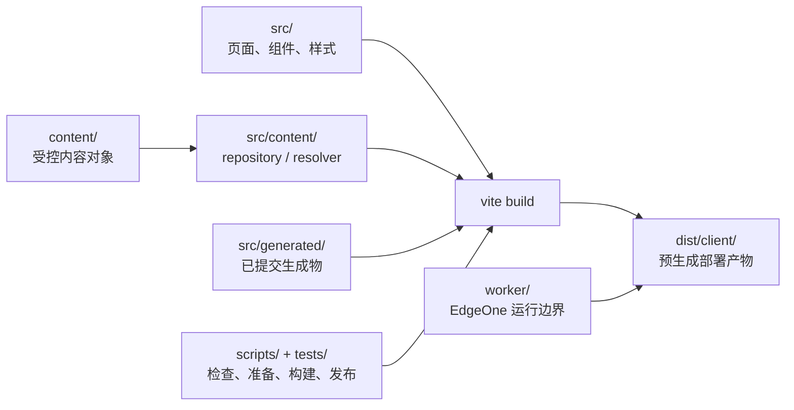

# xingbuild Engineering 架构与原则

状态：生效。本文只记录当前项目已经存在的工程边界，不定义产品业务、页面文案或运营事实；产品能力以产品总案为准，版本和发布以 [`iteration-and-release.md`](iteration-and-release.md) 为准。

## 一、当前工程边界



| 路径 | 当前责任 | 边界 |
| --- | --- | --- |
| `src/` | 网站页面、组件、样式和展示运行时 | 只实现已确认进入 `current.md` 的产品能力 |
| `content/` | 受控产品/观察/文章/Profile 内容对象与 schema | 内容事实必须经过对应内容合同，不能把 workspace 草稿当生产源 |
| `scripts/` | 检查、内容准备、业务准备、构建和发布工具 | 工具不能越过产品/内容责任边界；publish 只做 transport |
| `worker/` | EdgeOne Worker 与访问资格运行边界 | 不在页面组件中复制服务端逻辑 |
| `src/generated/`、`public/` | 由显式生成命令产出的受控文件 | 源/产品方案变更后、local commit 前生成并纳入同一提交 |
| `dist/client/` | 已验证的静态发布产物 | 由 `release:build` 或内容独立构建生成，publish 只读取身份匹配的产物 |
| `tests/` | 结构、内容、发布、运行时和治理合同验证 | 测试失败不得被发布命令自动绕过 |

## 二、工程执行原则

- 官方项目目录与 canonical `main` 是唯一工程基线；默认 direct-local，不自动创建 branch/worktree/detached checkout。
- Engineering 只实现 `current.md` 的正式方案；产品目标、对象边界、视觉合同或上游事实不成立时停止并回到责任 task。
- 生成器 `architecture:views`、`framework:data`、`framework:layout`、`article:figures` 只在源/方案变化后显式运行；构建和发布不无条件调用会回写 tracked 输出的生成器。
- `npm run release:prepare` / `release:build` 负责业务准备、构建和验证；`publish-xingbuild.command` / `unified-publish --kind product` 只校验已存在的 clean HEAD/tag 与 `dist/client`，然后按授权执行 push、deploy、公网验证，不包含网站业务逻辑。
- 产品 publish 与内容 publish 是两个独立责任边界：产品 publish 消费产品版本身份；内容 publish 消费独立 `contentReleaseId`、immutable `baseSiteArtifact` 和 ignored 发布包，不读取当前产品 HEAD/tag/current/preflight，不修改产品版本文件、commit/tag 或产品 current/history。
- 任一构建后 tracked dirty、版本身份不一致、产物缺失或发布目标不明确，必须停止并形成 Publish Incident；不得自动 patch、commit、tag、重试或继续后续阶段。

## 三、代码与事实边界

- 页面层投影受控内容对象和已确认产品能力，不为了页面便利复制 career/Robotaxi 上游业务事实。
- `content/` 与 `.content-workspace/` 分离；后者是内容草稿、审核、recovery、Ops 运行和独立发布包的 ignored 工作区，不能进入产品 bundle 或产品版本事实。
- 生成物、构建产物、Git commit/tag、EdgeOne 部署和公网 manifest 是不同事实，不互相代替；每次收口分别报告。
- 不在本文件重写产品 IA、视觉系统、内容 schema 或运营来源合同；需要这些事实时沿索引读取各自 owner。

## 四、验证最小闭环

```text
方案/current → release:prepare → release:build
→ closeout/preflight → local commit/tag/clean
→ 产品/视觉验收 → 用户授权 → transport → 公网证据
```

内容运营和 Ops 不进入这条产品版本闭环；它们使用各自合同和独立身份。Engineering 的交接使用 [`collaboration-workflow.md`](collaboration-workflow.md) 的一次性模板。
