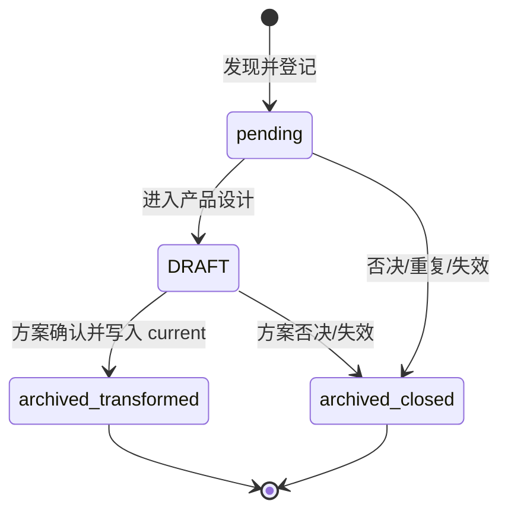

# xingbuild 迭代、启动与发布规则

## 1. 目标

让每次网站调整都形成一个短闭环：

> 明确目标 → 更新当前迭代 → 修改内容或代码 → 本地验证 → 形成稳定版本 → 发布 → 公网验证 → 记录结果

这套流程服务于快速迭代和真实验证，不复制 Robotaxi 的重型业务版本体系。

## 2. 事实源和责任边界

- `career`：职业定位、经历事实、能力判断和企业认知框架的上游事实源。
- `Robotaxi`：Robotaxi 作品状态、代码和运行结果的上游事实源。
- `xingbuild`：网站内容快照、视觉、交互、代码、测试和发布的唯一事实源。
- EdgeOne：线上部署状态、域名绑定、证书和访问状态的运行事实源。

网站可以重组表达，但不得自行提升上游事实、项目完成状态或结果证据。

### 2.1 跨 task 工作边界

- task 不是历史数据库。跨 task 交接只包含决策摘要、当前事实源/证据路径、修改文件、未完成项、执行范围和验收合同；禁止传递完整媒体、base64 或无界历史。
- 复盘默认只读取当前项目事实源和明确列出的决策。信息不足时报告缺口，不为补全历史自行扩展取证。
- 实现、验证、提交/标签、推送、部署和公网验收是独立状态；正式版本 tag 仅由主线发布责任任务创建。
- 浏览器验证串行执行并在结束后释放资源。单个浏览器工作进程超过 2GB、Codex 合计超过 6GB、swap 持续增长或出现重复 worker 时，立即停止验证并请求用户决定；不得自行终止或清理用户进程。
- 本地预览是当前 Engineering task 的唯一资源：固定端口 `4317` 必须绑定当前 worktree、HEAD、PID 和 task；启动只复用身份完全匹配的服务，否则硬失败，不换端口、不自动终止未知进程。标准 supervisor 退出时释放子进程和租约；未登记或归属不明的进程只报告阻断。

### 2.1.1 Canonical 基线与并行资源门禁

- 官方项目目录与 canonical `main` 是唯一长期事实源和默认执行基线；新 task 默认 direct-local，不自动创建 branch、worktree 或 detached checkout。
- 只有用户明确授权并行或高风险隔离时，才允许创建 branch/worktree；启动记录必须包含目的、范围、责任 task、canonical HEAD 和清理条件。
- 并行资源不得改变 canonical `main`、当前版本或发布状态；未授权的 detached worktree 不得作为交接、验收或版本事实源。
- task 归档前必须完成 canonical 同步、脏改分类、官方工作区 clean、版本身份核对和本 task 临时 worktree 清理；无法确认归属的修改必须先报告阻断，不得擅自删除或混入版本。

### 2.2 并行设计与串行交付

- Engineering 当前产品版本从实现开始，直至实现、验证、产品/视觉验收、本地提交、版本记录、tag、push、部署和公网验收全部完成，必须保持唯一且严格串行。
- 产品方案可以在独立 task 与隔离 worktree/branch 中并行推进，但只能形成明确标记为 `DRAFT（草案）` 的设计文档或有界决策检查点，不等于当前迭代、实现授权或发布计划。
- 并行草案不得修改 `docs/iterations/current.md`、`VERSION.md`、产品代码、依赖、发布配置或正在执行版本的验收合同，也不得在当前版本收口前合入主线。
- 草案至少记录事实源、已确认决策、明确非目标、待确认项和建议的后续版本；跨 task 仍只传递不超过 20 行的决策与状态检查点。
- 当前版本完成后，产品与视觉 task 只检查活动 `docs/iterations/candidates/`，将已确认候选综合为一个正式方案并写入 `docs/iterations/current.md`；方案正式化的同时移入 `docs/iterations/history/candidates/` 归档，再交 Engineering 开启下一个唯一版本。
- 内容运营、媒体替换和其他不改变产品能力的工作继续遵守各自独立合同，不因产品草案并行而转为产品迭代。

### 2.2.1 DRAFT、主线与版本提交门禁

- `DRAFT（草案）` 是未确认的产品/视觉候选，不是当前版本，也不是发布输入。它不得进入主线版本提交、版本 tag、push、deploy 或公网验收。
- 产品 DRAFT 在并行设计阶段必须位于独立 task 的隔离 branch/worktree；进入项目共享文档后，唯一目录为 `docs/iterations/candidates/`，不得继续放在 `docs/design/`、`docs/iterations/current.md` 或版本 history 中。DRAFT 可以被 Git 追踪以保留连续性，但不能成为产品版本输入。
- 隔离 worktree 只允许准备候选草稿；候选交接只有在 docs-only commit 已同步到 canonical `main` 后才成立。通知必须携带 canonical commit、候选路径和下一动作；仅存在于 task 私有 worktree 的文件不得作为共享事实源。
- 活动候选文件必须有 `status: pending | DRAFT`、`executionAuthorization: pending | confirmed`、事实源、优化目标、影响范围、责任 task 和下一动作；`confirmed` 只允许作为产品设计转化的瞬时评审结果，不能停留在活动目录。已转化或已关闭文件统一移入 `docs/iterations/history/candidates/`，不再维护额外的版本路线图状态。
- 只有用户和产品责任 task 明确确认、补齐事实源/非目标/验收、指定目标版本，并将 DRAFT 转为 `docs/design/v{版本号}...方案.md` 后，才允许写入 `current.md`；同时必须把原候选移入 `docs/iterations/history/candidates/` 并保留“已转化为方案”的来源链接，再交 Engineering 实现。
- 版本收口只暂存 `current.md` 明确列出的文件。`docs/iterations/candidates/` 下的 DRAFT、无责任归属的历史修改和未追踪文件必须被收口检查识别并排除；不得为了通过门禁临时删除、改名或混入文件。
- 其他 task 的未纳入修改不得删除或覆盖。需要收口时，使用独立 branch/worktree 或可逆的有记录隔离，并在收口后完整恢复。
- 内容 `draft` 是另一条内容生命周期，继续只存在被忽略的 `.content-workspace/`，无论是否已人工审核，都不得进入产品版本提交。
- 因此“DRAFT 不进入版本”指候选目录中的未确认方案不进入产品版本交付；只有转为正式 `docs/design/v{版本号}...方案.md` 并进入 `current.md` 后，才可作为目标版本的一部分。

### 2.2.2 候选转产品方案与自动续跑

- 用户已明确确认并记录的候选，必须在当前版本完成产品/视觉验收后由产品与视觉 task 自动清点；不再重复询问“是否开始下一版本”。
- 候选必须显式区分 `executionAuthorization: confirmed | pending`。只有已确认且没有会改变产品目标、页面责任、对象边界或工程范围的未决项，才可转为正式设计方案、写入 `current.md`，并在同一动作中归档原候选。
- `pending`、`DRAFT` 或仍有重大未决项的候选继续停留在活动 `docs/iterations/candidates/`；仅在此类真实不确定性下形成一次短阻断。
- 候选转方案并归档后，执行“正式方案 → Engineering 实现与自 QA → 本地提交版本 → 产品/视觉验收 → 用户 publish 授权 → push → 部署 → 公网验收”。候选不作为长期队列，也不以 `confirmed` 状态等待 Engineering。
- 只有活动 candidates 中没有 `pending`/DRAFT，且所有已确认项都已转方案并归档时，产品版本流水线才停止；内容采集、审核和内容发布继续按 `docs/operations/内容运营与发布规则.md` 的独立合同运行，不因内容发布启动产品版本。

### 2.2.3 实施问题与提交后验收问题分流

- Engineering 在本地提交前发现工程实现问题，先在当前版本内自行修复并重新 QA；不得把普通实现缺陷转成产品候选。
- Engineering 发现产品目标、对象边界、事实口径、视觉合同或验收合同不成立时，停止越界实现，回到产品与视觉 task 重新确认；只有需要形成跨范围后续能力的问题才登记候选。
- Engineering 形成本地提交版本后，产品与视觉 task 负责验收该已提交版本。验收发现产品、视觉、对象边界或验收合同问题时，产品与视觉 task 直接在 `current.md` 定义下一个 patch/小迭代/大迭代，不再创建普通候选。
- 已提交版本不得回写、移动或覆盖；下一个版本必须重新走产品设计合同 → Engineering 实现与自 QA → 本地提交 → 产品与视觉验收。

### 2.3 统一问题登记与产品评审

- Engineering 实施中需要跨范围决策的可验证问题、产品优化、运营工具/CLI/Skill 缺陷和内容流程能力缺口，必须先写入 `docs/iterations/candidates/<candidate-id>.md`；这里是唯一 tracked 优化入口。已提交本地版本的产品与视觉验收问题不走普通候选，直接形成下一版本。
- 候选文件由发现方填写事实、证据、影响、非目标、责任 task 和下一动作，并将 `status: pending` 与 `executionAuthorization: pending` 初始写入；发现方不得自行决定进入版本或 Engineering。
- 产品与视觉 task 负责逐条评审；确认后必须立即写入正式设计方案/current 并将候选移入 `docs/iterations/history/candidates/`，归档记录路由、目标版本、方案路径、commit/tag 与理由。未确认的活动候选保持 `pending`；否决或重复项直接归档为 `closed` 并保留关闭理由。
- Engineering 不读取活动候选决定实现范围，只实现已写入 `current.md` 的正式方案；活动候选不能实现、提交、tag、push、deploy 或进入公开页面。
- 运营工具、CLI 或 Skill 发现缺陷时，立即停止本次运营操作；不得为了本 task 在分支或 main 私自修复、创建工程迭代或绕过门禁。发现方只登记 pending 候选并通知产品与视觉 task，由其决定是否形成后续产品能力版本。
- `.content-workspace/ops/` 只保存采集、覆盖、运行和发布证据；不建立第二个 tracked 问题清单。已关闭的旧问题清单只作为历史归档，不参与启动或状态判断。
- Engineering 只实现当前迭代已批准的问题；相邻问题必须新增活动候选文件，不能顺手夹带。候选转化为方案或关闭后，所有结果、commit/tag 与验证证据写入历史归档文件，不回写活动候选入口。

#### 2.3.1 当前版本进行中的新优化

当前版本尚未完成时发现的新优化，也必须先写入唯一活动候选文件，不得只留在 `current.md`、task 消息、私有笔记或运营问题清单。候选是产品设计前的输入，不是 Engineering 的实现清单。

每条候选至少包含：

```text
ID / discoveredAt
status: pending | DRAFT
发现事实与证据路径
要解决的问题和用户影响
executionAuthorization: pending | confirmed
路由：待产品设计 | content-ops
下一动作：等待产品评审 | 补充事实 | 形成设计方案
是否改变当前范围或验收
责任 task / 下一动作 / 决定时间
```

处理规则：

1. 发现方只写 `status: pending`、`executionAuthorization: pending` 候选，并在 canonical `main` 同步后通知产品与视觉 task。
2. 产品与视觉 task 负责理解候选、补齐事实边界、确认是否进入产品设计；未确认项保持 `pending` 并向用户报告。
3. 一旦候选被产品设计方案继承，产品 task 必须在同一版本设计提交中写明来源候选 ID、目标版本、方案路径、current 路径和下一动作，然后把候选移入 `docs/iterations/history/candidates/`；活动目录不得保留 `confirmed`。
4. 被否决、重复或失效的候选直接移入 `docs/iterations/history/candidates/`，归档中保留关闭理由与证据；不得删除候选文件制造“从未发生”。
5. `content-ops` 只保留在被忽略的运营证据中，不创建第二个 tracked backlog；若后续改变产品能力，重新登记新的产品候选。

#### 2.3.2 候选方案目录与版本收口清点

- `docs/iterations/candidates/` 是未确认问题与产品优化的唯一活动共享入口；已转化/已关闭候选只在 `docs/iterations/history/candidates/` 保留归档；不再维护活动 roadmap、运营问题清单或候选 README。
- `docs/design/` 只保存已确认的正式设计方案、视觉系统和验收合同；文件名不得以 `DRAFT-` 开头。历史正式方案仍可保留在此用于追溯，结果以 `docs/iterations/history/` 为准。
- 版本开始前，产品责任 task 只检查活动 candidates 下的候选文件，逐条确认状态；综合确认项形成一个正式版本，写入 current 后立即归档来源候选；未确认候选保留原文件并提示用户。
- 同一时间可以有多个待评估候选，但必须先形成一个明确的产品设计方案；不得让多个 `confirmed` 候选停留在活动目录中。
- 版本收口后，若活动 candidates 为空，保留当前版本状态并停止；不读取 roadmap 或 task 历史补全队列。
- 活动候选中的 DRAFT/pending 可以进入独立规则/文档治理提交，但不得进入产品版本 tag、内容提交、部署或公开页面；一旦形成正式设计方案，必须和来源候选一起完成“写入方案/current → 移入历史候选归档”的原子闭环。

候选生命周期是单向转换，不允许回流或长期停留：



活动目录只保存 `pending`/DRAFT；历史归档目录保存 `archived_transformed`/`archived_closed` 及来源、目标版本、方案路径、commit/tag 和证据。

### 2.4 事件驱动的跨 task 调度

项目版本串行约束交付顺序，不要求多个 Codex task 同步阻塞。跨 task 协作固定为：

> 事实源就绪 → 异步交接 → 源 task 结束当前回合 → 目标 task 独立执行 → 主动回传里程碑 → 责任 task 被事件唤起 → 验收或下一授权

- 每次交接必须写明：项目与唯一 current、目标 task、回传 task、事实源路径、允许范围、禁止范围、目标里程碑、遇到合同冲突时的阻断条件和完成后的下一授权方。
- 交接成功后，源 task 不得通过持续 `wait`、`wait_threads`、sleep、重复状态读取或空轮询维持当前回合；项目责任仍然存在，但当前 task 回合应结束。
- 目标 task 对普通专业判断负责并连续执行，不因需要阶段性汇报而暂停；只有事实源缺失、产品合同冲突、破坏性操作、新外部授权或用户必须决定的选择才可停止。
- 目标 task 到达约定里程碑后，必须主动向指定回传 task 发送不超过 20 行的检查点；检查点只包含版本、事实源/commit、已完成证据、未完成项或阻断 ID、下一授权，不复制方案正文或历史。
- 回传 task 只在收到里程碑、合同冲突或用户新指令时恢复；没有新事件时不得定时唤醒自己或目标 task。
- 用户查询状态时，只允许一次即时快照（例如 `timeoutMs: 0`）或读取目标 task 已主动回传的最新检查点；查询结束后不得自动进入持续监控。
- `等待上游输入`、`blocked` 或“待用户授权”表示目标 task 已报告条件并结束当前回合，不表示后台调用等待工具。
- 只有用户明确要求“监控”“等待完成”或同一 task 内不可拆分的短时异步命令，才允许有界等待；每次等待不得超过沟通与资源规则允许的时长。

#### 2.4.0 Task 创建与交接权限门禁

- task 创建、fork、唤起和交接是不同动作；普通“执行”、版本推进、规则更新或工程授权不自动包含 task 创建权限。
- 交接前必须确认目标 task 已由用户明确指定且真实存在，并记录目标 task 身份；不得用新建 task、临时 task、猜测的 task 或其他责任 task 替代缺失目标。
- 找不到目标 task、目标 task 不存在、责任归属不清或无法确认目标身份时，必须立即向用户报告阻断并请求确认；不得自行创建、fork、@mention、轮询、后台等待或继续推进跨 task 工作。
- 只有用户明确要求创建/启动/分派新的 task，且给出目标责任域或允许由本 task 代为创建时，才可创建 task；创建后仍须记录目的、范围、canonical HEAD、允许范围、禁止范围、回传 task 和清理条件。
- 目标 task 已存在时，只发送不超过 20 行的有界交接；源 task 发送后结束当前回合，不通过持续等待维持协作。
- 没有目标 task 时，下一动作只能是“等待用户确认目标 task 或授权创建”，不自动转入 Engineering、内容、Ops 或其他项目责任域。

#### 2.4.1 固定版本交接

- 产品/视觉启动版本：检查上一个版本结果和 `candidates/`，形成正式方案并写入 `current.md`，只交一次 Engineering。
- Engineering 在当前合同内完成实现、自 QA、本地提交和版本记录，形成一个本地提交版本：版本号、名称、说明、commit、annotated tag、`VERSION.md`、`current.md`/`history` 和 clean 工作区一致；随后只向产品/视觉 task 发送一次验收检查点。
- 本地提交版本一经形成即为已提交版本；其完整迭代记录迁移到 `docs/iterations/history/v{版本号}.md`，不得因为后续验收结果回写旧版本。
- 产品/视觉验收发现问题时，直接在 `current.md` 定义下一个 patch/小迭代/大迭代；旧版本保留，Engineering 重新执行下一版本闭环。
- 产品/视觉验收通过后，Engineering 等待用户 publish 指令；未 publish 时线上可以落后于本地版本，但不得声称已上线。
- 用户明确要求产品 publish 后，Engineering 执行线上发布；成功后线上 `release.json`、产品版本号和最终提交必须与本地提交版本一致。内容 manifest 使用独立内容身份。
- 每次交接和收口必须报告：本地版本状态与 `http://127.0.0.1:4317/`、线上版本状态与 `https://xingbuild.top/`、已确定项、未确定项、候选状态、阻断 ID、下一动作和授权边界；无候选也必须明确报告等待用户下一步。
- `current.md` 只保留当前唯一版本与不可变 local version identity facts；产品/视觉验收、publish 授权和线上状态均为提交后的外部事件，不得回写已打 tag 的 current/history。

#### 2.4.2 Git 回退与资源安全

- 未 push 的本地版本问题：官方 direct-local `main` 是默认修正基线；若已 commit/tag，任何修正都必须进入下一版本，不强制创建 worktree，也不改写旧 tag。
- 已 push 未部署的问题：用新修正 commit，不改写远端历史、不移动已创建 tag。
- 已部署的问题：使用上一个已验证 commit/tag 重新发布，保留问题版本和回退证据。
- `main` 只作为干净集成/发布基线；DRAFT、Engineering 和内容发布不得共享脏工作区。
- 产品预览只使用带身份租约的 `4317`；租约必须包含 worktree、HEAD、版本、PID 和 task。端口冲突时由占用者释放，禁止静默换端口或终止未知进程。

### 2.5 多项目与项目 Agent

- 每个项目的根 `AGENTS.md` 是该项目目标、事实源、责任边界、版本、验证和发布规则的唯一项目入口；项目特有规则不得只存在于其他项目或某个 task 历史中。
- 跨项目共通原则可以保持同一最小合同，但项目特有字段、版本、命令、证据和发布门槛必须由该项目的产品/管理责任 task 在本项目中确认。
- 一个 task 可以提出跨项目标准或发送有界交接，但不得因此直接修改另一个项目的代码、版本、规则或发布状态；实际修改由目标项目明确负责该责任域的 task 执行并验证。
- 项目 task 是阶段性执行责任，不是永久历史数据库。长期事实进入项目文档、模型、代码、测试或问题清单；task 只保存当前检查点。
- 同一项目可以有产品与视觉、Engineering、内容与发布、Ops 等不同 task，但每项修改只能有一个执行 owner；其他 task 提供事实、验收或授权，不得双写同一文件、版本或发布动作。

## 3. 产品版本与观察内容发布

### 3.1 版本迭代

用于页面结构、内容模型、视觉系统、作品详情、发布架构等形成可辨识能力的变化。

版本号格式：`v主版本.能力版本.稳定修订`，当前从 `v0.1.0` 开始。

### 3.2 快速修订

用于文案、间距、颜色、响应式缺陷、链接等局部调整。多个快速修订可以在验证稳定后合并成一个版本。

不为每次对话、每次试验或未完成尝试增加版本号。

### 3.3 日常观察内容发布

日常 Observation 的准备、审核和内容发布不是产品版本。内容准备、构建、transport 和 finalize 是内容运营的四个阶段，不能在内容 transport 阶段创建产品版本或执行业务 QA。

- 内容准备和审核只产生 ignored workspace 事实；若内容改变产品能力或公开对象合同，必须先形成正式产品版本方案；
- 编辑准备固定为 candidate → draft → 本地直接预览 → 人工事实审核及内容 SHA-256 → promote；日常终端以 `npm run content:approve -- --slug <slug> --authority <authority>` 在共享 JS 能力层受控聚合 review + promote；
- 准备阶段执行目标内容检查、审核和必要素材生成；`content:prepare` 生成 ignored 内容包，`content:build` 在临时 staging copy 中构建完整静态包，不调用产品版本 closeout；
- transport 阶段只校验内容发布包、内容身份和精确目标 slug，然后在明确授权后执行内容传输、部署和公网验证；不读取产品 HEAD/tag 门禁；
- finalize 仅在公网验证成功后精确清理目标 slug 的 draft/review/recovery，不回写已打 tag 的 `current.md`/history；
- 人工审核 sidecar 至少保存 slug、`status=approved`、reviewedAt、authority 和 contentHash；draft 改动后 hash 不匹配必须失败；
- promote 只接受目标 slug 的有效 draft 和匹配审核记录，保留原 draft、审核记录与精确恢复副本，不让后续失败形成不可解释半状态；
- `content:approve` 要求唯一非空 slug 与 authority；成功只新增目标 review、recovery 与 production 并保留 draft，任一步失败精确回滚本次新增文件，不覆盖既有 draft、review 或 production；
- 内容传输、部署或公网验收任一步失败时，目标 draft、review 与 recovery 必须全部保留，以支持同一内容发布包的可控恢复；
- 只有 `verify-content-release` 公网验收成功后，才精确 finalize 目标 slug：删除该 slug 的 draft、review 与 recovery 三份临时事实，不使用通配且不触碰任何无关 workspace 文件；
- 必须在 transport 前通过目标 schema/事实边界/来源/Brief 合同、`content:check`、slug scope check、`content:build` 和 Sites test；
- 必须保留来源、逐条 `sourceRefs`、证据性质和边界；
- 必须形成独立内容发布身份；内容对象、必要 approved media、审核 hash 和内容发布证据不得写入产品 `current.md`、`VERSION.md`、history 或产品 tag；
- 内容 task 不创建、不管理产品 Engineering 的 branch/worktree，也不把 CLI 的内部临时内容 worktree 当作工程迭代；若发布工具自身失败，立即停止本次发布并进入 Publish Incident 决策门，不在 main 或隔离分支中自行修复。
- transport 前确认内容发布包、目标、审核 hash 和发布授权一致；不自动重建产品版本、commit、tag 或重试后继续 deploy。
- 无关 slug 的 ignored candidate/import/draft/review 可以并存且不得阻断；目标 slug 的 candidate/import 冲突、审核缺失/hash 不符或重复 production 必须失败；
- `content:approve` 不扫描、不删除也不修改无关 workspace；目标已有 review、recovery、production 或 candidate/import 冲突时硬失败，不得用该机械命令代替人工选题、写稿、事实审核、内容提交或发布授权；
- 用户在项目规则或当前任务明确授权“直接发布”后，内容 task 可按合同自动执行，不再为每条内容重复等待；事实审核、目标 slug、范围和公网门禁不变。
- Scheduled task 只能产生可信证据候选，不能决定 Brief/Article 表达、人工审核、promote 或生产发布。

`ObservationPublication → EvidenceUnit → Source` 是观察内容的固定三层模型。缺失字段必须失败或保留明确待补项，脚本不得虚构事实、来源、经营影响或证据关系。

Robotaxi 作品媒体是独立于观察的受控内容入口：`media` 保存读者可见的图片或未来视频，`action` 保存可选读者互动，`provenance` 保存上游 approved manifest 的媒体角色、状态边界、版本、Git commit、SHA-256 与审批记录。Git commit 是内部来源记录，不要求转换为网页 URL；只有 `approved/public`、审批记录有效且本地文件 SHA-256 一致的媒体可以导入。draft、rejected、revoked 或哈希不一致的资产必须失败，不得以页面占位、截图或泛化链接替代。

本地 candidate、import、draft、review、recovery 和 superseded 记录只允许位于被 Git 忽略的 `.content-workspace/`。生产读取层只消费 `content/observations/`；生产 bundle、静态资源和目标 slug 解析不得读取或暴露 workspace 路径与治理记录。

`.content-workspace/imports/` 使用安全消费语义：只有候选校验通过、文件名与 slug 一致且 draft 通过排他写入成功后，导入工具才删除这一条精确输入；外部输入和任何失败输入必须保留，不允许通配清理。

新观察进入人工审核前，必须分别在 1440px 与 390px 核对标题中的完整业务词组。只有真实渲染确认发生拆词时，才在该内容的必要词组中加入最小 WORD JOINER；不得以固定换行、视口专用文案或自动中文分词替代人工语义判断。

Supersede 只处理未发布草稿：必须显式提供 old slug、canonical slug、reason 和 decidedAt。原稿按精确文件名归档到 ignored `.content-workspace/superseded/`，sidecar 保存 `supersededBy/reason/decidedAt/contentHash`；canonical 不存在、hash 无法记录、old 已发布或出现通配清理时失败。已发布内容撤下不属于日常 supersede。

### 3.4 常青文章内容发布

`EvergreenArticlePublication` 的准备和 publish 不改变产品版本。提交必须显式指定一个文章 slug，内容、必要图形源/生成 SVG、来源和内容发布身份独立收口，并通过 `article:check`、内容 scope check、内容构建、Sites 和目标 URL/内容身份验证。当前图形适配器锁定 Mermaid CLI 11.16.0 与 LikeC4；D2 是未来可选 adapter，未锁定并通过专项验收前不得在内容对象中声明。

## 4. 当前迭代

唯一当前指针：`docs/iterations/current.md`。

`current.md`/history 只记录提交时冻结的本地版本身份事实；唯一允许的机器状态字段为：

```text
localSubmission: pending | complete
```

`localSubmission: complete` 只在 Engineering 本地 commit/tag/clean 形成时写入并冻结。产品/视觉验收是提交后的外部 QA/协作事件，publish 授权只接受显式 `--authorize-publish` 或 `XINGBUILD_PUBLISH_AUTHORIZATION=confirmed`，线上状态只由 release manifest、部署记录和公网验证承担；这些事件不得回写已打 tag 的 current/history。closeout/preflight 只校验不可变本地身份事实，不能把事件状态写入版本文件。

未确认的产品优化和运营转入的产品候选统一位于活动 `docs/iterations/candidates/`；候选目录不是当前版本，也不要求 Engineering 等待。产品 task 在当前版本结束后把候选转化为一个正式设计方案并立即归档来源候选；版本顺序不读取 roadmap 或 task 历史。

每轮开始时至少记录：

- 要解决的问题；
- 本轮范围和明确不做的内容；
- 涉及页面、内容对象和工程文件；
- 验收标准；
- 当前状态。

本地提交后由 Engineering 形成版本记录并将完整迭代记录一次性写入 `docs/iterations/history/v{版本号}.md`；该历史文件随后不可回写。产品/视觉验收证据写入 `docs/qa/`，线上发布证据由 release manifest、部署记录和公网验收记录承担；`current.md` 保留当前唯一版本和下一动作。
`docs/qa/` 只追加提交后的外部 QA、发布证据或 Publish Incident，不得通过 QA 结论回写已打 tag 的 `current.md`、history、VERSION 或 Git 身份。

## 5. 标准启动

双击根目录的 `start-xingbuild.command`：

1. 检查 Node.js 和依赖；
2. 缺少依赖时安装锁定版本；
3. 执行项目结构检查；
4. 启动 Vite；
5. 使用固定地址 `http://localhost:4317/`。

不要同时启动多个 xingbuild 服务。开发服务器支持热更新，保持一个进程即可。

启动指令必须复用并打开已有的正常 xingbuild 服务；没有服务时固定使用 4317 并自动打开浏览器；端口被异常或其他进程占用时停止并明确提示，不得静默切换到其他端口。终端同时显示本地网站与线上网站地址。

## 6. 完成与发布前检查

Engineering 只按四个阶段收口，不把旧的 `release:check` 或发布构建沙箱作为 publish 门槛：

1. 准备：`npm run release:prepare`，完成产品、内容、文章和实践业务检查；
2. 构建：`npm run release:build`，消费已提交生成物并生成 `dist/client`，记录 Sites 测试实际结果；
3. 本地收口：暂存预计范围，执行 `npm run release:closeout-check`，提交并创建 annotated tag，再执行 `npm run release:preflight`；
4. 线上 transport：用户明确授权后执行 publish，只消费第三阶段形成的 clean HEAD/tag 与预生成 manifest，完成 push、EdgeOne deploy 和公网验证。

`npm run release:check` 仅作为兼容性/诊断命令，不由 publish 调用，也不替代四阶段合同。任何阶段失败都停止并进入 Publish Incident 决策门，不自动 patch、重试或继续后续阶段。

版本收口同时必须完成候选生命周期核对：活动 `docs/iterations/candidates/` 只允许保留 `pending`/DRAFT；任何已纳入方案或已关闭候选必须位于 `docs/iterations/history/candidates/`，并保留来源、方案/历史版本和关闭证据。没有验收修复且活动候选为空时，归档完成后保留当前版本作为基线并停止；有 pending 候选则向用户报告待确认项，不得自行启动下一版本。

本地提交和标签完成后、双击发布前，再执行一次快速只读门槛：

```bash
npm run release:preflight
```

它只核对 `main`、工作区为空、`package.json`/`VERSION.md`/当前迭代版本一致、`HEAD` 标签一致和预期 `origin`；不联网、不构建、不部署。只有该命令通过，版本才是“可发布”，不能把“已提交并打标签”误报为“工作区干净或可发布”。若存在下一轮未提交工作，必须先由负责人决定提交、暂存隔离或延后发布，不能混入当前稳定版本。

准备与构建阶段包括：

- 必需项目文件和内容入口存在；
- 包版本与当前版本记录一致；
- 生产构建成功；
- Sites/Worker 兼容测试；
- 生成可部署静态产物。

涉及视觉或响应式变化时，还必须进行桌面和手机真实页面验证。构建成功不等于视觉验收完成。

日常内容准备执行更窄的内容专项门槛：

```bash
npm run content:check
npm run content:scope-check
npm run build
npm run test:sites
```

内容专项验证聚焦 schema、枚举、来源引用、事实边界、草稿隔离、目标文章与相关集合，不替代首次建立或修改内容系统时的产品版本完整验收。

构建纯度规则：`npm run build`、`npm run release:prepare`/`release:build` 只读消费已提交的 `src/generated/` 与 `public/` 生成物，不调用会回写 tracked 输出的生成器。`architecture:views`、`framework:data`、`framework:layout`、`article:figures` 是显式源变更/素材生成命令，只能在产品方案变更后、local commit 前运行，并将生成物纳入同一提交；构建后的 tracked dirty 检查仍是硬门禁。

发布职责拆分：产品 publish 前必须由 `release:prepare` 与 `release:build` 完成业务验证、构建和 Sites 测试；`publish-xingbuild.command`/`unified-publish.mjs --kind product` 只读取 clean main 的既有 HEAD+annotated tag，校验预先生成的 `dist/client/release.json` 与产品身份，再执行授权后的 push、EdgeOne deploy 和公网产品 manifest 验证。Transport 阶段不得运行 `release:check`、`release:build`、`build`、生成器或内容/文章/实践业务 QA；dist 缺失或身份不匹配立即失败。内容 publish 不属于产品四阶段，按独立内容合同执行。

## 7. EdgeOne 发布

生产发布入口由用户手动执行：

```bash
./publish-xingbuild.command
```

默认权限边界：

- Engineering 只能在稳定迭代完成后执行本地 Git 提交和版本标签；
- publish 不能创建版本，不能回写版本文件，不能 commit/tag；
- 本地提交不等于推送 GitHub，也不等于发布线上；
- GitHub 仓库创建、首次推送、EdgeOne 发布、域名绑定和 DNS 修改需要用户明确授权；
- 常规情况下由用户双击发布命令；
- 只有用户在当前任务明确要求“直接发布”时，Engineering 才能代为执行线上发布；`current.md` 不保存 publish 授权事件。

发布命令只消费已完成产品/视觉验收的现有 local commit/tag，按以下 transport 顺序执行：

1. 读取 source cwd、`current.md`、`VERSION.md`、package、history、HEAD 和 annotated tag，确认不可变版本身份一致；产品/视觉验收不从 current/history 推导；
2. 确认 source cwd 为官方 direct-local clean `main`，并记录 source HEAD；
3. 校验预生成的 `dist/client/release.json` 与产品身份；缺失或 version/commit 不匹配立即停止，产品 publish 不 build；
4. 执行 `release:preflight`，确认版本记录、HEAD、annotated tag 和工作区一致；
5. 只有用户明确 publish 授权后，才 push 同一 HEAD 与同名 tag；
6. 将同一 `dist/client` 部署到固定 EdgeOne `name=xingbuild-nochina`、`projectId=makers-ze0f6txvlhco`、`domain=xingbuild.top`，部署结果身份不匹配立即失败；
7. 使用同一 version/commit 访问固定公网域名并校验产品 `release.json` 和核心页面；`content-manifest.json` 若存在只作为内容入口 JSON，不承担产品版本身份；
8. 只有公网验证成功才报告线上统一版本；失败时保留未发布/部分完成事实，不写完成声明、不继续后续阶段。

双击 `publish-xingbuild.command` 本身就是明确的生产发布动作，入口将该动作显式传给统一脚本；直接调用统一脚本时必须传 `--authorize-publish` 或设置 `XINGBUILD_PUBLISH_AUTHORIZATION=confirmed`。它不创建新版本；一次执行可完成 GitHub 同步和 EdgeOne 生产发布，两者仍须分别报告。GitHub 推送成功而 EdgeOne 失败时，必须报告“代码已同步、网站未上线”，不得把部分成功描述为正式发布。

publish 禁止：`incrementPatch`、写 package/VERSION/current/history、`git commit`、`git tag`、自动修复脏改、自动推导 publish 授权、在失败后继续 push/deploy。

### 7.1 内容运营发布边界

正式 Observation、Article、Practice 和不改变页面能力的 B 端产品内容使用独立内容合同：

```bash
./publish-content.command --slug <slug>
```

该命令不创建产品版本；在 v0.24.16 内容独立发布能力完成后，必须：

1. 缺失或非法 slug 立即失败，不从 HEAD 猜测目标；
2. 准备阶段确认目标 production、审核 hash 与保留 draft 一致，并完成内容 scope/build/test；
3. transport 只读取内容发布包与独立内容身份，不创建产品分支、产品版本提交或产品 tag；
4. 只检查目标 slug 的 candidate/import 冲突；无关 ignored workspace 内容可以并存；
5. 部署前确认内容发布包身份、目标和审核状态一致；不自动 fast-forward、产品 commit、tag、重建或重试后继续发布；
6. 部署既有固定 EdgeOne 目标；
7. 以目标 slug URL、内容发布身份和公网内容结果完成验证，分别报告内容身份、部署和公网结果；不报告内容发布为产品版本；
8. 仅在公网验证成功后精确 finalize 目标 slug 的 draft/review/recovery；失败时三者完整保留，进入内容 Publish Incident 决策门。

脚本存在不构成发布授权。GitHub 同步、EdgeOne 部署和公网验收仍需分别报告。

### 7.2 Publish Incident 发布故障决策门

任一 prepare、build、closeout、preflight 或 transport 阶段失败，立即停止；禁止失败后自动 patch、重试、继续 push/deploy 或写入完成历史。Engineering 只提交一份最小故障检查点（可写入对应版本 `docs/qa/` 证据，不回写已打 tag 的 `current.md`/history）：

```text
Publish Incident
失败阶段：prepare | build | closeout | preflight | transport-push | transport-deploy | public-verify
事实证据：命令、HEAD/tag、工作区 dirty paths、manifest、远端/EdgeOne/公网响应
根因分类：产品验收问题 | 工程实现 | CLI/工具 | prepare/build | transport | 环境
影响：已完成与未完成的阶段、线上是否变化
方案：可选修复或回退路径
推荐：唯一推荐动作及理由
owner：唯一执行责任人/task
授权：已有授权、缺失授权或需用户重新授权
下一动作：停止条件解除前不得继续发布
```

路由固定为：产品验收问题进入下一版本；工程实现问题在当前未提交版本内修复；CLI/工具问题登记候选评审；prepare/build 问题回准备阶段修复；transport 问题修发布执行器；环境问题由环境责任人解除。push 已成功而 deploy/verify 失败时，只报告“代码已同步、网站未上线”，不得描述为完整发布。

### 7.3 轻量访问概览

- xingbuild 只在 `https://xingbuild.top/`（以及正式支持并重定向到同站的 `www` 别名）页面 visible 累计 15 秒后，以 `site_code=XINGBUILD` 调用同源 `POST /api/visits/qualify`；隐藏时间暂停累计，每次页面加载最多触发一次。
- 本站 origin 的 localStorage 独立保存 `visitor_seed`，不得使用父域 Cookie、共享种子或服务端网络信息关联 Robotaxi 匿名身份。父域 `xingbuild_visit_excluded=1` 只表达本设备排除。
- localhost、127.0.0.1、preview、webdriver、自动 QA 和非正式域名不调用；本站不新增访问管理页面。
- Worker 使用 `visitHashSecret` 对 `site_code|visitor_seed` 执行 HMAC-SHA-256，截取前 24 位小写十六进制；以 `visit_<SITE_CODE>_<YYYYMMDD>_<visitor_identifier>` 在 `visitKv` 中按 Asia/Shanghai 自然日幂等。
- KV 对象只允许 `site_code/qualified_date/visitor_identifier/first_qualified_at/last_qualified_at/device_type/website_version` 七字段；`qualified_date` 固定为 `YYYYMMDD`，`device_type` 只允许 `MOBILE/DESKTOP`。不得记录或推导 IP、地区、路径、点击、来源、输入、业务数据、精确时长、会话心跳或结束事件。
- 每次合格写入执行有界 30 天旧 key 清理。`visitKv` 和至少 24 位的 `visitHashSecret` 属于 EdgeOne 外部配置门禁；未绑定时接口必须失败，本地实现不得声称公网能力可用。

首次发布前需要一次性完成：

1. 执行 `npm ci` 安装项目锁定的 EdgeOne CLI；
2. 登录与当前 EdgeOne 免费账号一致的区域；
3. 在 EdgeOne 建立或确认 `xingbuild-nochina` 项目；
4. 绑定 `xingbuild.top`；
5. 配置 DNS CNAME 和 HTTPS；
6. 确认生产域名。

凭证只由 EdgeOne CLI 或控制台管理，禁止写入脚本、Git、文档或 `.env`。

当前生产项目固定为：

- EdgeOne 项目：`xingbuild-nochina`
- 项目 ID：`makers-ze0f6txvlhco`
- 加速区域：全球可用区（不含中国大陆）
- 正式域名：`xingbuild.top`

项目名是发布目标合同。不得为了命名简洁改回 `xingbuild`，否则 CLI 可能创建或更新另一个项目。
代码不接受 `XINGBUILD_EDGEONE_PROJECT`、`XINGBUILD_EDGEONE_PROJECT_ID` 或 `XINGBUILD_PUBLIC_URL` 覆盖；未声明的环境变量不得静默改变发布目标。未来目标变更必须作为明确发布目标合同写入新版本并同步验证。

## 8. 发布状态

产品工程沟通时必须区分：

- **实现完成**：内容和代码已修改；
- **本地验证完成**：完整检查和页面验证通过；
- **稳定版本完成**：版本记录、Git 提交和标签完成；
- **可发布**：稳定版本完成，且 `release:preflight` 已通过；
- **部署完成**：EdgeOne 报告生产部署成功；
- **域名生效**：`xingbuild.top` 已指向该部署且 HTTPS 正常；
- **公网验收完成**：通过桌面和手机从公网打开并验证核心页面。

任何前一状态都不能替代后一状态。产品工程另定义两个主版本状态：

- **本地提交版本**：版本号、名称、说明、代码 commit、annotated tag、版本记录和官方工作区 clean 已一致；线上可以尚未发布。
- **线上统一产品版本**：产品 publish 成功后，线上 `release.json`、产品版本号和最终提交与本地提交版本一致；内容 manifest 的内容身份另由内容发布合同承担。

产品 Publish 不改变“本地提交版本”的身份，只把同一 HEAD/tag 推送、部署并验证；产品 publish 失败不得新增版本、回写 current/history 或制造完成状态。内容 Publish 只记录内容发布身份，不写产品版本状态；内容失败保留 draft/review/recovery 和内容故障证据。产品版本身份冲突、tag 冲突、构建 dirty 或产品授权缺失必须回到产品/Engineering 版本流程解决。

每次 Engineering 或产品/视觉 task 收口必须同时报告：本地版本状态、本地预览 `http://127.0.0.1:4317/`、线上版本状态、线上网站 `https://xingbuild.top/`、已确定项、未确定项、候选状态、阻断 ID、下一动作和授权边界；这些报告不回写已打 tag 的 current/history。无候选、无阻断时必须明确写出“等待用户下一步”。链接用于便捷访问，不代表对应状态已经完成。

## 9. Git 版本管理

本地 Git 是 xingbuild 代码和网站表达变化的版本事实源：

1. 每个稳定版本完成验证；
2. Engineering 在本地提交收口中一次性更新 `current.md`、`VERSION.md` 和 `history/v{版本号}.md`；历史文件提交后不可回写，线上 publish 结果由 release manifest、部署记录和公网验收记录承担；
3. 检查变更范围；
4. 暂存本轮范围并执行 `npm run release:closeout-check`；
5. 创建本地提交；
6. 创建同名版本标签；
7. 执行 `npm run release:preflight`；只有通过后才报告“可发布”；publish 只能消费这一已存在的 local commit/tag；
8. 需要共享、备份或触发 EdgeOne Git 部署时，再单独推送 GitHub。

本地 commit 是产品版本候选，不等于公网发布；正式产品版本的 annotated tag 必须在本地版本收口中创建，产品 publish 不得创建或移动 tag。产品线上 `release.json` 必须与产品版本/commit 对齐；内容 `content-manifest` 使用内容发布身份。产品/视觉验收发现问题时，以新修复版本 commit 继续，不移动已发布 tag、不重写历史。

本地 Git、GitHub 和 EdgeOne 在产品工程发布中分别承担不同责任；内容运营的对象、审核和发布证据按 `docs/operations/内容运营与发布规则.md` 维护，不把内容批次伪装为产品 Git 版本。

- 本地 Git：差异、历史、回退和稳定版本；
- GitHub：远程备份、协作和可选的 EdgeOne 自动构建来源；
- EdgeOne：生产部署、域名、证书和公网运行状态。

不得因为已经提交而宣称已经推送，也不得因为已经推送而宣称已经上线。

## 10. 域名边界

- `xingbuild.top`：个人网站正式主域名。
- `www.xingbuild.top`：只做主域名跳转。
- `robotaxi.xingbuild.top`：Robotaxi 独立项目，由 Robotaxi 项目发布。

两个项目可共用根域名体系和 EdgeOne 账号，但不得共用构建产物、发布脚本或版本号。

## 11. 回退

- 不删除稳定 Git 标签和历史迭代记录。
- 线上出现问题时，优先在 EdgeOne 回退到上一个成功部署。
- 回退后记录失败版本、现象、影响范围和修复条件。
- 未完成公网验证前，不宣称问题已经恢复。
