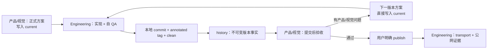
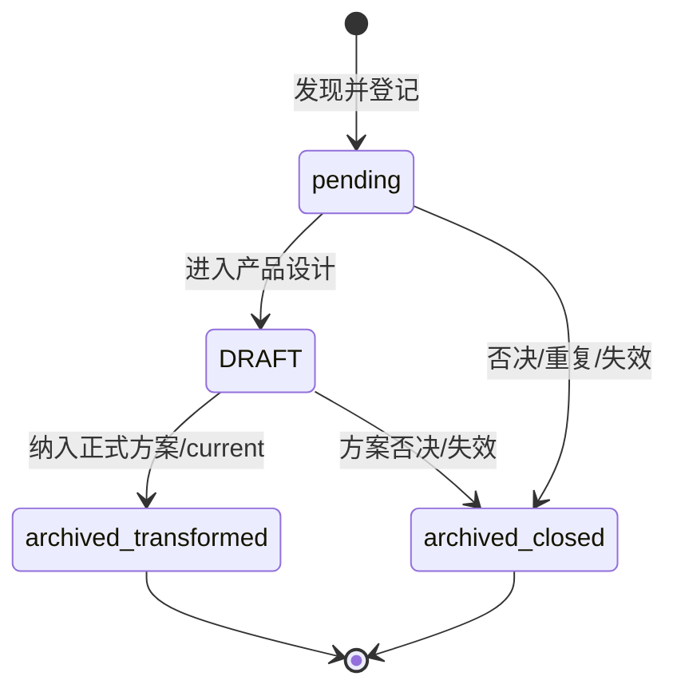

# xingbuild 职责边界与内部工作流

状态：生效。本文是 2.1 职责和内部流程唯一正文；跨 task 消息规则见 [`collaboration-workflow.md`](collaboration-workflow.md)，产品版本与发布规则见 [`iteration-and-release.md`](iteration-and-release.md)。

## 一、责任域

| 责任域 | 负责 | 不负责 |
| --- | --- | --- |
| 产品与视觉 | 产品总案、IA、页面能力、视觉合同、候选评审、正式方案、`current.md`、产品/视觉验收 | 日常选题、逐条事实审核、产品代码提交、线上 transport |
| Engineering | 读取 `current.md` 实现产品能力，测试、自 QA、版本记录、commit/tag/clean；用户明确 publish 后执行 transport 和公网验证 | 自行改变产品目标、越过方案、把内容发布当产品版本、擅自创建 task/分支/worktree |
| 内容与发布 | Brief/Article/Practice、B 端产品页面内容、事实审核、独立内容发布和内容公网验收 | 修改页面能力、IA、schema、组件、视觉 token、产品版本、产品 tag |
| Ops | 来源覆盖、可信证据候选、去重和运行记录 | 写公开正文、人工审核、发布、创建或复制 scheduler |
| 用户 | 产品方向、关键未决项、生产 publish 授权和不可逆外部决策 | 不替代执行 owner 的实现和验证 |

每个文件、版本和发布动作只有一个执行 owner；其他 task 只提供事实、验收或有界检查点。

## 二、产品工程固定闭环



- `current.md` 只保存当前可执行产品方案，不保存生命周期状态字段。
- Engineering 在本地形成 commit/tag/clean 后一次性写入对应 history；已打 tag 的 current/history 不因验收或线上事件回写。
- 提交前发现普通工程缺陷，Engineering 在当前版本内修复并重新自 QA；发现产品目标、对象边界或验收合同不成立，停止越界并回到产品/视觉确认。
- 提交后产品/视觉验收发现问题，直接定义下一个 patch/小迭代/大迭代并写入 current，不重新创建普通候选，也不改旧版本。
- 产品/视觉验收通过后，只有用户明确要求 publish，Engineering 才执行线上 transport；线上版本必须与同一 local HEAD/tag 对齐。

## 三、候选分流与归档

候选只属于产品设计前阶段，活动目录 [`../iterations/candidates/`](../iterations/candidates/) 只保留 `pending`/`DRAFT`：



- Engineering 实施中发现跨范围问题、产品优化或工具/CLI/Skill 缺陷，先登记候选并同步 canonical `main`，不自行决定进入版本。
- 产品/视觉确认并纳入正式设计方案时，必须在同一动作中写入方案/current、记录来源并将候选移入 [`../iterations/history/candidates/`](../iterations/history/candidates/)；不得留下长期 `confirmed`。
- 产品/视觉验收已提交版本发现的问题走“下一版本方案”路径，不走普通候选；内容文案、来源、媒体和不改变页面能力的 B 端内容只走独立内容运营。
- 候选被否决、重复或失效时归档并保留理由；不得删除制造“从未发生”。

## 四、资源和权限边界

- 官方项目目录与 canonical `main` 是唯一长期基线；默认 direct-local，不自动创建 branch、worktree、detached checkout、task 或 scheduled resource。
- 只有用户明确授权并行或高风险隔离，才允许创建 branch/worktree；启动时记录目的、范围、责任 task、canonical HEAD 和清理条件。
- 自动化、cron、scheduled task 是受控资源。经营观察只复用经营观察合同登记的唯一 scheduler；内容 task 和运行 task 不得创建、复制、更新或替代它。
- 任务创建、交接、执行、版本推进和发布授权是不同动作；普通“执行/继续”不自动获得创建权限。
- 找不到已存在的目标 task、目标身份无法确认、工具不可调用或责任归属不明时，立即报告用户并停止该跨 task 动作；不得猜测、替代、轮询或后台等待。

## 五、内容与 Ops 独立运营

```text
Ops 采集 → EvidenceCandidate → 内容审核/确认 → 独立 contentReleaseId 发布
```

内容和 Ops 使用各自合同、被忽略 `.content-workspace/` 与独立发布身份，不进入产品 `v0.x`、`current.md`、产品 history、commit/tag 或产品 publish。只有新增页面、路由、schema、组件、交互或共享视觉能力时，才转为产品候选并进入产品工程闭环。

## 六、固定收口报告

每次产品/视觉、Engineering、内容或 Ops task 收口都必须报告与自身责任域相关的：

```text
本地版本/内容身份状态；线上版本/内容状态；本地与线上 URL；已确定项；未确定项；候选状态；阻断 ID；下一动作；用户需要确认的授权
```

产品工程无候选、无阻断时明确“等待用户下一步”；内容和 Ops 不把该表述变成产品版本等待状态。
