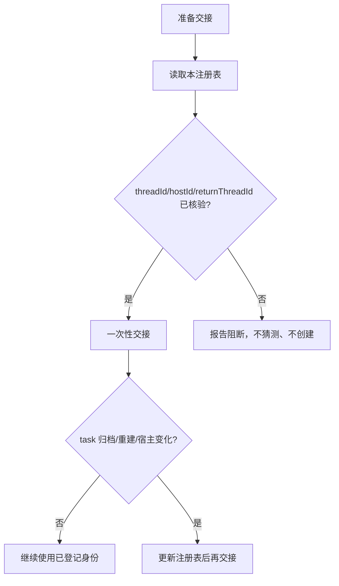

# xingbuild 活动 Task 注册表

状态：生效。本文只记录当前活动 task 的身份与通信地址，不保存任务正文、方案或执行日志。

## 当前登记

| 职责 | threadId | hostId | returnThreadId | 状态 | 最后核验 |
| --- | --- | --- | --- | --- | --- |
| 产品/视觉主线 | `019fc260-e14e-7211-97f1-44e075d0cc0f` | `local` | `019fc260-e14e-7211-97f1-44e075d0cc0f` | active | 2026-08-04 |
| Engineering 主线（旧，归档） | `019fc263-abf9-7732-84ef-73914e6a0a85` | `local` | `019fc260-e14e-7211-97f1-44e075d0cc0f` | archived | 2026-08-04 |
| Engineering 主线 | `019fcbf2-20e3-7d51-a4de-87ad7c94b190` | `local` | `019fc260-e14e-7211-97f1-44e075d0cc0f` | active | 2026-08-04 |
| 内容及发布主线 | `019fa166-9645-7532-87f6-99ae4cf9508a` | `local` | `019fc260-e14e-7211-97f1-44e075d0cc0f` | active | 2026-08-04 |
| Ops 采集主线（旧，归档） | `019fb57b-e90e-75a3-8898-ce380d6dc1fa` | `local` | `unverified` | archived | 2026-08-05 |
| Ops 采集主线 | `019fd012-6699-7b90-aadf-c2da6b097644` | `local` | `019fa166-9645-7532-87f6-99ae4cf9508a` | active | 2026-08-05 |

## 使用规则

- 普通消息、执行进度和回传不重复登记。
- 新建、归档、替代、宿主变化或回传地址变化时必须更新。
- `sourceThreadId` 只作来源追溯；发送目标只能使用登记的 `threadId`，回传只能使用登记的 `returnThreadId`。
- ID、宿主或责任无法核验时立即报告用户，不得按职责名称猜测、轮询、替代或创建 task。
- 归档 task 必须标记 `archived`；新 task 完成登记后才能成为 active。
