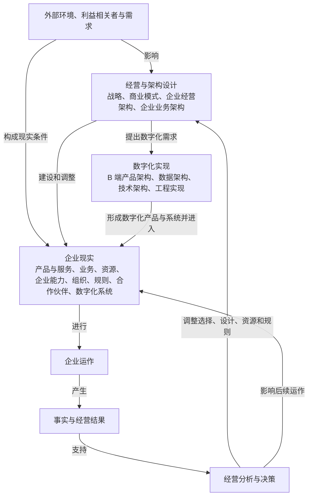
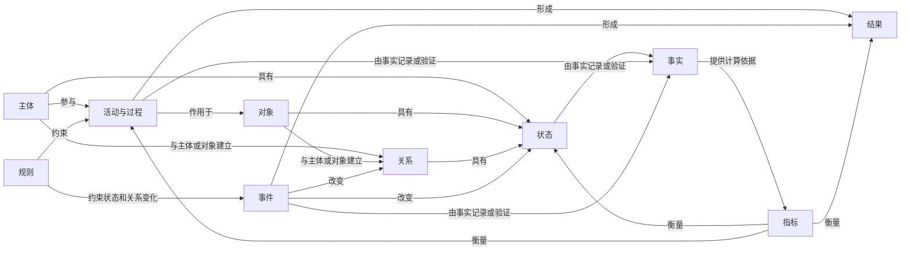

<!--
来源项目：Robotaxi
来源 task：readme定位
来源 threadId：019f4f35-5de2-77c1-95cb-4cde373a3440
版本沿革：v1.0 完整承接来源 task 已确认内容；v2.0 对商业本质、供给边界、价值闭环和统一表达规则进行结构性校正；v3.0 进一步区分分析对象、概念性质、对象生命周期、跨对象转化过程、验证门槛和经营状态；v3.1 校正核心研究对象与三个经营验证视角；v4.0 重建定义依赖顺序和固定关系；v5.0 执行概念最小化，区分企业现实、设计、数字化实现、运行反馈和分析应用；v5.1 在不改变既有概念定义的前提下，将知识构建顺序与学习顺序分离，建立从企业经营体系总览逐层深入到底层概念和具体应用的阅读结构。
基线说明：本文档是 career 项目个人认知框架与职业定位文档的唯一当前基线。
-->
本文档通过继承、补充、校正和固定持续演进。v5.1 完整继承 v5.0 已确认的概念、关系、对象生命周期、跨对象转化、三个经营验证视角和个人定位；本次只重构学习入口、章节归属和概念导航，不重造概念。

# 企业经营体系、数字化与职业定位认知框架 v5.1

## 使用原则

这套框架用于统一后续关于企业经营、业务架构、数字化系统、职业定位和 Robotaxi 项目的讨论。

- 已定义的正式概念不再随意更换名称。
- 不使用多个近义词表达同一概念。
- 新认识只能补充到现有结构中。
- 只有发现明确逻辑错误时才能修正，并说明原因。
- 行业判断和个人能力中尚未验证的部分，必须明确标记为假设或发展方向。
- 未在知识模型中完成底层概念定义前，不得用它建立上层关系、视角或结论；概念在文档中的阅读位置不改变其知识依赖。
- 每个核心概念只有一处权威定义；后文只能引用、展开、推导或应用。
- 上层推导不得为了解释方便新增未定义的对象、阶段、系统、闭环或概念名称。
- 只有在删除后会造成企业现实、设计或验证关系的实质信息丢失时，一个概念才能进入核心框架。
- 可以由“业务词语＋概念性质”生成的表达，不再逐个注册为底层概念。
- 历史误用、废弃名称和近义词区分只进入概念辨析与迁移说明，不参与核心关系推导。

当新认识证明原有正式概念的边界错误、包含关系冲突或无法稳定映射现实时，不应为了保留旧名称而继续修补，应说明原因后进行结构性校正。

### 知识构建与修订顺序

概念定义、逻辑校验和框架修订必须按照以下依赖关系自下而上进行：

1. 固定主体、对象、关系、状态、事件、活动与过程、规则、事实、指标和结果的基础表达语法。
2. 定义外部环境、利益相关者、需求、产品与服务、业务、资源、企业能力、组织、企业运作和经营结果等企业现实概念。
3. 定义战略、商业模式、企业经营架构、经营模型、企业业务架构和数字化实现路径，并明确它们是对企业现实的选择、设计与实现。
4. 由上述概念和关系组合形成核心研究对象“企业经营体系”及其四个平面固定关系。
5. 再展开企业业务架构视角、对象生命周期、跨对象转化和三个经营验证视角。
6. 将近义概念、废弃名称和历史误用放入独立辨析章节。
7. 最后进入供应链、Robotaxi、职业定位和经历证据应用。

任何修订如果破坏这一依赖顺序，都不得并入当前基线。

### 学习与使用顺序

读者不需要按照知识构建顺序线性阅读。学习和日常使用按照以下路径自上而下展开：

1. 先理解企业经营体系的整体含义和四个平面。
2. 再进入企业现实、经营与架构设计、数字化实现或运行反馈中的具体部分。
3. 在具体部分中理解相关概念、结构和关系。
4. 需要判断概念性质或边界时，再向下追溯基础表达语法和权威定义。
5. 最后进入供应链、Robotaxi、职业定位和经历证据等应用。

总览和导航可以引用后文已有权威定义的概念，但不能在总览中重新定义它们；概念修改仍然必须遵守自下而上的知识依赖。

---

# 第一部分：企业经营体系

## 1. 核心研究对象

企业经营体系，是企业在外部环境中，围绕利益相关者需求作出战略和商业模式选择，组织产品与服务、业务、资源、企业能力、组织和数字化系统进行实际运作，持续创造、交付和获取价值，并根据事实与结果进行分析、决策和调整的企业现实整体。

它回答的是一个根本问题：

> 一家企业如何在外部约束和有限资源下作出选择，形成并运用必要的企业能力，持续产生用户价值与经营结果，并根据事实调整自身、形成长期竞争优势？

企业经营体系是核心现实对象。战略、商业模式和各类架构是对这一现实的选择与设计；数字化系统是企业现实中使用的工具与自动化系统；三个经营验证视角是对企业运作及其结果的分析方法。

---

## 2. 企业经营体系总览

本节是整套认知框架的学习入口。它只展示后文已有权威定义的概念及其关系，使读者先建立整体认知，再进入具体部分和底层定义。

企业经营体系同时涉及企业现实、经营与架构设计、数字化实现、运行反馈四个相互连接的平面：



### 企业现实平面

```text
外部环境与利益相关者
          │ 提出需求并形成约束
          ↓
企业经营体系
（产品与服务、业务、资源、企业能力、组织、规则、合作伙伴和数字化系统）
          │ 进行
          ↓
企业运作
          │ 产生
          ↓
事实与经营结果
```

### 经营与架构设计平面

```text
外部环境、利益相关者需求、事实与经营结果
          │ 影响选择与设计
          ↓
战略与商业模式
          │ 驱动
          ↓
企业经营架构
          │ 驱动
          ↓
企业业务架构
          │ 指导
          ↓
企业现实的建设与调整
```

### 数字化实现平面

```text
企业业务架构
          │ 提出数字化需求
          ↓
B 端产品架构 ↔ 数据架构
          │ 共同驱动
          ↓
技术架构
          │ 通过工程实现形成
          ↓
企业数字化系统
          │ 进入企业现实并支持或执行
          ↓
企业运作
```

### 运行反馈平面

```text
企业运作产生的事实与经营结果
          │ 由指标计算并与经营目标比较
          ↓
经营分析与决策
          │ 调整
          ↓
战略选择、经营目标、经营模型、资源配置、架构设计或业务规则
          │ 再次指导
          ↓
后续企业运作
```

这四个平面共同构成一个固定关系：企业现实是研究对象；战略、经营与架构对企业现实作出选择和设计；数字化实现将部分业务设计转化为可运行的产品和系统；企业运作产生事实与结果，并通过分析和决策影响下一轮选择、设计与运作。

### 学习导航

| 想理解的问题 | 继续深入 |
| --- | --- |
| 企业现实由什么构成，如何实际运作 | [企业现实的构成、运作与反馈](#3-企业现实的构成运作与反馈) |
| 战略和商业模式如何进入经营与业务设计 | [战略、架构与数字化实现的核心定义](#第二部分战略架构与数字化实现的核心定义) |
| 企业业务架构包含哪些固定视角 | [企业业务架构要素及固定关系](#第三部分企业业务架构要素及固定关系) |
| 数字化系统如何进入企业现实 | [企业数字化系统](#第四部分企业数字化系统) |
| 产品化、商业化和规模化如何区分 | [对象生命周期与跨对象转化](#第五部分对象生命周期与跨对象转化) |
| 如何判断用户价值、企业运作和经济价值 | [商业本质与三个经营验证视角](#第六部分商业本质与三个经营验证视角) |
| 一个概念最终属于什么性质 | [底层概念与基础表达语法](#4-底层概念与基础表达语法) |
| 旧概念和近义词如何处理 | [概念辨析与迁移说明](#第七部分概念辨析与迁移说明) |
| 如何进入供应链、Robotaxi和职业应用 | 第八部分以后各应用章节 |

---

## 3. 企业现实的构成、运作与反馈

本节展开总览中的企业现实平面，说明企业经营体系在现实中包含哪些必要内容、如何实际运作，以及如何产生事实、结果和反馈。这里不是一张同层级“核心概念清单”，而是按照现实构成和运行关系逐层展开。

### 现实对象与基础要素

| 核心概念 | 概念性质 | 固定定义 |
| --- | --- | --- |
| 外部环境 | 对象、关系、状态与规则的集合 | 企业所处的市场、竞争、技术、政策、社会和宏观经济条件 |
| 利益相关者 | 主体 | 与企业相互影响，并对企业提出需求、提供资源、参与合作或承担结果的主体 |
| 需求 | 主体状态 | 利益相关者希望解决的问题、期望获得的结果以及需要满足的条件 |
| 产品与服务 | 对象 | 企业向用户提供并承载用户价值的产品或服务 |
| 业务 | 对象 | 企业围绕特定产品与服务，持续组织价值创造、交换、交付、价值获取和管理活动所形成的现实整体 |
| 资源 | 对象 | 企业可以投入、配置、使用或消耗的资产、资金、人才、技术、数据、品牌和关系 |

---

### 企业能力与组织责任

企业需要形成稳定能力，才能持续运用资源并完成价值创造。

#### 企业能力

企业能力是：

> 企业为了回应需求、完成业务并形成预期结果，必须能够持续完成的事情。

例如：

- 产品与服务研发能力
- 需求预测能力
- 采购能力
- 供给规划能力
- 定价能力
- 订单履约能力
- 客户服务能力
- 经营分析能力

企业能力回答的是：

> 企业必须能够做什么？

#### 组织

组织是：

> 企业对部门、团队、角色、人员、责任和决策权限的实际安排。

企业能力与组织的关系是：

```text
企业能力：企业需要能够做什么
组织：具体由哪个部门、团队和角色承担
```

---

### 企业运作的现实参与要素

企业运作由不同性质的现实要素按照各自关系共同完成：

| 现实要素 | 在企业运作中的关系 |
| --- | --- |
| 组织、角色与人员 | 承担责任与权限，作出判断并执行活动 |
| 合作伙伴 | 作为企业外部主体参与交易、协作与交付 |
| 资源 | 在企业运作中被投入、配置、使用或消耗 |
| 业务规则 | 约束判断、行为、对象关系和状态变化 |
| 企业数字化系统 | 记录数据、支持协作，并在授权范围内执行规则和业务活动 |

企业能力是企业能够稳定完成某类事情的整体能力，由组织责任、人员专业、业务流程、规则、资源、合作关系和数字化系统等共同形成。

---

### 企业运作、事实与经营结果

| 核心概念 | 概念性质 | 固定定义 |
| --- | --- | --- |
| 企业运作 | 活动与过程 | 企业中业务活动与支撑活动的实际执行 |
| 事实 | 事实 | 企业运作中已经发生并可以由证据验证的对象状态、事件、活动、资源投入和数量 |
| 经营结果 | 结果 | 企业运作在明确范围和期间内形成，并可以根据指标判断的用户、业务和经济结果 |

企业运作产生同一事实集合。具体业务分析从中选择与该业务相关的事实；企业经营分析进一步选择资源、收入、成本、费用、现金流和资金占用等事实。

---

### 经营分析、决策与持续进化

企业运作产生事实和经营结果；指标根据事实进行计算；事实和指标共同用于判断经营结果与目标之间的差距。

经营层根据事实完成：

以下箭头只表示经营反馈活动的执行顺序，不表示概念的包含、组成或对象生命周期关系。

```text
目标与计划
    ↓
资源配置与企业运作
    ↓
事实与经营结果
    ↓
实际、预测、计划和目标比较
    ↓
识别差异及其驱动因素
    ↓
调整策略、资源和业务规则
    ↓
再次执行和验证
```

因此，企业经营体系不是静态结构，而是一个持续学习和进化的系统。

---

## 4. 底层概念与基础表达语法

当需要继续追问企业现实中的概念“本质上属于什么”时，使用本节的底层定义。基础表达语法用于说明现实中存在什么、发生什么以及如何判断结果，只保留十类基础概念性质：

| 概念性质 | 固定含义 |
| --- | --- |
| 主体 | 能够提出需求、参与行动、作出决定或承担结果的现实参与者 |
| 对象 | 在现实中被识别、使用、改变或持续追踪的事物 |
| 关系 | 主体或对象之间已建立的联系、权利或义务 |
| 状态 | 主体、对象或关系在某一时点满足的明确条件 |
| 事件 | 已经发生并引起对象状态或关系变化的动作 |
| 活动与过程 | 为形成某一结果而发生的动作及顺序 |
| 规则 | 对行为、关系、判断和状态变化的约束 |
| 事实 | 已经发生并可以由证据验证的状态、事件、活动或数量 |
| 指标 | 根据事实计算并用于衡量状态、过程和结果的口径及数值 |
| 结果 | 活动与事件在明确范围和期间内形成的可验证后果 |

### 结构化阅读方式

为了理解十类基础概念性质之间的关系，可以按其回答的问题进行分组。以下分组只用于阅读，不增加新的概念性质：

| 阅读分组 | 基础概念性质 | 回答的问题 |
| --- | --- | --- |
| 现实参与 | 主体、对象 | 谁参与，围绕什么发生 |
| 现实结构 | 关系、状态 | 建立了什么联系，当前处于什么状态 |
| 现实变化 | 事件、活动与过程 | 发生了什么，如何发生 |
| 现实约束 | 规则 | 行为、关系、判断和状态变化受到什么约束 |
| 证据与判断 | 事实、指标、结果 | 已经发生什么，形成什么后果，如何衡量 |

### 固定关系图

下图只将本节已经定义的概念性质和关系结构化，不增加新的企业经营体系组成：



基础关系可以进一步压缩为：

```text
主体围绕对象参与活动
        ↓
活动作用于对象并受到规则约束
        ↓
事件改变对象状态或关系
        ↓
活动与事件形成结果
        ↓
事实记录和验证已经发生的状态、事件、活动与数量
        ↓
指标根据事实衡量状态、过程和结果
```

这条关系表达的是基础概念性质之间的依赖与因果，不是业务流程、价值流、对象生命周期或企业经营阶段。

具体业务词语必须通过上述性质获得确定含义，例如“履约活动”、“履约事件”、“履约状态”和“履约结果”。这些组合表达不再各自升格为底层概念。

---

## 5. 固定分析协议

分析企业、工作经历、项目或数字化系统时，依次回答五个问题：

1. **研究对象**：当前研究的是企业经营体系、某项业务、产品与服务、技术、数字化系统，还是某一具体主体或对象？
2. **所处平面**：当前讨论的是企业现实、经营与架构设计、数字化实现，还是分析与验证？
3. **采用视角**：当前从业务领域、企业能力、价值流、企业职能、组织、业务流程、对象与事件、产品、数据还是技术视角进行观察？
4. **生命周期与成熟度**：该对象处于自身发展过程的哪一位置，已经通过哪些事实条件？
5. **事实与证据**：当前结论由哪些已发生事实、指标和结果支持，哪些仍是目标、计划、预测或假设？

这五个问题是使用框架的分析协议，不是五类企业组成或新的底层概念。

---

# 第二部分：战略、架构与数字化实现的核心定义

本部分继续完成企业经营体系所依赖的选择、设计与数字化实现概念。以下定义是全文的权威定义；后续章节只能展开其内部关系或应用，不再重新定义。

## 1. 战略

战略是：

> 企业选择服务谁、解决什么问题、凭什么获胜，以及哪些事情明确不做。

战略主要确定：

- 目标用户和市场
- 核心产品与服务
- 差异化价值
- 资源投入重点
- 长期竞争优势
- 关键取舍

因此，战略是企业围绕长期发展方向和竞争优势作出的一组相互一致的选择与取舍，不是愿景口号或单一经营目标。

---

## 2. 商业模式

商业模式是：

> 对企业为谁提供什么产品与服务、如何使产品与服务被用户选择、获得和使用、如何形成收入并承担成本，从而创造、交付和获取价值的基本逻辑。

它至少包含：

- 服务什么用户
- 提供什么产品与服务
- 如何使用户接触、选择、获得和使用产品与服务
- 收入从哪里产生
- 成本由什么驱动
- 规模扩大后经济性如何变化

战略确定方向与取舍；商业模式说明价值和收益如何成立。

---

## 3. 企业经营架构

企业经营架构，是把战略和商业模式转化为经营目标、经营模型、业务组合、资源配置、组织责任、指标、决策机制和反馈闭环的整体设计。

其中：

> 经营目标，是企业在明确范围和期间内希望达到，并能够通过指标衡量的经营结果。

经营目标不是战略本身。战略确定方向与取舍；经营目标把战略转化为需要实现和验证的具体结果。

它回答：

> 企业应当经营什么、投入什么、追求什么结果、如何衡量结果，以及如何根据结果调整决策？

主要内容包括：

- 经营目标
- 经营模型
- 业务组合
- 收入、成本、利润与现金流逻辑
- 资源与资本配置
- 组织责任与决策权限
- 指标与经营分析
- 计划、执行、反馈和调整机制

正式名称固定为“企业经营架构”。

---

## 4. 经营模型

经营模型是企业经营架构中对关键经营变量及其因果关系的表达。

固定定义：

> 经营模型，是对需求、业务量、价格、收入、成本、资源、效率、现金流、利润和风险等关键经营变量之间因果关系的结构化及量化表达。

经营模型可能包含：

```text
需求规模
 ×
订单转化率
 ×
履约完成率
 ×
平均订单收入
 =
经营收入
```

以及：

```text
资产规模
 ×
可运营率
 ×
单位时间服务能力
 ×
有效利用率
 =
实际可服务能力
```

经营模型用于：

- 目标分解
- 经营计划
- 预测
- 资源配置
- 差异分析
- 经营决策
- 战略验证

经营模型根据企业运作中的事实与结果持续校验和调整。

---

## 5. 企业业务架构

企业业务架构是：

> 围绕企业经营目标，对业务领域、企业能力、价值流、企业职能、组织责任、业务流程、业务对象、业务事件、业务规则和指标进行整体设计，明确企业如何实际创造、交付和获取价值。

企业经营架构与企业业务架构的关系固定为：

| 架构 | 核心问题 |
| --- | --- |
| 企业经营架构 | 经营什么、投入什么、追求什么结果、如何分析和决策 |
| 企业业务架构 | 需要哪些能力、如何形成价值、由谁负责、具体如何运作 |

```text
企业经营架构
  │ 设计经营目标、经营模型、资源配置、组织责任、指标与决策机制，并驱动
  ↓
企业业务架构
  │ 设计实现经营目标所需的业务领域、企业能力、价值流及其他业务架构要素
```

---

## 6. B 端产品架构

B 端产品架构是：

> 根据企业业务架构和企业用户场景，对 B 端产品、用户角色、业务场景、功能边界及产品关系进行整体设计。

它回答：

> 企业用户通过什么产品完成工作和获得价值？

B 端产品架构将企业业务架构中的业务对象、活动、规则、协作和指标转化为企业用户可以使用的数字化产品。

---

## 7. 数据架构

数据架构是：

> 对业务对象、业务事件、对象关系、数据标准、事实来源、指标口径和数据流动方式进行整体设计。

它回答：

> 企业运作产生什么事实，这些事实如何记录、关联、计算和使用？

数据架构不只是数据库表设计。它首先要保证：

- 业务对象边界清楚
- 状态与动作一致
- 事实来源唯一
- 指标口径一致
- 预测、计划和实际事实相互区分
- 数据能够支持经营分析和决策

B 端产品架构与数据架构由企业业务架构共同驱动。

业务对象、业务事件、业务规则和指标会同时决定：

- B 端产品需要支持哪些用户角色、业务场景和业务动作。
- 数据需要记录哪些对象、关系、事件、状态和事实。

B 端产品架构和数据架构协同设计，并共同对技术架构和工程实现提出要求。

---

## 8. 技术架构

技术架构是：

> 对软件组件、服务边界、数据存储、系统集成、运行环境、安全和非功能能力进行整体设计。

它回答：

> 产品和数据通过什么技术结构稳定运行？

技术架构不能为了页面或局部实现方便，破坏业务对象边界、事实来源或业务服务责任。

---

## 9. 工程实现

工程实现是：

> 通过代码、配置、测试、部署、监控和维护，将 B 端产品架构、数据架构和技术架构转化为真实运行的软件。

工程实现把架构设计转化为可运行、可测试、可部署和可维护的软件。

工程实现形成能够实际运行的企业数字化系统：

> 企业数字化系统，是企业在实际运作中使用的软件、数据和自动化系统；它记录数据、支持人员协作，并在授权和规则范围内执行业务活动。

---

# 第三部分：企业业务架构要素及固定关系

## 1. 企业业务架构的固定视角

企业业务架构使用多个视角设计同一企业现实。每个视角回答不同问题：

| 业务架构视角 | 固定定义 | 回答的问题 |
| --- | --- | --- |
| 业务领域 | 按照业务知识、问题和责任范围对企业业务进行的逻辑划分 | 业务范围如何划分 |
| 企业能力 | 企业为实现经营目标必须能够稳定完成的事情 | 企业必须能够做什么 |
| 价值流 | 从利益相关者需求或业务触发开始，经过多个价值阶段形成用户价值和经营结果的端到端路径 | 价值如何端到端形成 |
| 企业职能 | 根据专业分工对相关能力和管理责任进行的归类 | 相关能力属于什么专业责任 |
| 组织责任 | 对部门、团队、角色、责任和权限的安排 | 具体由谁负责和决策 |
| 业务流程 | 在明确触发条件、角色分工和业务规则下为完成业务目标而执行的活动及顺序 | 具体如何执行 |
| 业务对象与事件 | 企业运作中被改变和追踪的对象，以及改变其状态与关系的事件 | 围绕什么运作，发生了什么 |
| 业务规则 | 对业务行为、对象关系、判断和状态变化的约束 | 业务受到什么约束 |
| 业务指标 | 根据相关事实衡量目标、过程和结果的口径及数值 | 如何衡量目标与结果 |

业务领域、企业能力、价值流、企业职能、组织责任、业务流程、业务对象与事件、业务规则和业务指标是对同一企业现实的不同设计视角。

企业业务架构识别和设计企业需要形成的能力、责任、流程、规则及其他要素；企业现实中的组织、人员、资源、伙伴和数字化系统共同使这些设计形成实际企业能力和企业运作。设计视角与企业现实相互对应，但不是同一概念。

### 业务对象、事件、规则与指标的概念限定

业务对象、业务事件、业务规则和业务指标不是新增的底层概念，而是第一部分十类基础概念性质在企业业务架构中的限定表达：

| 业务架构概念 | 底层概念性质 | 在企业业务架构中的含义 |
| --- | --- | --- |
| 业务对象 | 对象 | 在企业运作中被创建、使用、改变和持续追踪的对象，如用户、产品、订单、合同、Robotaxi和结算单 |
| 业务事件 | 事件 | 引起业务对象状态或对象关系变化的已发生动作 |
| 业务规则 | 规则 | 对业务行为、对象关系、判断和状态变化的约束 |
| 业务指标 | 指标 | 根据相关事实对状态、过程和结果进行量化衡量的口径及数值 |

---

## 2. 价值流与其他业务架构视角的关系

固定关系如下：

```text
利益相关者需求或业务事件
              │ 触发
              ↓
价值流及其价值阶段
              │ 需要
              ↓
企业能力与资源
              │ 由企业职能归类专业责任，由组织承担具体责任
              ↓
业务流程组织具体活动
              │ 在业务规则约束下改变
              ↓
业务对象的状态与关系
              │ 产生
              ↓
事实与结果
              │ 由业务指标衡量
              ↓
价值流结果与经营目标的差距
```

企业数字化系统可以在各业务流程中记录数据、支持协作或执行授权活动，但它不改变上述业务架构视角的性质。

---

## 3. 统一表达规则

后续分析企业、工作经历、项目、能力和 B 端产品时，统一遵守以下规则：

1. 先用第一部分的固定分析协议声明研究对象、所在平面、采用视角、生命周期或成熟度以及事实证据。
2. 描述企业现实时，使用主体、对象、关系、状态、事件、活动与过程、规则、事实、指标和结果这十种基础性质。
3. 描述企业业务架构时，使用业务领域、企业能力、价值流、企业职能、组织责任、业务流程、业务对象与事件、业务规则和业务指标这些固定视角。
4. 同一并列关系必须处于同一平面、采用同一视角、具有相同概念性质，并保持相近粒度。
5. 生命周期只描述同一个研究对象；不同对象之间的变化必须明确为转化过程及其验证门槛。
6. 架构表达设计，企业运作表达现实活动，企业数字化系统表达进入现实运作的软件、数据和自动化工具。
7. 事实是已发生记录，指标是基于事实形成的衡量口径与数值，结果是明确范围和期间内形成的后果。
8. 具体业务词语必须通过限定词说明性质，例如“履约能力”“履约流程”“履约事件”和“履约结果”；不把未限定性质的业务词语直接作为总结构节点。

| 表达任务 | 固定概念来源 |
| --- | --- |
| 描述企业现实中存在什么 | 主体、对象、关系、状态和资源 |
| 描述企业现实中发生什么 | 事件、活动与过程、规则、事实、指标和结果 |
| 设计企业业务 | 企业业务架构的九个固定视角 |
| 设计并实现数字化工具 | B 端产品架构、数据架构、技术架构、工程实现和企业数字化系统 |
| 判断对象成熟度 | 对象自身生命周期、验证门槛、事实、指标和结果 |
| 判断个人责任与能力 | 问题、判断、行动、责任边界、事实证据和结果 |

每段工作经历和每个代表项目统一使用：

> 我首先明确研究对象、所在平面、采用视角、生命周期或成熟度以及事实证据；再判断对象面临的问题、涉及的跨对象转化和验证门槛。在明确经营目标下，我通过企业业务架构识别所需能力、责任、流程、对象、事件、规则和指标，再将需要数字化支持的部分转化为 B 端产品、数据和企业数字化系统；最终只根据可验证的事实与结果判断我的责任、能力和价值。

---

# 第四部分：企业数字化系统

## 1. 职责与边界

企业数字化系统的权威定义已经在第二部分固定。本部分只展开其职责与使用边界，不重新定义。

企业数字化系统可以跨越多个业务领域，主要承担：

- 记录业务对象、事件、状态和事实。
- 支持人员之间的流程协作和信息协同。
- 按照明确的业务规则执行或约束业务动作。
- 为经营分析、决策和反馈提供数据，并在授权范围内完成自动化。

战略选择、经营责任、组织授权、管理判断、实体作业、资源投入和伙伴协作仍由企业现实中的相应主体与要素承担。

---

## 2. B 端产品与企业数字化系统

四个概念位于不同平面：

| 概念 | 所在平面 | 固定含义 |
| --- | --- | --- |
| 企业经营体系 | 企业现实 | 企业实际存在和运作的整体 |
| B 端产品 | 企业现实 | 企业用户在业务场景中实际使用的数字化产品 |
| B 端产品架构 | 架构设计 | 对 B 端产品边界、用户、场景、能力和关系的整体设计 |
| 企业数字化系统 | 企业现实与数字化实现结果 | 由软件、数据和自动化组成并进入企业运作的系统 |

---

## 3. 数字化系统与企业经营体系的关系

数字化系统与企业经营体系的关系沿用第一部分总览中的固定关系，以及第二部分已经定义的数字化实现路径：企业业务架构驱动 B 端产品架构与数据架构，二者对技术架构和工程实现提出要求，工程实现形成进入企业现实的 B 端产品和企业数字化系统；组织、人员、伙伴、资源、规则和数字化系统共同参与企业运作。

因此，你真正持续设计的不是页面和功能，而是：

> 从经营目标和真实业务问题出发，理解企业应该如何运作，建立企业业务架构，再将其转化为 B 端产品、数据和能够真实运行的企业数字化系统。

软件是经营与业务设计的数字化实现。企业运作产生事实与结果；企业数字化系统记录其中可以数字化的事实，并支持分析、决策和后续调整。

---

# 第五部分：对象生命周期与跨对象转化

本部分调用前四部分已经定义的研究对象、基础表达语法、企业现实、架构设计、数字化实现、企业运作、事实与结果，用于分析对象的发展及对象之间的转化，不增加新的底层概念。

## 1. 各分析对象的生命周期与成熟度

生命周期只能描述同一类分析对象随时间的发展。不同对象可以相互促进或约束，但不共用一条未声明对象的统一阶段链。

| 分析对象 | 自身生命周期 | 成熟度判断依据 |
| --- | --- | --- |
| 技术 | 研究探索→可行性验证→工程化成熟→应用验证→持续演进或淘汰 | 已定义的技术性能、可靠性、安全性和真实场景适用性事实与指标 |
| 产品与服务 | 需求探索→产品与服务定义→研发与交付准备→发布与用户验证→增长→成熟→更新或退出 | 已定义的用户需求、价值主张、功能、体验、质量、可交付性、用户结果和竞争事实与指标 |
| 业务 | 商业假设→用户采用与价值交换事实验证→经营模型验证→可重复增长→成熟经营→调整或退出 | 已定义的用户、价值交换、企业运作、收入、成本、单位经济性、现金流和可持续性事实与指标 |
| 企业经营体系 | 试验性运作→可重复运作→标准化运作→规模化经营→持续优化、组合调整或退出 | 经营目标对应的企业能力、组织责任、资源、规则、数字化系统、企业运作、事实、结果和反馈调整是否通过阶段门槛 |
| B 端产品与企业数字化系统 | 业务问题识别→产品与架构设计→工程实现→上线与业务采用→稳定运行与迭代→替换或退役 | 是否真实支持已经定义的业务对象、事件、规则、流程、协作、数据记录和经营反馈 |

“市场领先”、“专业水准”和“高质量”不是生命周期阶段，而是必须通过相应分析对象的事实、指标、用户结果、竞争比较或经营结果验证的属性和判断结果。

---

## 2. 产品化、商业化和规模化准备的跨对象转化关系

产品化、商业化和规模化准备不是同一对象的三个并列生命周期阶段，而是跨越技术、产品与服务、业务和企业经营体系的转化过程。

### 产品化与产品化就绪

> 产品化，是将已经具备基本技术可行性和用户价值假设的技术或方案，转化为能够在明确质量、安全、合规、成本和服务条件下被重复交付的产品与服务的过程。

> 产品化就绪，是产品与服务已经满足预先定义的技术、质量、安全、合规、成本和服务条件，具备重复交付基础的验证门槛。

产品化是跨对象转化过程，产品化就绪是验证门槛，都不等于产品与服务研发能力。

### 商业化与商业化验证通过

> 商业化，是使产品与服务进入真实业务，形成用户采用、价值交换、企业运作、收入、成本和现金流事实，并验证商业模式的跨对象转化过程。

> 商业化验证通过，是用户结果以及收入、成本、现金流等事实与指标已经证明商业模式在明确范围内初步成立的验证门槛。

获得第一个用户、第一笔订单或第一笔收入，只是商业化过程中的局部事实，不自动等于商业化验证通过。

### 规模化准备与规模化就绪

> 规模化准备，是为了支持用户、区域、订单、资产或收入等业务规模扩大，建立可以重复执行的企业能力、组织责任、业务流程、资源结构、B 端产品、数据和企业数字化系统的跨对象转化过程。

> 规模化就绪，是企业经营体系已经能够在明确目标规模下重复运作，并使预先定义的质量标准、履约指标、单位成本指标、现金流要求和风险约束保持在目标范围内的验证门槛。

### 规模化经营

> 规模化经营，是企业经营体系通过规模化就绪门槛后，在业务规模持续扩大过程中继续运作、产生事实，并根据指标和结果持续分析与调整的经营状态。

业务数量、用户或收入增长，不自动等于规模化经营成立。如果单位成本、组织复杂度、现金消耗或风险更快上升，只能说明业务规模扩大，不能证明已经达到规模化就绪或形成可持续的规模化经营。

跨对象关系固定表达为：

```text
技术完成应用验证
  │ 通过产品化过程转化为
  ↓
可重复交付的产品与服务
  │ 接受产品化就绪门槛验证
  ↓
产品与服务通过商业化过程形成真实业务及相关事实
  │ 接受商业化验证门槛验证
  ↓
业务与企业经营体系通过规模化准备建立可重复扩展基础
  │ 接受规模化就绪门槛验证
  ↓
进入规模化经营状态并持续接受事实与结果验证
```

---

# 第六部分：商业本质与三个经营验证视角

## 1. 推导边界

商业本质和三个经营验证视角属于对企业经营体系的上层抽象与观察方式，不是新的分析对象、业务子系统或对象生命周期。

本部分只能调用前五部分已经定义的概念和固定关系：

- 不增加新的企业经营体系组成。
- 不重新定义企业运作、企业能力、事实、结果或指标。
- 不把属性、约束、活动、事实和指标临时组合为新的总结构。
- 不用新的总图替代第一部分已经固定的四个平面及其关系。

---

## 2. 商业本质

基于前文已经定义的概念，商业本质固定表达为：

> 企业在外部环境中围绕利益相关者需求作出战略和商业模式选择，以产品与服务回应需求，通过业务组织价值创造、交换、交付和获取，配置资源、企业能力、组织责任、规则和数字化系统完成实际运作，形成用户结果与经营结果，并根据事实持续分析、决策和调整。

这段表达只压缩已经定义的基础关系：

```text
用户需求
  │ 由产品与服务回应和承载
  ↓
业务组织价值创造、交换、交付和获取
  │ 由企业经营体系配置资源、能力、组织、规则和数字化系统
  ↓
企业运作产生事实与结果
  │ 用于
  ↓
经营分析、决策、调整与再次验证
```

商业能否持续成立，不能只根据产品发布、交易发生、收入增长或系统上线中的任何单一事实判断。

---

## 3. 三个经营验证视角的固定关系

三个视角观察的是同一个企业经营体系及其实际运作，但选择不同的已定义概念和事实进行判断。

| 验证视角 | 从基础结构中选择的概念 | 固定验证问题 |
| --- | --- | --- |
| 用户价值验证视角 | 利益相关者需求、产品与服务、相关活动与事实、用户结果 | 产品与服务是否使用户获得预期结果 |
| 企业运作验证视角 | 企业业务架构、企业能力、组织责任、资源、规则、数字化系统、企业运作、事实、结果、经营目标和指标 | 企业业务设计是否进入实际运作，并持续产生符合目标的事实与结果 |
| 经济价值验证视角 | 投入、收入、成本、费用、现金流和资金占用事实，以及相应指标与经营结果 | 企业创造和交付的价值能否形成可持续经营收益 |

三个视角不是三条互相替代的链：用户获得价值，不自动证明企业能够稳定运作；企业能够稳定运作，不自动证明经济价值成立；获得短期利润，也不能反向证明用户价值和长期竞争优势已经形成。

---

## 4. 用户价值验证视角

本视角从用户一侧验证产品与服务是否产生预期结果：

```text
利益相关者需求
  │ 由产品与服务回应
  ↓
用户接触、选择、获得并使用产品与服务
  │ 产生相应事件、活动与事实
  ↓
用户结果
  │ 与预期需求比较
  ↓
用户价值判断
```

具体企业可以在其业务架构中进一步设计价值阶段、能力、流程、对象、事件、规则和指标；这些具体设计不进入本视角的通用底层结构。

---

## 5. 企业运作验证视角

本视角验证业务设计是否进入企业现实并形成稳定、可衡量的运作：

```text
企业业务架构
  │ 设计企业能力、价值流、责任、流程、对象、事件、规则和指标
  ↓
组织、人员、伙伴、资源、规则和数字化系统
  │ 共同参与
  ↓
企业运作
  │ 产生
  ↓
事实与结果
  │ 由指标衡量，并与经营目标比较
  ↓
经营分析与决策
  │ 反馈与调整
  ↓
资源配置、企业业务架构、业务规则和后续企业运作
```

企业运作验证判断的是：企业业务架构所设计的能力、责任、流程和规则是否通过现实参与要素进入实际运作，并持续产生能够被记录、衡量和比较的事实与结果。

---

## 6. 经济价值验证视角

经济价值验证使用企业运作已经产生的经济类事实，再通过指标计算和判断经济结果。

| 内容 | 概念性质 | 固定含义 |
| --- | --- | --- |
| 资源与资本投入 | 事实 | 企业已经实际投入的资源、资金和资本 |
| 收入与现金流入 | 事实 | 企业运作已经形成的收入确认和现金流入 |
| 成本、费用与现金流出 | 事实 | 企业为了产品与服务、业务和整体运作已经发生的资源消耗、费用确认和现金流出 |
| 资金与资本占用 | 事实 | 库存、资产、应收、建设投入等对资金和资本的持续占用 |
| 单位经济性 | 指标与判断结果 | 一个订单、用户、服务、产品或其他明确业务单位的收入、变动成本和贡献关系 |
| 利润 | 经营结果 | 在明确会计范围和期间内收入扣除成本与费用后的结果 |
| 现金流 | 经营结果 | 在明确范围和期间内现金流入、流出及净变化结果 |
| 资本回报 | 指标与经营结果 | 经营收益相对于投入资本及占用时间形成的回报 |

固定关系是：

```text
企业运作
  │ 产生经济类事实
  ↓
投入、收入、成本、费用、现金流入、现金流出和资本占用
  │ 通过明确口径计算
  ↓
单位经济性、利润、现金流和资本回报
  │ 支持
  ↓
经营分析、资源配置、再投资、调整或退出决策
```

收入、成本、现金流和资本占用是相互关联但可以并行产生的事实；上图表达计算与判断关系，不是业务流程。

### 成本与投入的统一表达

成本表达不得混用业务活动、会计性质和资金形态。每次分析必须先声明分类口径。

按成本所对应的价值创造与企业运作活动，可以区分：

- 产品与服务研发成本。
- 产品化成本。
- 需求获取与销售成本。
- 供给形成成本。
- 交易处理成本。
- 履约成本，其中可以进一步区分交付活动成本。
- 客户服务活动成本。

按企业支撑和资本性质，还需要区分：

- 组织管理成本。
- 企业数字化建设与运行成本。
- 合规与风险成本。
- 资金成本。
- 资本性投入、折旧与摊销。

还必须根据分析目的区分历史投入与当期成本、资本性投入与经营费用、固定成本与变动成本、直接成本与间接成本、账面利润与现金流、单位经济性与企业整体利润。

---

# 第七部分：概念辨析与迁移说明

本部分只处理常用词语的性质识别、近义概念边界和旧版本迁移，不增加企业经营体系的组成，不改变前六部分的底层概念和固定关系。

## 1. 经营、运作与运营

| 词语 | 在本框架中的使用 |
| --- | --- |
| 企业经营 | 企业确定经营目标、配置资源，根据事实与结果进行分析、决策和调整 |
| 企业运作 | 企业现实中的各项活动实际发生并产生事实与结果 |
| 业务运营 | 组织某项具体业务或服务持续运行的企业职能、组织责任、能力、流程或活动的统称；使用时应继续说明具体性质 |

例如：“Robotaxi 运营”可以指运营职能、运营团队、运营能力或运营活动。正式分析时应分别表达，不把“运营”作为未经限定的底层节点。

## 2. 产品与服务、B 端产品、B 端产品架构与企业数字化系统

| 词语 | 概念性质 | 固定边界 |
| --- | --- | --- |
| 产品与服务 | 企业现实中的对象 | 企业向用户提供并承载用户价值的对象 |
| B 端产品 | 产品与服务的一类 | 企业用户在业务场景中使用的数字化产品 |
| B 端产品架构 | 架构设计 | 对 B 端产品边界、用户、场景、能力与关系的整体设计 |
| 企业数字化系统 | 企业现实中的系统 | 由软件、数据和自动化组成并参与企业运作的系统 |

“产品系统”不再作为正式概念。需要表达企业用户使用的产品时使用“B 端产品”；需要表达架构设计时使用“B 端产品架构”；需要表达进入企业运作的软件、数据和自动化整体时使用“企业数字化系统”。

## 3. 具体业务词语的性质限定

下表不是新的底层概念表，而是基础表达语法的使用示例。同一个业务词语可以与不同概念性质组合，只有完成限定后才具有准确含义。

| 常用词语 | 可以形成的准确表达 | 含义 |
| --- | --- | --- |
| 供给 | 供给能力、供给活动、供给状态、供给事实、供给结果 | 分别表达企业能够形成产品或服务的能力、实际活动、当前状态、已发生记录和形成后果 |
| 交易 | 交易关系、交易活动、交易事件、交易事实、交易结果 | 分别表达交换关系、促成交换的活动、关系成立或变化事件、已发生记录和形成后果 |
| 订单与合同 | 订单对象、合同对象、订单状态、合同规则 | 记录双方约定及其状态、约束的业务对象 |
| 支付 | 支付活动、支付事件、支付事实、支付结果 | 分别表达资金支付的执行、发生、记录和后果 |
| 履约 | 履约价值阶段、履约能力、履约流程、履约活动、履约状态、履约事实、履约结果 | 分别从价值流、能力、流程和企业现实等不同角度描述约定义务的完成 |
| 交付 | 交付能力、交付流程、交付活动、交付事件、交付状态、交付结果 | 分别表达企业能够交付、如何交付、实际提供、完成或变化、当前状态及其后果 |
| 客户服务 | 客户服务能力、客户服务职能、客户服务流程、客户服务活动、客户服务结果 | 分别表达企业能够提供支持、专业责任、执行方式、实际支持和形成后果 |

这些词语之间不存在脱离具体业务架构的唯一通用顺序。例如，某项业务可以将“履约”设计为价值阶段，并在该阶段中包含一个或多个交付活动；另一项业务也可以把多次交付、验收、服务和结算共同设计为履约流程。是否包含、先后如何、由什么事件改变状态，必须由该业务的对象、承诺、规则和价值流确定。

## 4. 旧版本概念迁移

以下表达只用于解释版本演进，不再进入核心定义和上层推导：

| 旧表达 | 当前迁移方式 |
| --- | --- |
| 经营结构、企业经营结构 | 分别使用企业经营体系描述企业现实，使用企业经营架构描述经营设计 |
| 企业供给系统 | 取消。根据实际含义分别使用具体业务、业务领域、价值流、企业能力、流程、活动、状态或事实 |
| 产品系统 | 取消。分别使用 B 端产品、B 端产品架构或企业数字化系统 |
| 组织与管理机制、实体资源与合作伙伴、企业数字化系统“三类实现载体” | 取消统一载体分类。分别按主体、资源、规则、企业能力和数字化系统的实际性质表达 |
| 技术、产品与服务、业务、企业经营体系、B 端产品与企业数字化系统“五类固定对象” | 取消封闭枚举。使用“研究对象”分析协议，根据问题选择对象并声明边界 |
| 业务事实与经营事实两套事实 | 合并为“事实”。根据分析用途使用“业务类事实”“经济类事实”等限定表达 |
| 研产供销服 | 仅作为特定企业业务范围的简写，不作为通用价值流、企业经营体系结构或底层概念 |
| 需求—供给—交易—履约—服务等并列总链条 | 取消通用总链。具体企业通过价值流、流程、对象、事件和规则完成设计 |

迁移判断只有一个标准：如果一个表达可以由固定研究对象、所在平面、业务架构视角和十种基础性质准确生成，就不再为它建立新的底层概念。

---

# 第八部分：从供应链到企业价值创造与经营反馈

## 1. 供应链是你的业务基础

供应链是你成长起来的业务领域。

在电商和贸易业务中，你所接触的主要业务范围包括：

- 供应商关系管理能力与相关业务流程。
- 采购交易、采购履约阶段及其业务对象和业务事件。
- 库存、仓储和物流相关企业能力、业务流程与实体资源。
- 销售相关企业能力和业务流程，以及它们所支持的产品与服务匹配和交易成立事件。
- 订单、合同等交易承诺载体，以及订单履约阶段中的交付活动和交付完成事件。
- 客户服务能力与客户服务活动。

支付按照采购或销售交易规则发生，是业务事件和资金事实，不作为所有业务都必须处于同一位置的独立价值阶段。

这些业务涉及：

- 复杂业务流程
- 多组织协作
- 供需关系
- 履约效率
- 成本控制
- 业务对象与状态
- 数字化系统建设

在汽车行业中，企业不再只是采购和销售成品，而是增加了：

- 产品研发
- 生产制造
- 原材料采购
- 生产计划
- 质量管理

过去可以用“研、产、供、销、服”对这些业务范围进行快速概括：

```text
研：产品与服务研发
产：产品与服务生产制造
供：原材料、成品及相关资源供应
销：市场、销售与交易形成
服：订单履约阶段、交付活动与客户服务活动
```

财务、人力资源和经营分析等能力为整个价值创造过程提供支撑和反馈。

但“研、产、供、销、服”只是业务范围的简化概括，不是严格的价值流、企业能力或企业职能分类，后续不用它代替企业业务架构。

---

## 2. 供应链理论底座

供应链的结构性驱动因素包括：

- 设施
- 库存
- 运输
- 信息
- 采购
- 定价

供应链面对的根本问题是：

> 如何用有限且受约束的供给响应不确定需求，在用户响应性与成本效率之间取得平衡，并提升供应链盈余？

供应链盈余是用户价值减去端到端总成本后的结果。

供应链层关注供应链盈余；企业经营层还需要平衡增长、收入、利润、现金流、资本效率和风险；战略层则需要形成长期竞争优势。

---

## 3. 供给概念在供应链中的使用

本节依据第一部分的基础表达语法和第七部分的词语限定方法，说明“供给”在供应链场景中的具体性质：

- 库存型业务可以用“可售库存状态”和相应数量事实表达在特定质量、地点和规则约束下能够承诺的产品。
- 生产型业务可以用原材料状态、产能状态、生产计划、质量状态和周期约束共同判断能够承诺的产品数量与时间。
- 服务型业务可以用时间、地点、人员、资产状态和服务规则共同判断能够承诺的服务能力。
- “供给能力”表示企业持续形成、维持和调整产品或服务可承诺状态所需的能力，可以由研发、生产、采购、库存、资产、人员、计划、调度和伙伴协作共同支撑。
- 具体业务中的交易、履约、交付、支付和客户服务关系，由相应价值流、流程、对象、事件和规则确定，不由“供给”一词统一包含。

---

## 4. 从供应链认知到底层经营认知

你的认知升级可以固定为：

以下箭头表示个人研究和认知范围的扩展顺序，不是企业经营体系的组成关系、价值流或任一分析对象的生命周期。

```text
企业职能与局部流程
          ↓
供应链结构与六类驱动因素
          ↓
需求不确定性与供给约束
          ↓
跨职能端到端价值流
          ↓
企业业务架构
          ↓
企业经营架构
          ↓
目标、决策、执行、事实与反馈闭环
          ↓
系统型经营能力
```

这一升级不是否定原来的供应链专业，也不是用一个边界过大的“供给系统”包含整家企业，而是从：

- 职能操作
- 设施与流程
- 跨组织协作

进一步深入到：

- 供需结构
- 能力形成
- 用户价值
- 收入与成本
- 资源配置
- 经营反馈
- 长期竞争优势

---

# 第九部分：Robotaxi 供需匹配、履约与经营反馈

## 1. Robotaxi 的业务本质

Robotaxi 企业经营体系包含技术、产品与服务、业务、资源、企业能力、组织、规则、数字化系统以及实际运作。城市级实时供需匹配与服务履约是其中一个核心业务场景：

> 使用数量有限、位置不断变化、受到状态、电量、时间和空间约束的 Robotaxi，持续匹配分散且波动的用户需求，并平衡安全、服务、效率和成本。

这个定义的研究对象是 Robotaxi 企业运作中的供需匹配和履约问题。完整的 Robotaxi 企业经营体系还包括用户价值、技术与产品、市场与交易、资产与资源、安全与服务、收入与成本、现金流、组织责任和经营反馈。

单台 Robotaxi 同时是：

- 承载出行服务的实体资源
- 具有位置、电量、技术、运营和任务状态的业务对象
- 执行接驾、载客、空驶和调度活动的移动服务节点
- 发生资产投入、能源消耗、维护和折旧事实的经济对象

更准确地说：

> 单台 Robotaxi 是企业用于提供出行服务的实体资源和业务对象；车队履约能力由车辆、技术、人员、规则、流程、设施、伙伴和数字化系统共同形成，不能把单台车辆本身定义为企业能力。

---

## 2. 供应链驱动因素在 Robotaxi 中的对应

| 供应链驱动 | Robotaxi 中的对应 |
| --- | --- |
| 设施 | 运营中心、充电、清洁、维修和服务区域 |
| 库存 | 可运营 Robotaxi、可服务时间、电量和位置 |
| 运输 | 接驾、载客、空驶、调度与运营保障行驶 |
| 信息 | 需求、位置、状态、任务、道路和经营数据 |
| 采购 | Robotaxi、能源、配件、服务资源和合作能力 |
| 定价 | 价格、时段、区域和服务策略 |

Robotaxi 比传统实物供应链更强调：

- 时空匹配
- 动态服务库存
- 实时调度
- 资产利用率
- 安全约束
- 服务履约稳定性
- 单位经济性

---

## 3. Robotaxi 项目的真实意义

Robotaxi 项目承担五项验证：

| 项目意义 | 需要验证什么 |
| --- | --- |
| 专业复盘 | 过去十多年真正沉淀下来的能力是什么 |
| 认知升级 | 能否从供应链和业务流程进一步理解用户价值、企业运作、经济价值、企业业务架构和企业经营架构 |
| 数字化实践 | 能否把经营认知转化为产品、数据和工程系统 |
| AI 协作 | 能否形成可复用、可验证、可维护的人机协作方法 |
| 行业与职业探索 | 能否在 Robotaxi 中创造真实价值并获得长期发展机会 |

这个项目不能证明你已经具备 Robotaxi 行业答案，也不能替代真实城市运营经验。

它能够诚实呈现的是：

- 你如何理解问题
- 如何建立业务结构
- 如何定义对象、规则和流程
- 如何形成 B 端产品架构与数据架构
- 如何组织工程实现
- 如何根据运行结果修正判断
- 目前还缺少什么

---

# 第十部分：你的专业定位

## 1. 固定定位

> 我是以供应链与企业运作为业务基础、以企业业务架构为核心专业、以 B 端产品研发为职业载体，推动复杂经营问题数字化落地的产品研发负责人。

固定分为四层：

| 层次 | 定位 |
| --- | --- |
| 业务基础 | 供应链与企业运作 |
| 核心专业 | 企业业务架构 |
| 当前职业身份 | B 端产品研发负责人 |
| 长期发展方向 | 系统型经营能力 |

对外职业身份继续使用与真实经历一致的：

- B 端产品负责人
- B 端产品研发负责人

“企业业务架构”用于定义你的核心专业能力，不包装成未经职业事实验证的新职位。

“系统型经营能力”用于表达长期发展方向，不作为当前已经完成的身份。

---

## 2. 你的工作输入与输出

你的工作输入不只是某个用户提出的功能需求，而是：

- 战略与经营目标
- 业务问题
- 用户和业务人员需求
- 业务对象与事实
- 组织协作
- 成本、效率和服务问题
- 产品与技术约束

你的核心工作过程是：

```text
理解经营目标和真实问题
          ↓
识别端到端价值流与结构性矛盾
          ↓
定义能力、对象、规则、流程和指标
          ↓
形成企业业务架构
          ↓
形成 B 端产品架构与数据架构
          ↓
组织产品与研发完成工程实现
          ↓
通过事实与结果持续验证
```

---

## 3. 核心能力

固定表述为：

> 将复杂、分散的企业业务抽象为端到端企业业务架构，并通过 B 端产品、数据和工程系统，使其可执行、可协作、可度量和可持续优化。

核心转化包括：

| 关键转化 | 形成的价值 |
| --- | --- |
| 隐性的业务经验 → 明确的对象与规则 | 使业务知识可以共享、执行和持续维护 |
| 割裂的企业职能 → 端到端价值流 | 减少局部最优和跨组织断点 |
| 复杂业务问题 → 企业业务架构 | 形成稳定、统一的业务理解 |
| 企业业务架构 → B 端产品架构与数据架构 | 使业务认知能够进入数字化实现 |
| 人工低效协作 → 系统化协作机制 | 提升效率、责任清晰度和交付稳定性 |
| 事后经验判断 → 指标与反馈闭环 | 支持经营分析、决策调整和持续学习 |

---

## 4. 你的价值所对应的分析对象、转化过程与责任边界

你的价值不能再用一条混合技术、产品与服务、业务和企业经营体系的笼统“阶段链”定义。必须先区分你作用于什么分析对象，再说明参与什么跨对象转化过程、承担什么责任，以及证据达到什么程度。

### 4.1 按分析对象划分

| 分析对象 | 当前价值与责任边界 |
| --- | --- |
| 技术 | 不承担基础研究、核心技术突破或技术可行性的最终判断责任；可以在技术进入应用时提出业务场景、成本、履约、运营和数字化约束 |
| 产品与服务 | 可以参与企业场景、交付条件和经营约束设计；目前没有足够证据证明独立创造市场领先产品与服务或对其整体结果负责 |
| 业务 | 能够围绕需求、交易、履约阶段、交付活动、客户服务活动和价值获取，设计业务对象、规则、流程和指标，使产品与服务进入可运行、可记录和可分析的真实业务 |
| 企业经营体系 | 能够参与企业业务架构、能力建设、组织协作、流程规则、事实记录和指标反馈建设；尚未持续承担完整企业经营架构、损益、现金流和资源配置的最终责任 |
| B 端产品与企业数字化系统 | 这是当前证据最充分的职业责任对象：能够把复杂业务转化为 B 端产品、数据和工程系统，并承担团队建设、研发管理和系统实现责任 |

### 4.2 按跨对象转化过程和经营状态划分

| 名称 | 概念性质 | 当前价值与责任边界 |
| --- | --- | --- |
| 产品化 | 跨对象转化过程 | 能够参与识别业务场景、交付条件和企业运作约束，但不把自己表述为产品与服务整体产品化负责人 |
| 商业化 | 跨对象转化过程 | 能够根据具体业务的价值流、能力、流程、对象、事件和规则建设数字化支撑，使真实业务事实能够产生和记录；不把企业全部商业化结果归因于个人 |
| 规模化准备 | 跨对象转化过程 | 当前最核心的价值区域：通过企业业务架构、B 端产品、数据、工程系统和团队机制，建立可重复运作、可度量和可持续优化的基础 |
| 规模化经营 | 经营状态 | 能够支持和优化企业运作，并逐步把系统结果连接到经营结果；尚未持续承担规模化经营及完整损益结果的最终责任 |

因此，你当前的核心价值固定为：

> 在技术或方案走向产品化、产品与服务走向商业化、业务与企业经营体系进入规模化准备的跨对象转化过程中，围绕业务与企业经营体系，通过企业业务架构、B 端产品、数据和企业数字化系统建立可重复运作和验证的基础。

在纯技术研究和单一技术可行性验证阶段，你的直接专业价值有限，需要依赖相应的技术和行业专家。当技术进入应用验证和产品化，或产品与服务进入商业化、业务与企业经营体系进入规模化准备时，你可以提前介入，但责任必须限定在业务、企业经营体系和数字化实现范围内。

你主要解决：

- 技术应用与产品和服务进入真实业务时，需要满足哪些经营与企业运作约束。
- 产品与服务进入真实业务需要哪些企业能力、价值流、组织责任、资源、规则和数字化系统。
- 如何从用户价值、企业运作和经济价值三个经营验证视角，分别选择相互关联的事实检验同一个企业经营体系及其实际运作。
- 业务对象、事件、规则、流程和指标如何转化为 B 端产品、数据和企业数字化系统。
- 企业在业务扩大前后，如何建立稳定交付、事实记录、经营分析和持续调整的基础。

因此，你的核心作用不是代替专家判断“技术和产品本身是否足够好”，也不是独立承诺企业最终盈利，而是与相关专家共同解决：

> 一项已经具备技术应用基础和用户价值假设的方案，如何形成可重复交付的产品与服务，如何通过业务和企业经营体系进入真实经营，并逐步通过产品化就绪、商业化验证和规模化就绪门槛。

---

## 5. 你的优势

- 对供需、履约、组织、成本和系统关系的理解与抽象能力。
- 能从局部流程继续追问端到端用户价值和经营结果。
- 能把隐性的业务经验转化为对象、规则、流程和指标。
- 能连接业务人员、管理者、产品、数据和工程团队。
- 能领导 B 端产品与研发完成实际系统交付。
- 能从产品功能继续上升到企业业务架构。
- 正在通过 AI 协作缩短分析、设计、实现和验证之间的距离。

你的优势不是掌握所有领域，而是将多项能力组合起来，形成从业务认知到数字化落地的完整链路。

---

## 6. 你的能力边界

当前必须诚实保留：

- 不是自动驾驶算法、车辆工程或安全工程专家。
- 当前职业证据不足以证明你是基础科学、核心技术突破，或市场领先消费产品与服务的原始创造者。
- 不是所有供应链职能的深度操作专家。
- 尚无真实城市 Robotaxi 经营和运营经验。
- 尚未对完整 Robotaxi 业务的利润、现金流和资本配置承担最终责任。
- 产品与服务能否获得利润，同时受用户价值、市场需求、定价、研发投入、获客、供给、履约、服务、组织效率、资本投入和规模效应影响，不能将企业整体利润简单归因于个人或数字化系统。
- 当前项目不能代替真实行业数据和经营结果。
- 对经营架构和系统型经营的认识仍需要在真实责任和结果中验证。

领域专家提供纵向深度。你的价值是与他们共同把不同专业连接成端到端业务架构、数字化系统和反馈闭环，而不是替代他们。

---

## 7. 你在团队中的位置

```text
战略与经营负责人
       ↓
经营目标、资源约束与结果要求
       ↓
你的核心位置
企业业务架构 + B 端产品研发
       ↓
对象、规则、流程、指标、产品和数据设计
       ↓
工程研发与企业数字化系统
       ↓
企业运作、事实与结果
```

横向需要与以下专业协作：

- 一线业务与运营专家
- 供应链及职能专家
- 自动驾驶与安全专家
- 算法与数据专家
- 工程研发团队
- 财务与经营分析人员
- 企业经营和战略负责人

你的核心价值不是高于这些专业，而是把经营目标和不同专业知识连接成统一、可落地、可验证的系统。

---

# 第十一部分：价值感、兴趣与职业困惑

## 1. 困惑的根源

你真正向往的是一种直接而可见的产品创造：

```text
先进技术
   ↓
优秀产品
   ↓
用户获得明显价值
   ↓
产品和公司获得认可
```

例如：

- Tesla Model Y
- 自动驾驶技术
- Robotaxi
- 出行服务
- AI 产品

这些成果具体、可见、面向用户，也容易被理解为高技术、前沿和具有创造性。

相比之下，企业内部业务、B 端产品和数字化系统通常不直接面向大众，价值不容易被外部看见。因此会产生疑问：

> 我是不是只在支持别人创造产品，而没有真正参与产品创造？

这个困惑成立，但不能因此忽视完整的企业价值创造过程。

---

## 2. Robotaxi 中不同分析对象及其关系

分析 Robotaxi 时，需要根据问题分别选择技术、产品与服务、业务、企业经营体系以及 B 端产品与企业数字化系统等研究对象：

| 分析对象 | Robotaxi 场景中的内容 |
| --- | --- |
| 技术 | 自动驾驶、车辆、传感器、计算平台和安全相关技术 |
| 产品与服务 | 面向用户提供的 Robotaxi 出行产品与服务 |
| 业务 | 需求识别与市场触达、交易、履约阶段（包括订单调度和服务交付活动）、客户服务活动和价值获取 |
| 企业经营体系 | 战略与商业模式、企业能力、组织与资源、规则与流程、事实、指标和决策反馈 |
| B 端产品与企业数字化系统 | 供需规划、车队与能源、订单调度、履约监控、运营保障、结算财务和经营分析等数字化产品与系统 |

它们之间不是简单的上下游阶段关系，而是通过跨对象转化过程相互连接：

```text
技术完成应用验证
        ↓ 产品化
形成可重复交付的 Robotaxi 产品与服务
        ↓ 产品化就绪门槛
通过商业化形成真实业务以及用户、运作和经济事实
        ↓ 商业化验证门槛
通过规模化准备建设可重复运作所需的企业经营体系与数字化系统
        ↓ 规模化就绪门槛
进入规模化经营，并根据事实与结果持续调整
```

没有核心技术，不会形成 Robotaxi 产品与服务；但核心技术成立，也不等于产品与服务已经产品化、业务已经商业化或企业经营体系已经规模化就绪。每个判断都必须对应具体分析对象、生命周期、转化过程、验证门槛和事实证据。

---

## 3. 你的真实价值位置

你目前的主要积累不在：

- 车辆设计
- 自动驾驶模型
- 芯片与传感器
- 核心算法研究
- 基础科学创新

而在：

- 复杂企业业务的理解与抽象
- 企业业务架构
- 端到端价值流与经营反馈关系
- B 端产品与企业数字化系统
- 多职能、多团队协作
- 从经营问题到系统交付
- 从运行事实到持续优化

因此，你当前更准确的价值位置是：

> 在技术或方案走向产品化、产品与服务走向商业化、业务与企业经营体系进入规模化准备的跨对象转化过程中，主要承担业务与企业经营体系的企业业务架构、B 端产品和数字化实现责任。

这个位置不以“产品已经完全成熟”为介入前提。当技术进入应用验证，或者产品与服务开始面对真实业务与经营约束时，你就可以参与。但你承担的是业务、企业经营体系和数字化实现责任，不是自动驾驶核心技术、Robotaxi 产品与服务整体结果或企业全部经营结果的最终责任。

这不是自动驾驶核心技术创造，而是前沿技术形成可交付产品与服务、真实业务和可持续企业运作过程中不可缺少的专业责任。

对你当前能够承诺的价值，固定表达为：

> 通过企业业务架构明确价值流、企业能力、组织责任、流程、对象、事件、规则和指标，并通过 B 端产品、数据和企业数字化系统支持企业运作，建设达到规模化就绪所需的可重复执行、可核算和可持续优化的经营基础。

“使收入大于成本并获得利润”是企业整体经营目标，不是当前可以由个人独立声称的结果。在没有承担完整损益、现金流和资本配置责任之前，你更准确的价值是建立可持续经营的基础，改善企业经营体系达到规模化就绪并形成长期盈利的可能性。

---

## 4. 不应进行的自我包装

不能因为希望接近前沿技术，就把已有经历重新包装成：

- 自动驾驶技术专家
- 核心算法产品专家
- Robotaxi 行业经营专家
- 已经成熟的系统型经营者

同样，也不能因为不是底层技术专家，就否定过去在复杂业务、产品研发和数字化系统上的积累。

更适合你的路径不是抛弃过去重新开始，而是：

> 进入技术、产品与服务、业务和企业经营体系发生转化的交叉位置，在技术或方案走向产品化、产品与服务走向商业化、业务与企业经营体系进入规模化准备的过程中，承担与自身证据一致的企业业务架构和数字化实现责任，并在真实行业中继续扩大产品、经营和技术理解。

---

# 第十二部分：长期竞争优势与发展方向

## 1. 长期职业优势

不存在脱离场景和结果的绝对职业优势。

真正可以建立的是一种长期积累、难以复制并能够持续产生经营结果的组合优势：

```text
长期职业优势
=
供应链与企业运作深度
× 企业业务架构能力
× B 端产品与工程落地
× 经营结果责任
× Robotaxi 真实行业经验
× AI 协作能力
```

这是乘法关系。任何一个关键部分长期过弱，都会限制整体价值。

目前已经有不同程度积累的是：

- 供应链与企业运作
- 企业业务架构的初步形成
- B 端产品研发与团队领导
- 产品、数据和工程落地
- AI 协作探索

当前最需要补充的是：

- 真实 Robotaxi 行业经验
- 对真实用户和一线运营的理解
- 真实数据和经营指标验证
- 对经营结果承担责任
- 从系统交付走向资源配置和经营决策

---

## 2. 当前职业发展状态

当前最重要的不是继续创造新的职业名称，而是证明：

1. 能否稳定建立准确的企业业务架构。
2. 能否将业务架构转化为 B 端产品、数据和工程系统。
3. 能否用真实事实与结果验证产品和系统是否有效。
4. 能否逐步把系统结果连接到经营结果。
5. 能否将这种能力迁移到 Robotaxi。

Robotaxi 项目可以形成认知和能力证据，但不能替代真实行业结果。

---

## 3. 下一阶段职业责任

更适合你的 Robotaxi 切入位置包括：

- Robotaxi 运营产品负责人
- Robotaxi 供需匹配与履约产品负责人
- Robotaxi 运营平台产品研发负责人
- Robotaxi 经营数字化产品负责人
- 自动驾驶商业化业务系统负责人

这些位置处在前沿技术与规模化经营的交叉地带，能够使用你已有积累，也能帮助你补足真实行业经验。

---

## 4. 中期职业责任发展

需要从“系统是否完成和上线”进一步走向：

- 用户价值是否改善
- 供需是否更加平衡
- 履约是否更加稳定
- Robotaxi 利用率是否提高
- 单位服务成本是否下降
- 收入和利润是否改善
- 投入是否形成可复用能力
- 经营模型是否被真实结果验证

这一步会让你的责任从产品交付扩大到经营结果。

对经营结果的判断不能只看静态的“收入大于成本”，必须按本框架已经固定的成本与投入分类口径，结合单位经济性、规模效应、现金流和投资回收周期进行验证。

---

## 5. 系统型经营能力

系统型经营能力是长期方向，不是当前职位名称。

固定定义：

> 从战略和经营目标出发，识别关键价值流，配置资源和企业能力，明确组织责任与业务规则，使人员、伙伴、资源和企业数字化系统共同参与企业运作，并根据事实与结果持续分析、决策和调整的能力。

它不要求一个人掌握所有专业，而是要求能够：

- 看清企业经营的整体结构。
- 找到决定结果的核心矛盾。
- 判断资源应投入在哪里。
- 理解不同业务能力之间的因果关系。
- 组织不同领域专家共同创造价值。
- 建立目标、计划、执行、事实、分析和决策闭环。
- 让企业持续学习并形成长期竞争优势。

即使未来成为更高层负责人，你的核心价值也不应是“什么都会”，而是能够在复杂企业中找到最关键的问题，给出正确方向，并组织不同专业共同实现结果。

---

# 第十三部分：概念索引

本表只帮助定位权威定义，不重新摘要、扩写或建立另一套术语体系。近义词边界和旧表达迁移统一见第七部分。

| 概念组 | 权威位置 |
| --- | --- |
| 企业经营体系总览及其现实构成 | 第一部分第 1—3 节 |
| 主体、对象、关系、状态、事件、活动与过程、规则、事实、指标、结果 | 第一部分第 4 节 |
| 固定分析协议 | 第一部分第 5 节 |
| 战略、商业模式、企业经营架构和经营模型 | 第二部分第 1—4 节 |
| 企业业务架构 | 第二部分第 5 节、第三部分 |
| B 端产品架构、数据架构、技术架构和工程实现 | 第二部分第 6—9 节 |
| 企业现实、架构设计、数字化实现和运行反馈的固定关系 | 第一部分第 2 节 |
| 企业数字化系统 | 第四部分 |
| 对象生命周期、产品化、商业化、规模化准备和规模化经营 | 第五部分 |
| 商业本质及三个经营验证视角 | 第六部分 |
| 经营、运作、运营及具体业务词语的性质限定 | 第七部分第 1—3 节 |
| 旧版本概念迁移 | 第七部分第 4 节 |
| 当前职业身份、核心专业和长期发展方向 | 第十、十二部分 |

---

# 第十四部分：职业能力证据框架

## 1. 目的与边界

本部分用于把个人工作经历、项目、成果和能力映射到前文已经固定的企业经营体系、三个经营验证视角和数字化实现关系，并作为后续职业复盘、简历、作品集和面试案例的共同底座。

它不新增企业经营或业务架构概念，也不替代《企业经营体系、数字化与职业定位认知框架 v5.1》。前文解释企业如何经营、运作和数字化；本部分解释：

> 我在这套企业经营与数字化结构中解决过什么问题、承担过什么责任、产生过什么结果、形成了什么可复用能力，以及下一步应向哪里发展。

---

## 2. 五层结构

```text
L0 企业经营体系、数字化与职业定位认知框架
企业如何创造、交付、获取价值并持续调整
                    ↓
L1 职业事实库
公司、岗位、项目、责任、决策、动作、结果和证据
                    ↓
L2 职业能力证据框架
每段经历覆盖十点职业证据映射结构的哪些节点、达到什么深度
                    ↓
L3 当前定位与能力结构
业务基础、核心专业、职业身份、价值和能力边界
                    ↓
L4 对外表达
简历、作品集、面试案例、职业介绍和岗位版本
```

- L0 是唯一认知基线。
- L1 只记录真实事实，不进行包装。
- L2 建立经历、行动、结果与能力之间的因果关系。
- L3 从重复出现且经过验证的能力中形成定位。
- L4 根据具体对象选择证据，不改变底层事实。

简历不是起点，而是这套体系的输出。

---

## 3. 十点职业证据映射结构

这不是一条业务价值流，也不是业务领域、企业能力或企业职能目录，而是跨越战略、经营、业务、数字化实现、企业运作、事实、结果和反馈的职业证据映射结构。

所有工作经历和项目统一映射到以下十个节点：

| 节点 | 固定内容 | 经历复盘时回答的问题 |
| --- | --- | --- |
| 1 | 外部环境与利益相关者需求 | 企业为什么必须解决这个问题，影响哪些用户、客户或合作方 |
| 2 | 战略选择与商业模式 | 企业选择了什么方向和价值获取方式，我是否参与 |
| 3 | 企业经营架构 | 经营目标、经营模型、资源配置、责任和指标是什么 |
| 4 | 价值流与核心业务问题 | 端到端价值如何形成，真正阻碍结果的问题是什么 |
| 5 | 企业业务架构 | 需要哪些能力、职能、组织、流程、对象、事件、规则和指标 |
| 6 | B 端产品架构与数据架构 | 需要哪些 B 端产品，产品边界、事实和数据关系如何设计 |
| 7 | 技术架构与工程实现 | 如何转化为软件，我承担什么产品研发和工程实现责任 |
| 8 | 企业数字化系统与企业运作 | 系统如何进入真实业务，组织、人员、伙伴、资源和规则如何共同参与，企业如何实际运作 |
| 9 | 事实与结果 | 实际产生了什么用户、订单、成本、效率、收入和资金事实与结果 |
| 10 | 经营分析、决策与能力沉淀 | 如何根据结果调整，最终沉淀了什么可复用能力 |

```text
为什么做
外部环境与利益相关者需求
              ↓
做什么以及如何获得价值
战略选择与商业模式
              ↓
追求什么结果以及如何配置资源
企业经营架构
              ↓
价值怎样端到端形成
价值流与核心业务问题
              ↓
企业具体应该怎样运作
企业业务架构
              ↓
用户通过什么产品工作、事实如何记录
B 端产品架构与数据架构
              ↓
如何转化为可运行软件
技术架构与工程实现
              ↓
如何进入真实业务执行
企业数字化系统与企业运作
              ↓
产生什么事实和结果
事实与结果
              ↓
如何调整并形成长期能力
经营分析、决策与能力沉淀
```

一段经历通常覆盖映射结构中的多个连续节点，不只属于某一个分类。职业价值取决于覆盖范围、关键节点深度、责任大小和结果可信度，而不是要求十个节点达到同样水平。

---

## 4. 经历与项目的统一证据结构

每段工作经历和代表项目统一按照以下结构复盘：

### 业务背景

- 这段经历主要作用于技术、产品与服务、业务、企业经营体系或 B 端产品与企业数字化系统中的哪些分析对象。
- 各分析对象分别处于什么生命周期和成熟度，不用一条笼统阶段替代。
- 涉及产品化、商业化或规模化准备中的哪项跨对象转化过程，面对什么验证门槛。
- 服务哪些用户和利益相关者。
- 业务模式是什么。
- 为什么需要解决这个问题。

### 核心问题

- 表面问题是什么。
- 直接原因是什么。
- 结构性根因是什么。
- 哪个研究对象缺少什么企业能力、组织责任、资源、规则、数字化系统或事实证据，因而无法通过相应验证门槛。
- 不解决会影响哪些业务和经营指标。

### 责任边界

- 我参与了什么。
- 我主导了什么。
- 我决定了什么。
- 我管理了哪些人员和资源。
- 我对哪些结果负责。
- 哪些内容不属于我的责任。
- 分别说明对技术、产品与服务、业务、企业经营体系及 B 端产品与企业数字化系统承担的责任，不能由一个对象上的责任推导为全部对象的责任。

### 业务与产品方案

- 如何识别或调整端到端价值流。
- 定义了哪些业务对象、事件、规则、流程和指标。
- 建立了哪些业务能力。
- 形成了什么 B 端产品架构与数据架构。

### 工程与组织实现

- 如何组织产品、数据和研发协作。
- 如何完成设计、研发、测试、发布和运行。
- 如何处理系统边界、质量、稳定性和持续迭代。
- 如何推动业务与组织真实使用。

### 结果与证据

严格区分：

```text
目标
预测
计划
已完成设计
已上线
已被使用
实际事实
实际结果
```

还必须说明：

- 对应分析对象的生命周期或成熟度是否真的发生变化。
- 产品化就绪、商业化验证或规模化就绪门槛是否通过，以及依据哪些事实判断。
- 结果属于个人、团队、项目还是企业，个人贡献与最终责任分别是什么。

### 复盘与能力沉淀

- 哪个判断被事实证明正确。
- 哪个判断存在错误或局限。
- 如果重新执行会改变什么。
- 形成了什么可以迁移到其他场景的能力。

---

## 5. 能力成熟度

经历过、学习过或参与过，不等于已经形成稳定能力。每项能力按照以下成熟度判断：

| 等级 | 固定含义 |
| --- | --- |
| L1 了解 | 学习或参与过，能够理解基本逻辑 |
| L2 独立执行 | 能在明确范围内独立完成工作 |
| L3 主导设计 | 能定义问题、设计方案并推动落地 |
| L4 结果负责 | 对团队、系统或业务结果承担责任 |
| L5 持续经营 | 能根据事实与结果持续配置资源、决策和调整 |
| L6 跨场景复用 | 能迁移到不同企业或行业，并重复产生结果 |

当前初步判断：

| 能力 | 当前成熟度与边界 |
| --- | --- |
| 价值流与复杂业务问题 | 已有较强的跨场景识别和解决能力 |
| 企业业务架构 | 已形成并在多个复杂业务领域中得到验证，仍需增加企业整体治理证据 |
| B 端产品架构 | 已形成稳定能力，并有多次 0 到 1、重构和跨系统实践 |
| 数据架构 | 已具备事实记录、对象关系和指标口径设计能力，仍需继续形成系统证据 |
| 产品研发与工程实现 | 已承担团队和系统实现责任，仍需用最新工作的工程与运行结果继续验证 |
| 团队与跨组织协作 | 已有产品团队、产品研发团队和大型跨职能项目证据 |
| 项目级经营结果 | 已有成本、效率、稳定性、履约和资金结果证据 |
| 企业经营架构 | 当前以理解和参与为主，尚未持续承担完整企业经营设计责任 |
| 完整经营结果责任 | 尚未持续承担收入、利润、现金流和资源配置的最终责任 |
| Robotaxi 行业能力 | 目前主要是认知迁移和模拟验证，缺少真实行业运营结果 |

---

## 6. 已解决的问题、当前能力与价值

### 过去长期解决的问题

> 复杂企业业务如何被结构化，并通过 B 端产品、数据和企业数字化系统形成可重复、可度量和可持续优化的企业运作。

这些问题主要表现为：

- 业务知识分散在人员和部门中，无法被稳定执行。
- 端到端流程割裂，对象、状态和规则不一致。
- 系统不能支持业务增长、稳定性和新业务变化。
- 产品、业务、数据和研发之间缺少统一理解。
- 企业数字化系统已经上线，但没有连接成本、效率、履约和资金结果。
- 企业缺少能够持续交付复杂 B 端产品的产品研发能力。

### 由此形成的能力链

```text
进入复杂业务现场
        ↓
理解企业实际如何运作
        ↓
识别端到端价值流和核心矛盾
        ↓
定义业务能力、对象、事件、规则、流程和指标
        ↓
形成企业业务架构
        ↓
转化为 B 端产品架构与数据架构
        ↓
组织产品研发团队完成工程实现
        ↓
通过事实与结果持续验证
```

### 当前能够解决的问题

- 为业务复杂但缺乏统一结构的企业建立端到端企业业务架构。
- 将经营目标和业务问题转化为 B 端产品、数据和可运行的软件。
- 解决产品与系统无法支撑业务规模、稳定性和持续变化的问题。
- 从零建立或改善产品研发团队、协作机制和工程交付能力。
- 在技术或方案走向产品化、产品与服务走向商业化、业务与企业经营体系进入规模化准备的过程中，承担业务架构与数字化实现责任，使业务可运行、产品与服务可交付、事实可记录和分析。

### 当前提供的核心价值

1. 降低业务复杂度，把分散和隐性的业务知识转化为统一结构。
2. 减少跨组织断点，用端到端价值流连接不同职能和团队。
3. 提升执行效率与稳定性，让业务通过产品和系统稳定运行。
4. 形成可度量的事实，使成本、效率、履约和资金结果能够被追踪。
5. 建立可持续迭代能力，形成产品研发团队、系统能力和反馈闭环。

---

## 7. 定位如何由证据形成

```text
长期业务基础
供应链与企业运作
        ↓
反复解决的问题
复杂企业业务如何被结构化并形成可重复、可度量和可持续优化的企业运作
        ↓
反复使用并得到验证的方法
企业业务架构
        ↓
实际承担责任的职业载体
B 端产品设计与产品研发管理
        ↓
已经形成的结果
成本、效率、稳定性、履约和资金改善
        ↓
当前职业身份
B 端产品研发负责人
        ↓
下一阶段责任升级
持续经营结果与资源配置
        ↓
长期发展方向
系统型经营能力
```

固定定位不是宣传语，而是由长期经历和结果证据推导出的压缩表达：

> 我是以供应链与企业运作为业务基础、以企业业务架构为核心专业、以 B 端产品研发为职业载体，推动复杂经营问题数字化落地的产品研发负责人。

---

## 8. 简历与对外表达原则

后续简历不再以公司、职责和系统清单为主线，而按照以下顺序生成：

```text
职业定位：现在能够解决什么问题
        ↓
核心能力：通过什么稳定机制解决
        ↓
代表成果：有哪些可验证结果
        ↓
工作经历：在哪些场景承担过什么责任
        ↓
代表项目：问题、判断、架构、实现和结果
        ↓
能力边界与发展：哪些已验证，哪些仍在形成
```

每段工作经历只保留四类核心内容：

1. 企业当时最重要的问题。
2. 自己承担的责任边界。
3. 关键判断和解决路径。
4. 可以验证的业务与经营结果。

产品和系统名称只作为解决方案证据，不作为叙事主体。

---

## 9. 最终固定含义

```text
工作经历是场景
项目是问题载体
产品和系统是解决方案
结果是验证
重复出现的方法是能力
跨场景复用的能力是专业
能够向市场承诺解决的问题是定位
尚未覆盖的责任是发展方向
```

> 本认知框架解释企业如何创造、交付、获取价值并持续调整；职业能力证据框架把个人经历放到同一套经营与价值创造结构中，识别解决了什么问题、承担了什么责任、形成了什么产品和系统、产生了什么经营结果，以及沉淀了什么可复用能力。

---

# 最终固定总结

> 我的业务基础来自供应链与企业运作，长期职业实践是 B 端产品研发与企业数字化系统建设。随着实践和学习，我逐渐将关注点从单一企业职能和业务流程扩展到跨职能端到端价值流、企业业务架构以及事实与结果驱动的分析、决策和调整反馈，并进一步理解战略、企业经营架构、B 端产品架构、数据架构和工程实现之间的关系。  
>
> 我的核心能力，是将复杂、分散的企业业务抽象为端到端企业业务架构，并通过 B 端产品、数据和工程系统，使其可执行、可协作、可度量和可持续优化。  
>
> 我不是自动驾驶技术专家，也尚无真实城市 Robotaxi 经营经验。Robotaxi 是我希望长期进入和发展的行业，也是我用来检验供应链、企业业务架构、产品研发和 AI 协作能力能否迁移的新场景。  
>
> 我的长期方向不是把自己包装成无所不知的经营者，而是在真实业务和经营结果中，逐步形成从战略目标、资源配置、业务架构、数字化实现到事实反馈和决策调整的系统型经营能力。
